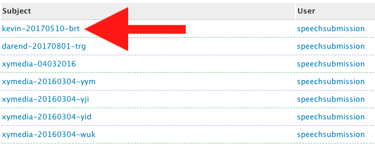
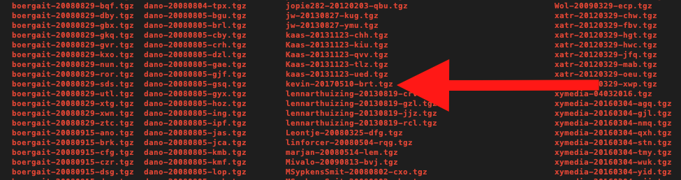
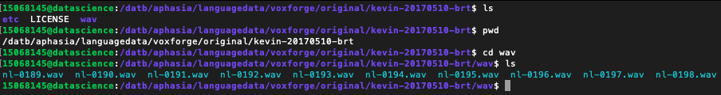

<h1>Scraper for scraping data from Voxforge.org</h1>
<p>(c) Koray</p>
<p>Deze scraper (een soort BOT) haalt de gewenste data zoals audio en daaraan gerelateerde gesproken tekst af van de website voxforge.org. Deze data is de ruwe data en kan gebruikt worden voor toekomstige aanmaak van datasets voor het trainen van modellen zoals neurale netwerk. Deze data wordt <b>NIET</b> gebruikt bij de aligner script "Data Preperation" omdat de audio al is gealignt met de gerelateerde zin.</p>


```python
# Needed packages
import os, requests
from subprocess import call
from bs4 import BeautifulSoup
from ipywidgets import FloatProgress
from IPython.display import display
import time
```


```python
#Init urls
mainUrl = 'http://www.voxforge.org/home/downloads/speech/dutch?pn='
webUrl = 'http://www.voxforge.org'
downloadUrl = 'http://www.repository.voxforge1.org/downloads/Dutch/Trunk/Audio/Original/48kHz_16bit/'
fileZip = '.tgz'
headers = {'User-Agent':"Mozilla/5.0 (Macintosh; Intel Mac OS X 10_12_5) AppleWebKit/537.36 (KHTML, like Gecko) Chrome/59.0.3071.115 Safari/537.36"}
```


```python
# Method for getting download url
def getDownloadUrl(fileUrl):    
    fileUrlRequest = requests.get(url=fileUrl, headers=headers)
    
    fileSoup = BeautifulSoup(fileUrlRequest.text, 'html.parser')

    border = fileSoup.find_all("div", {"class": "postBorderCurrent"})
    downUrl = ''
    try:
        downUrl = border[0].find_all("a", href=True)[0].get('href')
    except IndexError:
        downUrl = 'empty'
    return downUrl
```

<h2>Script voor het downloaden van de gewenste data.</h2>
<p>Deze script doet zich voor als een normale website bezoeker en download alle data op de website in één keer. Bij deze cell haal ik eerst de urls naar de gewenste ZIP bestanden op.</p>


```python
start_time = time.time()

dataLinks = []

iterations = 27

f = FloatProgress(min=0, max=iterations, description='Init dataLinks:', bar_style='success', orientation='horizontal')
display(f)

for i in range(iterations):
    print('<------------> [i] = {}'.format(i))
    # Get the request body with HEADERS
    fileUrlRequest = requests.get(url=mainUrl+str((i+1)), headers=headers)

    # Init BeautifulSoup with HTML parser
    fileSoup = BeautifulSoup(fileUrlRequest.text, 'lxml')
    
    # Add all links of the folder in de lists
    for even in filter(lambda x: x.a is not None, fileSoup.find_all("td", {"class": ["oddThread", "evenThread"]})):
        if 'untitled' not in even.a['href']:
            if 'viewProfile' not in even.a['href']:
                filepageUrl = webUrl + even.a['href']
                dataLinks.append(getDownloadUrl(filepageUrl))
    
    f.value += 1        
            
print('Finished')

print("--- %s seconds ---" % ((time.time() - start_time)/60))
```


    <------------> [i] = 0
    <------------> [i] = 1
    <------------> [i] = 2
    <------------> [i] = 3
    <------------> [i] = 4
    <------------> [i] = 5
    <------------> [i] = 6
    <------------> [i] = 7
    <------------> [i] = 8
    <------------> [i] = 9
    <------------> [i] = 10
    <------------> [i] = 11
    <------------> [i] = 12
    <------------> [i] = 13
    <------------> [i] = 14
    <------------> [i] = 15
    <------------> [i] = 16
    <------------> [i] = 17
    <------------> [i] = 18
    <------------> [i] = 19
    <------------> [i] = 20
    <------------> [i] = 21
    <------------> [i] = 22
    <------------> [i] = 23
    <------------> [i] = 24
    <------------> [i] = 25
    <------------> [i] = 26
    Finished
    --- 14.02139590581258 seconds ---


<p>Sommige items zijn geen "http" urls dus die moeten niet worden meegenomen naar de volgende cell. Vandaar clean links.</p>


```python
print('Before:{}'.format(len(dataLinks)))
cleanLinks = list(filter(lambda link: 'http' in link, dataLinks))
print('After:{}'.format(len(cleanLinks)))
```

    Before:795
    After:792


<h2>For downloading and unzipping</h2>
<p>Hier heb ik een batch geschreven die de ZIP bestanden (audio en tekstbestanden) van de website download, unzipt op de server en kopieert de inhoudt naar een map op de server.</p>


```python
start_time = time.time()

toDel = 'rm -R '
untar = 'tar -xvzf '

f = FloatProgress(min=0, max=len(dataLinks), description='Downloading:', bar_style='success', orientation='horizontal')
display(f)

for filelink in cleanLinks:
    finalDestination = '/datb/aphasia/languagedata/voxforge/originalZip/' + filelink.split('/')[-1]
    curlAudio = 'curl -0 ' + filelink + ' -o ' + finalDestination
    call(curlAudio, shell=True)
    f.value += 1

print('Finished')
print("--- %s seconds ---" % ((time.time() - start_time)/60))
```


    Finished
    --- 18.624718300501506 seconds ---


```python
# Untar the tar file to folder Original
import glob
untar = 'tar xvzf '
destination = ' -C /datb/aphasia/languagedata/voxforge/original/'

for tarFile in glob.glob('/datb/aphasia/languagedata/voxforge/originalZip/*'):
    call(untar + tarFile + destination, shell=True)

print('Finished')
```

    Finished


```python
from IPython.display import Image
file1 = "1.png"
file2 = "2.png"
file3 = "3.png"
print('Van de website')
Image(url= file2, width=600, height=300)
```

    Van de website





```python
print('Op de server na downloaden')
Image(url= file1, width=800, height=400)
```

    Op de server na downloaden





```python
print('Na het uitpakken van het ZIP bestand. In "etc" map staat tekst bestand en in "wav" map staan de wav bestanden.')
Image(url= file3, width=1000, height=400)
```

    Na het uitpakken van het ZIP bestand. In "etc" map staat tekst bestand en in "wav" map staan de wav bestanden.





<h3>De hertz van de audio converteren naar de gewenste hertz</h3>
<p>Dit onderdeel is van belang voor de audio naar MFCC transformatie voor het krijgen van de features bij het onderdeel "Phoneme Boundary Generator".</p>
<p>Dit hoeft maar 1x uitgevoerd te worden!</p>


```python
folderpath = '/datb/aphasia/languagedata/voxforge/transform/align/'

# Get all csv files where the audiopaths are saved
files = getFiles(folderpath)

# First check if all audio is in the format WAV before transforming to another HERTZ
count = 0
for fileIndex in range(0, len(files)):
    for audio in readDict(files[fileIndex]):
        audiopath = audio['audiopath'].split('/')[-1]
        count += 1 if 'wav' not in audiopath else 0

print('Amount of non-wav files: {}'.format(count))
print('Lookup is finished')


# A batch for converting all VoxForge audiofiles to a desired HERTZ which is 16000hz
if(count == 0):
    for fileIndex in range(0, len(files)):
        for audio in readDict(files[fileIndex]):
            try:
                audiofile = AudioSegment.from_wav(audio['audiopath'])
                transform_audio_hertz(audiofile, audio['audiopath'], 'wav', 16000)
            except FileNotFoundError:
                separated = audio['audiopath'].split('/')
                newName = re.sub('', '',separated[-1].lower())
                newAudioPath = '/'.join(separated[:-1]) + '/' + newName
                audiofile = AudioSegment.from_wav(newAudioPath)
                transform_audio_hertz(audiofile, audio['audiopath'],'wav', 16000)

    print('Converting hertz is finished')
else:
    print('There are non-wav files!')
```

    Amount of non-wav files: 0
    Lookup is finished
    Converting hertz is finished