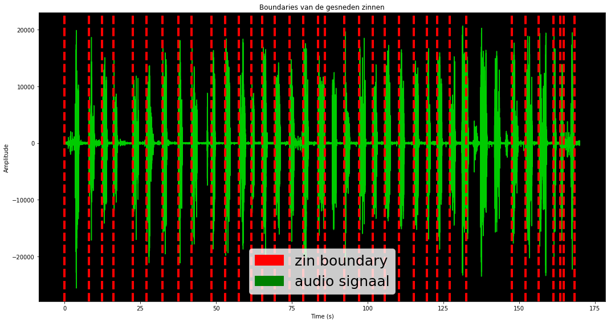

<h1>Aligner for aligning sentences from audio signals</h1>

(c) Koray

<p>Dit is een script die de data van de UVA in de gewenste structuur zet welke nodig is om SPHINX te kunnen trainnen. Deze script alignt een zin in een audio signaal en slaat die data op in een csv bestand met de gerelateerde wav bestand.</p>
<p>De gewenste structuur welke nodig is om SPHINX te kunnen trainen ziet er als volgt uit:</p>
<p>E.G. [s]Today is a rainy day[/s] user/koray/audiofiles/weather.wav</p>


```python
# Import needed libraries
from aeneas.executetask import ExecuteTask
from aeneas.language import Language
from aeneas.syncmap import SyncMapFormat
from aeneas.task import Task
from aeneas.task import TaskConfiguration
from aeneas.textfile import TextFileFormat
import aeneas.globalconstants as gc
import os, json
import csv
from subprocess import call
import re
import pandas as pd
import matplotlib.pyplot as plt
import numpy as np
from scipy.io import wavfile

from pydub import AudioSegment
import glob

from ipywidgets import FloatProgress
from IPython.display import display
import time
```

<p>De benodigde methoden</p>


```python
dirPath = '/datb/aphasia/languagedata/uva/'
cleanDir = '/datb/aphasia/languagedata/uva/transform/clean/'
alignDir = '/datb/aphasia/languagedata/uva/transform/sentencealign/'
wavDir = '/datb/aphasia/languagedata/uva/transform/wavfiles/'
finalDir = '/datb/aphasia/languagedata/uva/final/'

# Voor het inlezen van alle bestanden
def getFiles(folderpath):
    return glob.glob(folderpath)

# Voor het inlezen van alle bestanden in een map met txt en wav bestanden. Hij geeft 2 lijsten terug waarvan 1 txt en 1 wav.
def getAllfiles(directory):
    files = glob.glob(directory+'*')
    audiodic = {}
    textdic = {}
    
    for file in files:
        extension = file.split('/')[-1].split('.')

        if extension[-1] == 'txt':
            textdic[extension[0]] = file
        else:
            audiodic[extension[0]] = file

    return [audiodic, textdic]

# Voor het inlezen van alle txt bestanden en terug geven als een dictionary.
def getAllTextFiles(directory):
    files = glob.glob(directory+'*.txt')
    textdic = {}
    
    for file in files:
        extension = file.split('/')[-1].split('.')
        textdic[extension[0]] = file
        
    return textdic

# Voor het inlezen van een bestand
def getFile(directory, name, extension=None):
    path = directory + name
    path += '.' + extension if extension is not None else ''
    return glob.glob(path)[0]

# Voor het aanmaken van een nieuwe Json path en die teruggeven
def getPathOutputFile(name, extension):
    mkDir(alignDir, name)
    with open(alignDir + name + '/' + name + '.' + extension, 'w') as jsonfile:
        jsonfile.close()
    
    return getFile(alignDir + name + '/', name, extension)

# Voor het aanmaken van een map
def mkDir(parentDir, newChildDir):
    call('mkdir ' + parentDir + newChildDir, shell = True)
    
    return parentDir + newChildDir + '/'

# Voor het converteren van audio aifc bestand naar wav en de nieuwe wav path teruggeven
def convert_audio_aifc_to_wav(originalPath, filename, toFormat):
    
    audio = AudioSegment.from_file(originalPath, 'aiff')

    changedAudio = audio.set_frame_rate(16000).set_channels(1)
    
    mkDir(alignDir, filename)

    changedAudio.export(wavDir + filename + '.' + toFormat, format=toFormat)

    return wavDir + filename + '.' + toFormat

# Voor het inlezen van een Json bestand
def readJson(directory, name, extension):
    with open(directory + name + '.' + extension, 'r') as f:
        yield json.load(f) 

audiodic, textdic = getAllfiles(cleanDir)
```

<h2>Converter: convert aiff to wav</h2>
<p>Dit onderdeel is van belang voor het alignment proces. Hier worden alle aifc audiobestanden van de UVA omgezet naar WAV extensie. Dit hoeft maar 1x uitgevoerd te worden.</p>


```python
from ipywidgets import FloatProgress
from IPython.display import display
import time

# Init Progress bar
f = FloatProgress(min=0, max=len(audiodic), description='Converting to WAV:', bar_style='success', orientation='horizontal')
display(f)

# Convert .aifc audio files to .wav and save in a new folder in Align directory
for audio in audiodic:
    newAudioPath = convert_audio_aifc_to_wav(audiodic[audio], audio, 'wav')
    f.value += 1

print('Finished')
```


```python
wavFolderpath = '/datb/aphasia/languagedata/uva/transform/wavfiles/*'
wavfiles = getFiles(wavFolderpath)
print('Aifc amount: {}'.format(len(audiodic)))
print('WAV converted amount: {}'.format(len(wavfiles)))
print('There are: {} not related text with audio files'.format(int(len(audiodic)-len(wavfiles))))
```

    Aifc amount: 554
    WAV converted amount: 514
    There are: 40 not related text with audio files


<h2>Slicing and structuring data</h2>
<p>Dit is de aligner script die eerst de data van de UVA converteert naar de juiste structuur om die vervolgens te kunnen gebruiken om de getransformeerde verder te kunnen transformeren naar de gewenste structuur om SPHINX te kunnen trainen.</p>


```python
# Init task conf for the alginment process
config = TaskConfiguration()
config[gc.PPN_TASK_LANGUAGE] = Language.NLD
config[gc.PPN_TASK_IS_TEXT_FILE_FORMAT] = TextFileFormat.PLAIN
config[gc.PPN_TASK_OS_FILE_FORMAT] = SyncMapFormat.JSON
config_string = u"task_language=nld|is_text_type=plain|os_task_file_format=json"

# To convert seconds to milliseconds (for slicing purpose)
ms = 1000

textDictonary = getAllTextFiles(cleanDir)

# Init Progress bar
f = FloatProgress(min=0, max=len(textdic), description='Slicing and structuring:', bar_style='success', orientation='horizontal')
display(f)
    
for index, textdic in enumerate(textDictonary):
    filename = textdic

    # Get the transformed wav file
    audioPath = getFile(wavDir, filename, 'wav')
    textPath = textDictonary[textdic]

    # Create a empty Json file and save and return the path
    outputPath = getPathOutputFile(filename, 'json')

    # Init task for eah audio
    task = Task(config_string=config_string)
    task.audio_file_path_absolute = u""+audioPath
    task.text_file_path_absolute = u""+textPath
    task.sync_map_file_path_absolute = u""+outputPath

    # Execute task
    ExecuteTask(task=task).execute()
    task.output_sync_map_file()

    # Init the audio
    audioToSlice = AudioSegment.from_wav(audioPath)

    # Get fragments of the json file for begin, end time and sentences
    fragments = list(readJson(alignDir+filename+'/', filename, 'json'))[0]['fragments']

    # Save each sentence and related audiosegment to a csv file
    # This csv file with sentences and related audiosegment is equal to the original audio
    with open(alignDir + filename + '/' + filename + '.csv', 'w') as writeTo:
        fieldnames = ['audiopath', 'sentence']
        writer = csv.DictWriter(writeTo, fieldnames=fieldnames)
        writer.writeheader()
    
        # Loop through each fragment
        for i, fragment in enumerate(fragments):
            
            if i > 0:
                begin = int(float(fragment['begin'])) * ms
                end = int(float(fragment['end'])) * ms
                sentence = re.sub('[!?@#$]', '', ''.join(fragment['lines']).lower())

                # Slice the audio with begin and end values
                slicedSegment = audioToSlice[begin:end]

                # Export the sliced audio to the subfolder with the audio name
                newSlicedAudioPath = alignDir + filename + '/' + filename + str((i+1)) + '.wav'
                slicedSegment.export(newSlicedAudioPath, format='wav')

                writer.writerow({'audiopath': newSlicedAudioPath, 'sentence': sentence})

    # Update progress bar
    f.value += 1
print('Finished')
```


    Finished


<p>Een voorbeeld van een audio die is gesneden en alignt met de gerelateerde zin.</p>


```python
exampleDir = '/datb/aphasia/languagedata/uva/transform/sentencealign/M58D2PS/*'
folder = getFiles(exampleDir)
jsonPath = list(filter(lambda x: 'json' in x, folder))[0].split('.')[0]
fragments = list(readJson(jsonPath, '', 'json'))[0]['fragments']
ms = 1000
for fragment in fragments:
    begin = int(float(fragment['begin'])) * ms
    end = int(float(fragment['end'])) * ms
    sentence = re.sub('[!?@#$]', '', ''.join(fragment['lines']).lower())
    
    print('begin: {}\tend:{}\tsentence:{}'.format(begin, end, sentence))
```

    begin: 0	end:0	sentence:1
    begin: 0	end:8000	sentence:toen praten hun die stem
    begin: 8000	end:12000	sentence:de deur liep in degene die niet meer kon
    begin: 12000	end:16000	sentence:ze kon het horen komen en droomde
    begin: 16000	end:22000	sentence:de uil kon ze niet meer plukken
    begin: 22000	end:27000	sentence:hij trok een bloem zingt en kwam
    begin: 27000	end:32000	sentence:deste tierde zij hem op de vond
    begin: 32000	end:37000	sentence:kwaad kon hij rond de nachtegalen
    begin: 37000	end:41000	sentence:wanneer ging hij ze in zon
    begin: 41000	end:48000	sentence:harder onderging hij rond joringel
    begin: 48000	end:53000	sentence:toen kon hij die lijden
    begin: 53000	end:57000	sentence:de schapen waren weg naar reiziger
    begin: 57000	end:61000	sentence:joringel trok haar aan de kooien
    begin: 61000	end:65000	sentence:de noordenwind kon
    begin: 65000	end:69000	sentence:de vrouw bekeek naar helft
    begin: 69000	end:74000	sentence:het kasteel droomde naar betovering
    begin: 74000	end:78000	sentence:groot kwam hij rond jorinde
    begin: 78000	end:83000	sentence:de nachtegaal zou haar om de was
    begin: 83000	end:85000	sentence:het kasteel liep over mij niet meer gewezen
    begin: 85000	end:92000	sentence:krom ging hij rond de tortelduif
    begin: 92000	end:97000	sentence:de schapen kon ze niet meer moesten
    begin: 97000	end:101000	sentence:ze was in de bloem bekeken en weggepakt
    begin: 101000	end:105000	sentence:de deur zingt naar vogels
    begin: 105000	end:110000	sentence:joringel vloog haar aan de was
    begin: 110000	end:115000	sentence:het kasteel tovert naar het ringetje
    begin: 115000	end:119000	sentence:joringel had zijn aan de hand
    begin: 119000	end:123000	sentence:wanneer had hij zich doen
    begin: 123000	end:127000	sentence:groot beweegt hij rond de struik
    begin: 127000	end:132000	sentence:jorinde liep in ze niet meer gewoond
    begin: 132000	end:147000	sentence:zo raakte de kooien verlost en jammerden
    begin: 147000	end:152000	sentence:de betovering huilde ie niet meer droeg
    begin: 152000	end:156000	sentence:ze keek de fluiten praten en liep erin
    begin: 156000	end:161000	sentence:ze kwamen overeen een zon kon en raakte
    begin: 161000	end:163000	sentence:een avond was in
    begin: 163000	end:164000	sentence:joringel komt
    begin: 164000	end:168000	sentence:toen zou hij ze buurt
    begin: 168000	end:169000	sentence:


<h3>Een visualisatie van de gesneden zinnen van de data van hierboven.</h3>


```python
import matplotlib.patches as mpatches

# Een methode om de boundary van de zinnen te plotten.
def display_plot_audio_time(audioPath, audiosegmenten):
    rate, signal = wavfile.read(audioPath)

    Time = np.linspace(0, len(signal) / rate, num=len(signal))

    fig = plt.figure(1, figsize=(15,8))

    plt.title('Boundaries van de gesneden zinnen')
    plt.xlabel('Time (s)')
    plt.ylabel('Amplitude')

    ax = fig.add_subplot(111)
    ax.plot(Time, signal, alpha=0.8, color='lime')

    ax.patch.set_facecolor('black')

    xcoords = set()

    for index, x in enumerate(audiosegmenten):
        if index < len(audiosegmenten)-1:
            xcoords.add(float(x[0]))
            xcoords.add(float(x[1]))

    for xc in xcoords:
        plt.axvline(x=xc, color='red', linestyle='--', linewidth=4)
        
    red_patch = mpatches.Patch(color='red', label='zin boundary')
    green_patch = mpatches.Patch(color='green', label='audio signaal')
    
    plt.legend(handles=[red_patch, green_patch], prop={'size': 25})

    plt.tight_layout()
    plt.show()

    
audioFile = '/datb/aphasia/languagedata/uva/transform/wavfiles/M58D2PS.wav'
exampleDir = '/datb/aphasia/languagedata/uva/transform/sentencealign/M58D2PS/*'
folder = getFiles(exampleDir)
jsonPath = list(filter(lambda x: 'json' in x, folder))[0].split('.')[0]
fragments = list(readJson(jsonPath, '', 'json'))[0]['fragments']
fragments = [[x['begin'], x['end'], ''.join(x['lines'])] for x in fragments[1:]]

display_plot_audio_time(audioFile, fragments)
```





<p>Een voorbeeld van een resultaat na het uivoeren van de aligner script. Dit is dus de uiteindelijke structuur die SPHINX nodig heeft om getraind te kunnen worden en dit wordt gerealiseerd door deze aligner script.</p>


```python
exampleFile = '/datb/aphasia/languagedata/uva/transform/sentencealign/M58D2PS/M58D2PS.csv'

data_df = pd.read_csv(exampleFile, sep=',', skiprows=1, names=['audiopath', 'sentence'])
data_df = data_df.dropna()
data_df
```


<div>
<style scoped>
    .dataframe tbody tr th:only-of-type {
        vertical-align: middle;
    }

    .dataframe tbody tr th {
        vertical-align: top;
    }

    .dataframe thead th {
        text-align: right;
    }
</style>
<table border="1" class="dataframe">
  <thead>
    <tr style="text-align: right;">
      <th></th>
      <th>audiopath</th>
      <th>sentence</th>
    </tr>
  </thead>
  <tbody>
    <tr>
      <th>0</th>
      <td>/datb/aphasia/languagedata/uva/transform/sente...</td>
      <td>toen praten hun die stem</td>
    </tr>
    <tr>
      <th>1</th>
      <td>/datb/aphasia/languagedata/uva/transform/sente...</td>
      <td>de deur liep in degene die niet meer kon</td>
    </tr>
    <tr>
      <th>2</th>
      <td>/datb/aphasia/languagedata/uva/transform/sente...</td>
      <td>ze kon het horen komen en droomde</td>
    </tr>
    <tr>
      <th>3</th>
      <td>/datb/aphasia/languagedata/uva/transform/sente...</td>
      <td>de uil kon ze niet meer plukken</td>
    </tr>
    <tr>
      <th>4</th>
      <td>/datb/aphasia/languagedata/uva/transform/sente...</td>
      <td>hij trok een bloem zingt en kwam</td>
    </tr>
    <tr>
      <th>5</th>
      <td>/datb/aphasia/languagedata/uva/transform/sente...</td>
      <td>deste tierde zij hem op de vond</td>
    </tr>
    <tr>
      <th>6</th>
      <td>/datb/aphasia/languagedata/uva/transform/sente...</td>
      <td>kwaad kon hij rond de nachtegalen</td>
    </tr>
    <tr>
      <th>7</th>
      <td>/datb/aphasia/languagedata/uva/transform/sente...</td>
      <td>wanneer ging hij ze in zon</td>
    </tr>
    <tr>
      <th>8</th>
      <td>/datb/aphasia/languagedata/uva/transform/sente...</td>
      <td>harder onderging hij rond joringel</td>
    </tr>
    <tr>
      <th>9</th>
      <td>/datb/aphasia/languagedata/uva/transform/sente...</td>
      <td>toen kon hij die lijden</td>
    </tr>
    <tr>
      <th>10</th>
      <td>/datb/aphasia/languagedata/uva/transform/sente...</td>
      <td>de schapen waren weg naar reiziger</td>
    </tr>
    <tr>
      <th>11</th>
      <td>/datb/aphasia/languagedata/uva/transform/sente...</td>
      <td>joringel trok haar aan de kooien</td>
    </tr>
    <tr>
      <th>12</th>
      <td>/datb/aphasia/languagedata/uva/transform/sente...</td>
      <td>de noordenwind kon</td>
    </tr>
    <tr>
      <th>13</th>
      <td>/datb/aphasia/languagedata/uva/transform/sente...</td>
      <td>de vrouw bekeek naar helft</td>
    </tr>
    <tr>
      <th>14</th>
      <td>/datb/aphasia/languagedata/uva/transform/sente...</td>
      <td>het kasteel droomde naar betovering</td>
    </tr>
    <tr>
      <th>15</th>
      <td>/datb/aphasia/languagedata/uva/transform/sente...</td>
      <td>groot kwam hij rond jorinde</td>
    </tr>
    <tr>
      <th>16</th>
      <td>/datb/aphasia/languagedata/uva/transform/sente...</td>
      <td>de nachtegaal zou haar om de was</td>
    </tr>
    <tr>
      <th>17</th>
      <td>/datb/aphasia/languagedata/uva/transform/sente...</td>
      <td>het kasteel liep over mij niet meer gewezen</td>
    </tr>
    <tr>
      <th>18</th>
      <td>/datb/aphasia/languagedata/uva/transform/sente...</td>
      <td>krom ging hij rond de tortelduif</td>
    </tr>
    <tr>
      <th>19</th>
      <td>/datb/aphasia/languagedata/uva/transform/sente...</td>
      <td>de schapen kon ze niet meer moesten</td>
    </tr>
    <tr>
      <th>20</th>
      <td>/datb/aphasia/languagedata/uva/transform/sente...</td>
      <td>ze was in de bloem bekeken en weggepakt</td>
    </tr>
    <tr>
      <th>21</th>
      <td>/datb/aphasia/languagedata/uva/transform/sente...</td>
      <td>de deur zingt naar vogels</td>
    </tr>
    <tr>
      <th>22</th>
      <td>/datb/aphasia/languagedata/uva/transform/sente...</td>
      <td>joringel vloog haar aan de was</td>
    </tr>
    <tr>
      <th>23</th>
      <td>/datb/aphasia/languagedata/uva/transform/sente...</td>
      <td>het kasteel tovert naar het ringetje</td>
    </tr>
    <tr>
      <th>24</th>
      <td>/datb/aphasia/languagedata/uva/transform/sente...</td>
      <td>joringel had zijn aan de hand</td>
    </tr>
    <tr>
      <th>25</th>
      <td>/datb/aphasia/languagedata/uva/transform/sente...</td>
      <td>wanneer had hij zich doen</td>
    </tr>
    <tr>
      <th>26</th>
      <td>/datb/aphasia/languagedata/uva/transform/sente...</td>
      <td>groot beweegt hij rond de struik</td>
    </tr>
    <tr>
      <th>27</th>
      <td>/datb/aphasia/languagedata/uva/transform/sente...</td>
      <td>jorinde liep in ze niet meer gewoond</td>
    </tr>
    <tr>
      <th>28</th>
      <td>/datb/aphasia/languagedata/uva/transform/sente...</td>
      <td>zo raakte de kooien verlost en jammerden</td>
    </tr>
    <tr>
      <th>29</th>
      <td>/datb/aphasia/languagedata/uva/transform/sente...</td>
      <td>de betovering huilde ie niet meer droeg</td>
    </tr>
    <tr>
      <th>30</th>
      <td>/datb/aphasia/languagedata/uva/transform/sente...</td>
      <td>ze keek de fluiten praten en liep erin</td>
    </tr>
    <tr>
      <th>31</th>
      <td>/datb/aphasia/languagedata/uva/transform/sente...</td>
      <td>ze kwamen overeen een zon kon en raakte</td>
    </tr>
    <tr>
      <th>32</th>
      <td>/datb/aphasia/languagedata/uva/transform/sente...</td>
      <td>een avond was in</td>
    </tr>
    <tr>
      <th>33</th>
      <td>/datb/aphasia/languagedata/uva/transform/sente...</td>
      <td>joringel komt</td>
    </tr>
    <tr>
      <th>34</th>
      <td>/datb/aphasia/languagedata/uva/transform/sente...</td>
      <td>toen zou hij ze buurt</td>
    </tr>
  </tbody>
</table>
</div>


