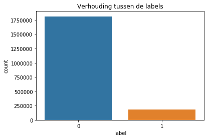
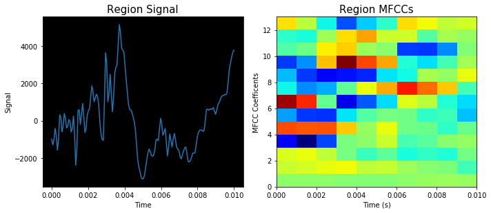
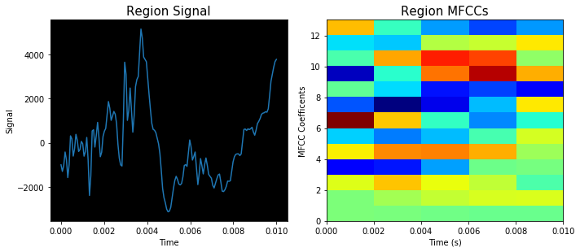

<h1>Data Visualization</h1>
<p>In deze notebook wordt een visualizatie van de data weergegeven die is gebruikt om modellen mee te trainen.</p>


```python
import os, io, wave, csv, json, re, glob
import librosa
import numpy as np
import seaborn as sns
import pandas as pd
import matplotlib.pyplot as plt
import scipy.io.wavfile as wav
from scipy.fftpack import dct
import matplotlib.cm as cm
import matplotlib as mpl
from pydub import AudioSegment

from python_speech_features import mfcc
from python_speech_features import delta
from python_speech_features import logfbank
from python_speech_features import get_filterbanks
from python_speech_features import fbank
```

<p>Benodogde methoden</p>


```python
# Voor het inlezen van bestanden uit een map.
def getFiles(folderpath, amount=None):
    files = glob.glob(folderpath + '*')
    size = len(files)
    return files[0:amount if amount is not None else size]


# Voor het krijgen van de juiste sample tijd
def getTime(seconds, sample_rate):
    return int(seconds * sample_rate)


# Voor het krijgen van features van een audio signaal
def getSignalMFCC(signal, sample_rate):
    mfcc_feat = mfcc(signal, sample_rate, winlen=0.010, winstep=0.001, nfft=512, ceplifter=22)
    return delta(mfcc_feat, 2)


# Voor het krijgen van tijdsduur van een signaal
def getAudioDuration(signal, sample_rate):
    return signal.shape[0] / float(sample_rate)


# Methode voor het plotten van de regio naar histogram voor visualisatie
def plotAudioRegion(audiopath, begin, end, features, fignum, title, subplotNum):
    print('Frams [0] and filterbanks [1]' + str(features.shape))
    
    sample_rate, signal = wav.read(audiopath)
    sec = 1000
    signal = signal[getTime(begin/sec, sample_rate):getTime(end/sec, sample_rate)]
    
    TimeSample = np.linspace(0, len(signal) / sample_rate, num=len(signal))

    fig = plt.figure(fignum, figsize=(10,8))
    ax1 = fig.add_subplot(subplotNum+1)
    ax1.plot(TimeSample, signal)
    ax1.patch.set_facecolor('black')
    ax1.set_title(title + " Signal", fontsize=15)
    ax1.set_ylabel('Signal', fontsize=10)
    ax1.set_xlabel('Time', fontsize=10)
    
    T = getAudioDuration(signal, sample_rate)
    ax2 = fig.add_subplot(subplotNum+2)
    ax2.imshow(np.flipud(features.T), cmap=cm.jet, aspect='auto', extent=[0,T,0,13])
    ax2.set_title(title + " MFCCs", fontsize=15)
    ax2.set_ylabel('MFCC Coefficents', fontsize=10)
    ax2.set_xlabel('Time (s)', fontsize=10)
    
    plt.tight_layout()
```


```python
# Waar de dataset opgeslagen moet worden
datasetDir = '/datb/aphasia/languagedata/corpus/dataset/'
```

<h2>Data "datasetboundary_10ms_v1.csv"</h2>


```python
# Voor het weghalen van 'nan' rows in de column "region" wordt hier ook dropna gebruikt.
df_nondifference = pd.read_csv(datasetDir + 'datasetboundary_10ms_v1.csv', 
                               sep=',', skiprows=1, 
                               names=['region', 'label', 'sample_rate', 'begin', 'end', 'audiopath']).dropna(subset=['region'])

df_nondifference
```


<div>
<style scoped>
    .dataframe tbody tr th:only-of-type {
        vertical-align: middle;
    }

    .dataframe tbody tr th {
        vertical-align: top;
    }

    .dataframe thead th {
        text-align: right;
    }
</style>
<table border="1" class="dataframe">
  <thead>
    <tr style="text-align: right;">
      <th></th>
      <th>region</th>
      <th>label</th>
      <th>sample_rate</th>
      <th>begin</th>
      <th>end</th>
      <th>audiopath</th>
    </tr>
  </thead>
  <tbody>
    <tr>
      <th>0</th>
      <td>0.45186446629700117|-2.2411709727700626|-4.803...</td>
      <td>0</td>
      <td>16000</td>
      <td>895</td>
      <td>905</td>
      <td>/datb/aphasia/languagedata/corpus/transform/wa...</td>
    </tr>
    <tr>
      <th>1</th>
      <td>-0.12845238308858561|1.580986614981171|0.24997...</td>
      <td>0</td>
      <td>16000</td>
      <td>885</td>
      <td>895</td>
      <td>/datb/aphasia/languagedata/corpus/transform/wa...</td>
    </tr>
    <tr>
      <th>2</th>
      <td>-0.11602922572367262|-1.2346745188543071|0.756...</td>
      <td>0</td>
      <td>16000</td>
      <td>875</td>
      <td>885</td>
      <td>/datb/aphasia/languagedata/corpus/transform/wa...</td>
    </tr>
    <tr>
      <th>3</th>
      <td>-0.09618923144771045|-0.40988938072728764|0.55...</td>
      <td>0</td>
      <td>16000</td>
      <td>865</td>
      <td>875</td>
      <td>/datb/aphasia/languagedata/corpus/transform/wa...</td>
    </tr>
    <tr>
      <th>4</th>
      <td>0.024768099066800175|0.71369664198569|-0.13309...</td>
      <td>0</td>
      <td>16000</td>
      <td>855</td>
      <td>865</td>
      <td>/datb/aphasia/languagedata/corpus/transform/wa...</td>
    </tr>
    <tr>
      <th>5</th>
      <td>0.1044214207149338|0.898956367962499|1.1497730...</td>
      <td>1</td>
      <td>16000</td>
      <td>905</td>
      <td>915</td>
      <td>/datb/aphasia/languagedata/corpus/transform/wa...</td>
    </tr>
    <tr>
      <th>6</th>
      <td>0.08121620572303315|-1.035433675786434|1.50680...</td>
      <td>0</td>
      <td>16000</td>
      <td>915</td>
      <td>925</td>
      <td>/datb/aphasia/languagedata/corpus/transform/wa...</td>
    </tr>
    <tr>
      <th>7</th>
      <td>0.08336445623273932|-0.4601872940794867|1.2417...</td>
      <td>0</td>
      <td>16000</td>
      <td>925</td>
      <td>935</td>
      <td>/datb/aphasia/languagedata/corpus/transform/wa...</td>
    </tr>
    <tr>
      <th>8</th>
      <td>0.014788770364876313|-0.14207770864079167|1.14...</td>
      <td>0</td>
      <td>16000</td>
      <td>935</td>
      <td>945</td>
      <td>/datb/aphasia/languagedata/corpus/transform/wa...</td>
    </tr>
    <tr>
      <th>9</th>
      <td>0.012305554601820746|0.31417087651911013|-0.00...</td>
      <td>0</td>
      <td>16000</td>
      <td>945</td>
      <td>955</td>
      <td>/datb/aphasia/languagedata/corpus/transform/wa...</td>
    </tr>
    <tr>
      <th>10</th>
      <td>0.09737044751156035|-0.7906800137754187|-1.803...</td>
      <td>0</td>
      <td>16000</td>
      <td>955</td>
      <td>965</td>
      <td>/datb/aphasia/languagedata/corpus/transform/wa...</td>
    </tr>
    <tr>
      <th>11</th>
      <td>-0.11878458855630498|-1.726249338578426|-0.039...</td>
      <td>0</td>
      <td>16000</td>
      <td>1128</td>
      <td>1138</td>
      <td>/datb/aphasia/languagedata/corpus/transform/wa...</td>
    </tr>
    <tr>
      <th>12</th>
      <td>0.045820973436674704|1.2747293023644013|-1.006...</td>
      <td>0</td>
      <td>16000</td>
      <td>1118</td>
      <td>1128</td>
      <td>/datb/aphasia/languagedata/corpus/transform/wa...</td>
    </tr>
    <tr>
      <th>13</th>
      <td>-0.1345803702828583|0.5478743341586962|-0.3098...</td>
      <td>0</td>
      <td>16000</td>
      <td>1108</td>
      <td>1118</td>
      <td>/datb/aphasia/languagedata/corpus/transform/wa...</td>
    </tr>
    <tr>
      <th>14</th>
      <td>0.16877398870182886|-0.13400720694871956|-0.74...</td>
      <td>0</td>
      <td>16000</td>
      <td>1098</td>
      <td>1108</td>
      <td>/datb/aphasia/languagedata/corpus/transform/wa...</td>
    </tr>
    <tr>
      <th>15</th>
      <td>-0.12496636167076147|1.0555533551985803|1.3645...</td>
      <td>0</td>
      <td>16000</td>
      <td>1088</td>
      <td>1098</td>
      <td>/datb/aphasia/languagedata/corpus/transform/wa...</td>
    </tr>
    <tr>
      <th>16</th>
      <td>-0.21745602564343153|-1.0831683466835738|-1.10...</td>
      <td>1</td>
      <td>16000</td>
      <td>1138</td>
      <td>1148</td>
      <td>/datb/aphasia/languagedata/corpus/transform/wa...</td>
    </tr>
    <tr>
      <th>17</th>
      <td>0.19576011854061798|-1.691733996125738|-1.5450...</td>
      <td>0</td>
      <td>16000</td>
      <td>1148</td>
      <td>1158</td>
      <td>/datb/aphasia/languagedata/corpus/transform/wa...</td>
    </tr>
    <tr>
      <th>18</th>
      <td>0.11003181550161756|-0.7174596854242502|0.0304...</td>
      <td>0</td>
      <td>16000</td>
      <td>1158</td>
      <td>1168</td>
      <td>/datb/aphasia/languagedata/corpus/transform/wa...</td>
    </tr>
    <tr>
      <th>19</th>
      <td>-0.031089564940147342|0.16398681541574547|1.94...</td>
      <td>0</td>
      <td>16000</td>
      <td>1168</td>
      <td>1178</td>
      <td>/datb/aphasia/languagedata/corpus/transform/wa...</td>
    </tr>
    <tr>
      <th>20</th>
      <td>0.13332144757933903|0.36306855650876246|-0.860...</td>
      <td>0</td>
      <td>16000</td>
      <td>1178</td>
      <td>1188</td>
      <td>/datb/aphasia/languagedata/corpus/transform/wa...</td>
    </tr>
    <tr>
      <th>21</th>
      <td>-0.04707426514060984|1.1483475808383623|2.1557...</td>
      <td>0</td>
      <td>16000</td>
      <td>1188</td>
      <td>1198</td>
      <td>/datb/aphasia/languagedata/corpus/transform/wa...</td>
    </tr>
    <tr>
      <th>22</th>
      <td>-0.022679615604190673|-0.3703255871833928|0.34...</td>
      <td>0</td>
      <td>16000</td>
      <td>1574</td>
      <td>1584</td>
      <td>/datb/aphasia/languagedata/corpus/transform/wa...</td>
    </tr>
    <tr>
      <th>23</th>
      <td>0.05303990419967306|-0.14594196483075147|-0.07...</td>
      <td>0</td>
      <td>16000</td>
      <td>1564</td>
      <td>1574</td>
      <td>/datb/aphasia/languagedata/corpus/transform/wa...</td>
    </tr>
    <tr>
      <th>24</th>
      <td>0.012391489809039768|1.5021549591965415|-2.193...</td>
      <td>0</td>
      <td>16000</td>
      <td>1554</td>
      <td>1564</td>
      <td>/datb/aphasia/languagedata/corpus/transform/wa...</td>
    </tr>
    <tr>
      <th>25</th>
      <td>-0.04464828082206225|0.05360867290150848|0.539...</td>
      <td>0</td>
      <td>16000</td>
      <td>1544</td>
      <td>1554</td>
      <td>/datb/aphasia/languagedata/corpus/transform/wa...</td>
    </tr>
    <tr>
      <th>26</th>
      <td>0.012417299113509727|-0.7760398280951091|1.054...</td>
      <td>0</td>
      <td>16000</td>
      <td>1534</td>
      <td>1544</td>
      <td>/datb/aphasia/languagedata/corpus/transform/wa...</td>
    </tr>
    <tr>
      <th>27</th>
      <td>-0.008779460940900919|0.5680587569994701|-0.26...</td>
      <td>1</td>
      <td>16000</td>
      <td>1584</td>
      <td>1594</td>
      <td>/datb/aphasia/languagedata/corpus/transform/wa...</td>
    </tr>
    <tr>
      <th>28</th>
      <td>0.02632948477470052|0.5616281983051223|-1.4014...</td>
      <td>0</td>
      <td>16000</td>
      <td>1594</td>
      <td>1604</td>
      <td>/datb/aphasia/languagedata/corpus/transform/wa...</td>
    </tr>
    <tr>
      <th>29</th>
      <td>-0.06062422394052831|-0.07636351665881538|-0.1...</td>
      <td>0</td>
      <td>16000</td>
      <td>1604</td>
      <td>1614</td>
      <td>/datb/aphasia/languagedata/corpus/transform/wa...</td>
    </tr>
    <tr>
      <th>...</th>
      <td>...</td>
      <td>...</td>
      <td>...</td>
      <td>...</td>
      <td>...</td>
      <td>...</td>
    </tr>
    <tr>
      <th>1996184</th>
      <td>-0.01603427610341015|0.7620135614369301|0.0205...</td>
      <td>0</td>
      <td>16000</td>
      <td>225012</td>
      <td>225022</td>
      <td>/datb/aphasia/languagedata/corpus/transform/wa...</td>
    </tr>
    <tr>
      <th>1996185</th>
      <td>-0.009615732068357374|-0.8605368189763333|1.28...</td>
      <td>0</td>
      <td>16000</td>
      <td>225002</td>
      <td>225012</td>
      <td>/datb/aphasia/languagedata/corpus/transform/wa...</td>
    </tr>
    <tr>
      <th>1996186</th>
      <td>-0.005679118953858975|-0.628917206933518|-0.48...</td>
      <td>1</td>
      <td>16000</td>
      <td>225052</td>
      <td>225062</td>
      <td>/datb/aphasia/languagedata/corpus/transform/wa...</td>
    </tr>
    <tr>
      <th>1996187</th>
      <td>0.056720316175682586|0.31574134279546584|0.453...</td>
      <td>0</td>
      <td>16000</td>
      <td>225062</td>
      <td>225072</td>
      <td>/datb/aphasia/languagedata/corpus/transform/wa...</td>
    </tr>
    <tr>
      <th>1996188</th>
      <td>0.06120993165447004|1.4449647790975828|0.51446...</td>
      <td>0</td>
      <td>16000</td>
      <td>225072</td>
      <td>225082</td>
      <td>/datb/aphasia/languagedata/corpus/transform/wa...</td>
    </tr>
    <tr>
      <th>1996189</th>
      <td>-0.0443962743858954|-0.2944245786000906|-0.351...</td>
      <td>0</td>
      <td>16000</td>
      <td>225082</td>
      <td>225092</td>
      <td>/datb/aphasia/languagedata/corpus/transform/wa...</td>
    </tr>
    <tr>
      <th>1996190</th>
      <td>0.03142810983305857|-1.687623180914833|-2.9155...</td>
      <td>0</td>
      <td>16000</td>
      <td>225092</td>
      <td>225102</td>
      <td>/datb/aphasia/languagedata/corpus/transform/wa...</td>
    </tr>
    <tr>
      <th>1996191</th>
      <td>-0.02322132541966191|0.9097533406477062|-0.557...</td>
      <td>0</td>
      <td>16000</td>
      <td>225102</td>
      <td>225112</td>
      <td>/datb/aphasia/languagedata/corpus/transform/wa...</td>
    </tr>
    <tr>
      <th>1996192</th>
      <td>0.061621909864381055|0.5144945042596567|-0.754...</td>
      <td>0</td>
      <td>16000</td>
      <td>225163</td>
      <td>225173</td>
      <td>/datb/aphasia/languagedata/corpus/transform/wa...</td>
    </tr>
    <tr>
      <th>1996193</th>
      <td>0.029599175527359377|-0.28184739234089484|0.53...</td>
      <td>0</td>
      <td>16000</td>
      <td>225153</td>
      <td>225163</td>
      <td>/datb/aphasia/languagedata/corpus/transform/wa...</td>
    </tr>
    <tr>
      <th>1996194</th>
      <td>-0.021168563269052854|-0.5861485315928366|-0.1...</td>
      <td>0</td>
      <td>16000</td>
      <td>225143</td>
      <td>225153</td>
      <td>/datb/aphasia/languagedata/corpus/transform/wa...</td>
    </tr>
    <tr>
      <th>1996195</th>
      <td>-0.1110944657910025|-1.5926956461947437|-0.586...</td>
      <td>0</td>
      <td>16000</td>
      <td>225133</td>
      <td>225143</td>
      <td>/datb/aphasia/languagedata/corpus/transform/wa...</td>
    </tr>
    <tr>
      <th>1996196</th>
      <td>-0.06927486719778705|-0.6079064587412661|-0.02...</td>
      <td>0</td>
      <td>16000</td>
      <td>225123</td>
      <td>225133</td>
      <td>/datb/aphasia/languagedata/corpus/transform/wa...</td>
    </tr>
    <tr>
      <th>1996197</th>
      <td>0.038636563204660135|0.5106522089499033|1.4357...</td>
      <td>1</td>
      <td>16000</td>
      <td>225173</td>
      <td>225183</td>
      <td>/datb/aphasia/languagedata/corpus/transform/wa...</td>
    </tr>
    <tr>
      <th>1996198</th>
      <td>0.03627271207876674|-0.4023798215634692|1.8618...</td>
      <td>0</td>
      <td>16000</td>
      <td>225183</td>
      <td>225193</td>
      <td>/datb/aphasia/languagedata/corpus/transform/wa...</td>
    </tr>
    <tr>
      <th>1996199</th>
      <td>0.054715404227680155|-1.0322774242525228|1.116...</td>
      <td>0</td>
      <td>16000</td>
      <td>225193</td>
      <td>225203</td>
      <td>/datb/aphasia/languagedata/corpus/transform/wa...</td>
    </tr>
    <tr>
      <th>1996200</th>
      <td>0.020670921034293598|0.7458278021624742|1.1001...</td>
      <td>0</td>
      <td>16000</td>
      <td>225203</td>
      <td>225213</td>
      <td>/datb/aphasia/languagedata/corpus/transform/wa...</td>
    </tr>
    <tr>
      <th>1996201</th>
      <td>0.05072962577003892|1.2229799365569307|-0.0097...</td>
      <td>0</td>
      <td>16000</td>
      <td>225213</td>
      <td>225223</td>
      <td>/datb/aphasia/languagedata/corpus/transform/wa...</td>
    </tr>
    <tr>
      <th>1996202</th>
      <td>-0.019409828717382994|-0.3842454310862692|-0.1...</td>
      <td>0</td>
      <td>16000</td>
      <td>225223</td>
      <td>225233</td>
      <td>/datb/aphasia/languagedata/corpus/transform/wa...</td>
    </tr>
    <tr>
      <th>1996203</th>
      <td>-0.14446800414469826|4.498503401445793|3.68097...</td>
      <td>0</td>
      <td>16000</td>
      <td>225518</td>
      <td>225528</td>
      <td>/datb/aphasia/languagedata/corpus/transform/wa...</td>
    </tr>
    <tr>
      <th>1996204</th>
      <td>-0.09030634471483623|0.8887562786676838|0.4290...</td>
      <td>0</td>
      <td>16000</td>
      <td>225508</td>
      <td>225518</td>
      <td>/datb/aphasia/languagedata/corpus/transform/wa...</td>
    </tr>
    <tr>
      <th>1996205</th>
      <td>-0.06688269178450205|-0.7272504135345244|-0.38...</td>
      <td>0</td>
      <td>16000</td>
      <td>225498</td>
      <td>225508</td>
      <td>/datb/aphasia/languagedata/corpus/transform/wa...</td>
    </tr>
    <tr>
      <th>1996206</th>
      <td>-0.00016643033092869075|-1.0541554085845584|-1...</td>
      <td>0</td>
      <td>16000</td>
      <td>225488</td>
      <td>225498</td>
      <td>/datb/aphasia/languagedata/corpus/transform/wa...</td>
    </tr>
    <tr>
      <th>1996207</th>
      <td>-0.07898966118184134|-0.23175120398966415|-0.4...</td>
      <td>0</td>
      <td>16000</td>
      <td>225478</td>
      <td>225488</td>
      <td>/datb/aphasia/languagedata/corpus/transform/wa...</td>
    </tr>
    <tr>
      <th>1996208</th>
      <td>0.13161464674937912|1.278791346993315|0.940746...</td>
      <td>1</td>
      <td>16000</td>
      <td>225528</td>
      <td>225538</td>
      <td>/datb/aphasia/languagedata/corpus/transform/wa...</td>
    </tr>
    <tr>
      <th>1996209</th>
      <td>0.07932508132163534|0.42636991316752637|0.6959...</td>
      <td>0</td>
      <td>16000</td>
      <td>225538</td>
      <td>225548</td>
      <td>/datb/aphasia/languagedata/corpus/transform/wa...</td>
    </tr>
    <tr>
      <th>1996210</th>
      <td>-0.0726482836184296|-0.2803690460948669|0.4461...</td>
      <td>0</td>
      <td>16000</td>
      <td>225548</td>
      <td>225558</td>
      <td>/datb/aphasia/languagedata/corpus/transform/wa...</td>
    </tr>
    <tr>
      <th>1996211</th>
      <td>-0.022248132208658334|-0.1131998027732326|-0.5...</td>
      <td>0</td>
      <td>16000</td>
      <td>225558</td>
      <td>225568</td>
      <td>/datb/aphasia/languagedata/corpus/transform/wa...</td>
    </tr>
    <tr>
      <th>1996212</th>
      <td>-0.002306531882149443|-0.11242284126041113|0.7...</td>
      <td>0</td>
      <td>16000</td>
      <td>225568</td>
      <td>225578</td>
      <td>/datb/aphasia/languagedata/corpus/transform/wa...</td>
    </tr>
    <tr>
      <th>1996213</th>
      <td>0.008177956112938034|0.3274757368542076|-0.552...</td>
      <td>0</td>
      <td>16000</td>
      <td>225578</td>
      <td>225588</td>
      <td>/datb/aphasia/languagedata/corpus/transform/wa...</td>
    </tr>
  </tbody>
</table>
<p>1996212 rows × 6 columns</p>
</div>


```python
df_nondifference.info(verbose=True)
```

    <class 'pandas.core.frame.DataFrame'>
    Int64Index: 1996212 entries, 0 to 1996213
    Data columns (total 6 columns):
    region         object
    label          int64
    sample_rate    int64
    begin          int64
    end            int64
    audiopath      object
    dtypes: int64(4), object(2)
    memory usage: 106.6+ MB


<h3>Aantal features</h3>


```python
example_data = np.array(df_nondifference.region[0].split('|'))
print(f'Aantal features: {len(example_data)}')
```

    Aantal features: 130


<h3>Verhouding van de labels 0 en 1 in de dataset.</h3>
<p>We zien hier dat de dataset kampt met skewed data. Dit kan natuurlijk opgelost worden met OVERSAMPLING.</p>


```python
fig , ax = plt.subplots(figsize=(6,4))
sns.countplot(x='label', data=df_nondifference)
plt.title("Verhouding tussen de labels")
plt.show()
print('Er zijn meer 0 class data dan 1 class data.')
```





    Er zijn meer 0 class data dan 1 class data.


<h3>Een visualisatie van de features (filterbanks) van de kolom "region" van 10ms</h3>
<p>Hiermee geef ik een beeld hoe een audio signaal van 10ms er uit ziet zodra hij is omgezet naar MFCCs.</p>


```python
# Get true labels only
regionSignalTrue = np.array([float(x) for x in df_nondifference.loc[5, :].region.split('|')])
audiopath = df_nondifference.iloc[5, -1]
times = df_nondifference.iloc[5, 3:5]

# Plot the true region data
plotAudioRegion(audiopath, times[0], times[1], regionSignalTrue.reshape(10, 13), 1, 'Region', 220)

plt.show()
```

    Frams [0] and filterbanks [1](10, 13)





<h2>Data "datasetboundary_difference_v1.csv"</h2>


```python
# Using Pandas for reading dataset csv
df_difference = pd.read_csv(datasetDir + 'datasetboundary_difference_v1.csv', 
                               sep=',', skiprows=1, 
                               names=['region', 'label', 'sample_rate', 'begin', 'end', 'audiopath']).dropna(subset=['region'])

df_difference
```


<div>
<style scoped>
    .dataframe tbody tr th:only-of-type {
        vertical-align: middle;
    }

    .dataframe tbody tr th {
        vertical-align: top;
    }

    .dataframe thead th {
        text-align: right;
    }
</style>
<table border="1" class="dataframe">
  <thead>
    <tr style="text-align: right;">
      <th></th>
      <th>region</th>
      <th>label</th>
      <th>sample_rate</th>
      <th>begin</th>
      <th>end</th>
      <th>audiopath</th>
    </tr>
  </thead>
  <tbody>
    <tr>
      <th>0</th>
      <td>0.36866650181047195|-3.596968847597437|-4.6059...</td>
      <td>0</td>
      <td>16000</td>
      <td>895</td>
      <td>905</td>
      <td>/datb/aphasia/languagedata/corpus/transform/wa...</td>
    </tr>
    <tr>
      <th>1</th>
      <td>-0.31153354921552145|3.65936756280274|-0.48901...</td>
      <td>0</td>
      <td>16000</td>
      <td>885</td>
      <td>895</td>
      <td>/datb/aphasia/languagedata/corpus/transform/wa...</td>
    </tr>
    <tr>
      <th>2</th>
      <td>0.27301986697927416|-4.077293211282512|3.87560...</td>
      <td>0</td>
      <td>16000</td>
      <td>875</td>
      <td>885</td>
      <td>/datb/aphasia/languagedata/corpus/transform/wa...</td>
    </tr>
    <tr>
      <th>3</th>
      <td>-0.08086209394662731|-1.2120730322023252|1.640...</td>
      <td>0</td>
      <td>16000</td>
      <td>865</td>
      <td>875</td>
      <td>/datb/aphasia/languagedata/corpus/transform/wa...</td>
    </tr>
    <tr>
      <th>4</th>
      <td>0.1631079235638232|0.5408029547782245|-0.46767...</td>
      <td>0</td>
      <td>16000</td>
      <td>855</td>
      <td>865</td>
      <td>/datb/aphasia/languagedata/corpus/transform/wa...</td>
    </tr>
    <tr>
      <th>5</th>
      <td>0.09655880215074149|0.060164999575823|1.667178...</td>
      <td>1</td>
      <td>16000</td>
      <td>905</td>
      <td>915</td>
      <td>/datb/aphasia/languagedata/corpus/transform/wa...</td>
    </tr>
    <tr>
      <th>6</th>
      <td>-0.21325791147118736|-0.35849504013023537|2.11...</td>
      <td>0</td>
      <td>16000</td>
      <td>915</td>
      <td>925</td>
      <td>/datb/aphasia/languagedata/corpus/transform/wa...</td>
    </tr>
    <tr>
      <th>7</th>
      <td>0.18078562501697065|-0.8526064971178349|1.7536...</td>
      <td>0</td>
      <td>16000</td>
      <td>925</td>
      <td>935</td>
      <td>/datb/aphasia/languagedata/corpus/transform/wa...</td>
    </tr>
    <tr>
      <th>8</th>
      <td>-0.16972292026351923|-0.3809575915222724|2.775...</td>
      <td>0</td>
      <td>16000</td>
      <td>935</td>
      <td>945</td>
      <td>/datb/aphasia/languagedata/corpus/transform/wa...</td>
    </tr>
    <tr>
      <th>9</th>
      <td>0.10028121640081551|0.22036522357270044|0.8767...</td>
      <td>0</td>
      <td>16000</td>
      <td>945</td>
      <td>955</td>
      <td>/datb/aphasia/languagedata/corpus/transform/wa...</td>
    </tr>
    <tr>
      <th>10</th>
      <td>-0.05175431833054417|-0.6277919384862718|-0.07...</td>
      <td>0</td>
      <td>16000</td>
      <td>955</td>
      <td>965</td>
      <td>/datb/aphasia/languagedata/corpus/transform/wa...</td>
    </tr>
    <tr>
      <th>11</th>
      <td>-0.13565366452175098|-1.6176725704937203|0.159...</td>
      <td>0</td>
      <td>16000</td>
      <td>1128</td>
      <td>1138</td>
      <td>/datb/aphasia/languagedata/corpus/transform/wa...</td>
    </tr>
    <tr>
      <th>12</th>
      <td>0.27496661542292383|0.5948495978088635|-1.3196...</td>
      <td>0</td>
      <td>16000</td>
      <td>1118</td>
      <td>1128</td>
      <td>/datb/aphasia/languagedata/corpus/transform/wa...</td>
    </tr>
    <tr>
      <th>13</th>
      <td>-0.2134002697104144|-0.24359528607265168|0.796...</td>
      <td>0</td>
      <td>16000</td>
      <td>1108</td>
      <td>1118</td>
      <td>/datb/aphasia/languagedata/corpus/transform/wa...</td>
    </tr>
    <tr>
      <th>14</th>
      <td>0.1775290455809525|-1.4448540382293347|1.16575...</td>
      <td>0</td>
      <td>16000</td>
      <td>1098</td>
      <td>1108</td>
      <td>/datb/aphasia/languagedata/corpus/transform/wa...</td>
    </tr>
    <tr>
      <th>15</th>
      <td>-0.03911613456945204|-0.07556785244400177|2.21...</td>
      <td>0</td>
      <td>16000</td>
      <td>1088</td>
      <td>1098</td>
      <td>/datb/aphasia/languagedata/corpus/transform/wa...</td>
    </tr>
    <tr>
      <th>16</th>
      <td>-0.21852900109356171|0.6972627875738624|0.5482...</td>
      <td>1</td>
      <td>16000</td>
      <td>1138</td>
      <td>1148</td>
      <td>/datb/aphasia/languagedata/corpus/transform/wa...</td>
    </tr>
    <tr>
      <th>17</th>
      <td>-0.012563871264406501|-0.17022174283679603|-0....</td>
      <td>0</td>
      <td>16000</td>
      <td>1148</td>
      <td>1158</td>
      <td>/datb/aphasia/languagedata/corpus/transform/wa...</td>
    </tr>
    <tr>
      <th>18</th>
      <td>0.048692475195176145|-0.03590281624737912|0.46...</td>
      <td>0</td>
      <td>16000</td>
      <td>1158</td>
      <td>1168</td>
      <td>/datb/aphasia/languagedata/corpus/transform/wa...</td>
    </tr>
    <tr>
      <th>19</th>
      <td>0.06770405210202526|0.43023711699808875|2.8180...</td>
      <td>0</td>
      <td>16000</td>
      <td>1168</td>
      <td>1178</td>
      <td>/datb/aphasia/languagedata/corpus/transform/wa...</td>
    </tr>
    <tr>
      <th>20</th>
      <td>0.04439491244494462|1.066061684427539|-1.68363...</td>
      <td>0</td>
      <td>16000</td>
      <td>1178</td>
      <td>1188</td>
      <td>/datb/aphasia/languagedata/corpus/transform/wa...</td>
    </tr>
    <tr>
      <th>21</th>
      <td>-0.02940309693183636|1.2196987323007698|2.4734...</td>
      <td>0</td>
      <td>16000</td>
      <td>1188</td>
      <td>1198</td>
      <td>/datb/aphasia/languagedata/corpus/transform/wa...</td>
    </tr>
    <tr>
      <th>22</th>
      <td>0.02126879219677349|-0.2544190863733755|-0.089...</td>
      <td>0</td>
      <td>16000</td>
      <td>1574</td>
      <td>1584</td>
      <td>/datb/aphasia/languagedata/corpus/transform/wa...</td>
    </tr>
    <tr>
      <th>23</th>
      <td>0.017101064947650714|-0.2530820309201559|-0.30...</td>
      <td>0</td>
      <td>16000</td>
      <td>1564</td>
      <td>1574</td>
      <td>/datb/aphasia/languagedata/corpus/transform/wa...</td>
    </tr>
    <tr>
      <th>24</th>
      <td>-0.009329050540431184|2.480222967647929|-2.252...</td>
      <td>0</td>
      <td>16000</td>
      <td>1554</td>
      <td>1564</td>
      <td>/datb/aphasia/languagedata/corpus/transform/wa...</td>
    </tr>
    <tr>
      <th>25</th>
      <td>-0.035981248051189144|0.2209005986678437|-0.47...</td>
      <td>0</td>
      <td>16000</td>
      <td>1544</td>
      <td>1554</td>
      <td>/datb/aphasia/languagedata/corpus/transform/wa...</td>
    </tr>
    <tr>
      <th>26</th>
      <td>0.05365991329241098|-1.663428205622|-0.4849432...</td>
      <td>0</td>
      <td>16000</td>
      <td>1534</td>
      <td>1544</td>
      <td>/datb/aphasia/languagedata/corpus/transform/wa...</td>
    </tr>
    <tr>
      <th>27</th>
      <td>-0.04268583395449213|0.5119734142659017|0.0835...</td>
      <td>1</td>
      <td>16000</td>
      <td>1584</td>
      <td>1594</td>
      <td>/datb/aphasia/languagedata/corpus/transform/wa...</td>
    </tr>
    <tr>
      <th>28</th>
      <td>0.04989222093567136|0.9475508284849002|-2.0275...</td>
      <td>0</td>
      <td>16000</td>
      <td>1594</td>
      <td>1604</td>
      <td>/datb/aphasia/languagedata/corpus/transform/wa...</td>
    </tr>
    <tr>
      <th>29</th>
      <td>0.052795297984278025|0.9394364365079652|-1.931...</td>
      <td>0</td>
      <td>16000</td>
      <td>1604</td>
      <td>1614</td>
      <td>/datb/aphasia/languagedata/corpus/transform/wa...</td>
    </tr>
    <tr>
      <th>...</th>
      <td>...</td>
      <td>...</td>
      <td>...</td>
      <td>...</td>
      <td>...</td>
      <td>...</td>
    </tr>
    <tr>
      <th>1996173</th>
      <td>0.16117683434062471|0.7029383604977908|-0.1630...</td>
      <td>0</td>
      <td>16000</td>
      <td>225012</td>
      <td>225022</td>
      <td>/datb/aphasia/languagedata/corpus/transform/wa...</td>
    </tr>
    <tr>
      <th>1996174</th>
      <td>0.040567938968774794|-0.7849728899732938|1.153...</td>
      <td>0</td>
      <td>16000</td>
      <td>225002</td>
      <td>225012</td>
      <td>/datb/aphasia/languagedata/corpus/transform/wa...</td>
    </tr>
    <tr>
      <th>1996175</th>
      <td>0.05623921567493469|-0.4751392450771331|-0.742...</td>
      <td>1</td>
      <td>16000</td>
      <td>225052</td>
      <td>225062</td>
      <td>/datb/aphasia/languagedata/corpus/transform/wa...</td>
    </tr>
    <tr>
      <th>1996176</th>
      <td>0.14854004769075646|1.120679092427942|0.409583...</td>
      <td>0</td>
      <td>16000</td>
      <td>225062</td>
      <td>225072</td>
      <td>/datb/aphasia/languagedata/corpus/transform/wa...</td>
    </tr>
    <tr>
      <th>1996177</th>
      <td>0.014876229902385421|1.9094895731722614|2.5963...</td>
      <td>0</td>
      <td>16000</td>
      <td>225072</td>
      <td>225082</td>
      <td>/datb/aphasia/languagedata/corpus/transform/wa...</td>
    </tr>
    <tr>
      <th>1996178</th>
      <td>-0.07925478654208576|-0.898166894538591|-0.340...</td>
      <td>0</td>
      <td>16000</td>
      <td>225082</td>
      <td>225092</td>
      <td>/datb/aphasia/languagedata/corpus/transform/wa...</td>
    </tr>
    <tr>
      <th>1996179</th>
      <td>-0.06519301334033009|-2.5704530832609778|-3.65...</td>
      <td>0</td>
      <td>16000</td>
      <td>225092</td>
      <td>225102</td>
      <td>/datb/aphasia/languagedata/corpus/transform/wa...</td>
    </tr>
    <tr>
      <th>1996180</th>
      <td>0.041482902140053214|1.72199049624506|0.202930...</td>
      <td>0</td>
      <td>16000</td>
      <td>225102</td>
      <td>225112</td>
      <td>/datb/aphasia/languagedata/corpus/transform/wa...</td>
    </tr>
    <tr>
      <th>1996181</th>
      <td>0.10362974950410014|2.609148475000618|-0.35294...</td>
      <td>0</td>
      <td>16000</td>
      <td>225163</td>
      <td>225173</td>
      <td>/datb/aphasia/languagedata/corpus/transform/wa...</td>
    </tr>
    <tr>
      <th>1996182</th>
      <td>0.10044853298087303|1.376588136229189|0.157505...</td>
      <td>0</td>
      <td>16000</td>
      <td>225153</td>
      <td>225163</td>
      <td>/datb/aphasia/languagedata/corpus/transform/wa...</td>
    </tr>
    <tr>
      <th>1996183</th>
      <td>0.021953124841505554|-0.6226024411536258|-1.01...</td>
      <td>0</td>
      <td>16000</td>
      <td>225143</td>
      <td>225153</td>
      <td>/datb/aphasia/languagedata/corpus/transform/wa...</td>
    </tr>
    <tr>
      <th>1996184</th>
      <td>-0.1759500608835843|-2.741737220572531|-1.2840...</td>
      <td>0</td>
      <td>16000</td>
      <td>225133</td>
      <td>225143</td>
      <td>/datb/aphasia/languagedata/corpus/transform/wa...</td>
    </tr>
    <tr>
      <th>1996185</th>
      <td>-0.11090054904867691|-1.587960265837845|-0.940...</td>
      <td>0</td>
      <td>16000</td>
      <td>225123</td>
      <td>225133</td>
      <td>/datb/aphasia/languagedata/corpus/transform/wa...</td>
    </tr>
    <tr>
      <th>1996186</th>
      <td>-0.13831171288300864|2.3057716615759682|2.5242...</td>
      <td>1</td>
      <td>16000</td>
      <td>225173</td>
      <td>225183</td>
      <td>/datb/aphasia/languagedata/corpus/transform/wa...</td>
    </tr>
    <tr>
      <th>1996187</th>
      <td>-0.04798527892779632|-0.1750350413983533|2.268...</td>
      <td>0</td>
      <td>16000</td>
      <td>225183</td>
      <td>225193</td>
      <td>/datb/aphasia/languagedata/corpus/transform/wa...</td>
    </tr>
    <tr>
      <th>1996188</th>
      <td>0.0028748485452304365|-2.024333131305858|1.827...</td>
      <td>0</td>
      <td>16000</td>
      <td>225193</td>
      <td>225203</td>
      <td>/datb/aphasia/languagedata/corpus/transform/wa...</td>
    </tr>
    <tr>
      <th>1996189</th>
      <td>-0.05007952666541939|0.28405426728677197|1.100...</td>
      <td>0</td>
      <td>16000</td>
      <td>225203</td>
      <td>225213</td>
      <td>/datb/aphasia/languagedata/corpus/transform/wa...</td>
    </tr>
    <tr>
      <th>1996190</th>
      <td>0.032334589669402905|-0.36162293304005844|1.48...</td>
      <td>0</td>
      <td>16000</td>
      <td>225213</td>
      <td>225223</td>
      <td>/datb/aphasia/languagedata/corpus/transform/wa...</td>
    </tr>
    <tr>
      <th>1996191</th>
      <td>-0.03198112372549104|-3.0187943353132893|0.061...</td>
      <td>0</td>
      <td>16000</td>
      <td>225223</td>
      <td>225233</td>
      <td>/datb/aphasia/languagedata/corpus/transform/wa...</td>
    </tr>
    <tr>
      <th>1996192</th>
      <td>-0.6347555472124575|-0.14224314718699915|2.979...</td>
      <td>0</td>
      <td>16000</td>
      <td>225518</td>
      <td>225528</td>
      <td>/datb/aphasia/languagedata/corpus/transform/wa...</td>
    </tr>
    <tr>
      <th>1996193</th>
      <td>-0.03925062119939291|-0.4620361203854727|-0.79...</td>
      <td>0</td>
      <td>16000</td>
      <td>225508</td>
      <td>225518</td>
      <td>/datb/aphasia/languagedata/corpus/transform/wa...</td>
    </tr>
    <tr>
      <th>1996194</th>
      <td>0.030560148629299275|-0.11742253811960945|-0.3...</td>
      <td>0</td>
      <td>16000</td>
      <td>225498</td>
      <td>225508</td>
      <td>/datb/aphasia/languagedata/corpus/transform/wa...</td>
    </tr>
    <tr>
      <th>1996195</th>
      <td>0.06116599754642245|0.5549972673011652|0.22106...</td>
      <td>0</td>
      <td>16000</td>
      <td>225488</td>
      <td>225498</td>
      <td>/datb/aphasia/languagedata/corpus/transform/wa...</td>
    </tr>
    <tr>
      <th>1996196</th>
      <td>-0.08102952138668477|0.5609080023846531|0.2335...</td>
      <td>0</td>
      <td>16000</td>
      <td>225478</td>
      <td>225488</td>
      <td>/datb/aphasia/languagedata/corpus/transform/wa...</td>
    </tr>
    <tr>
      <th>1996197</th>
      <td>0.17656980433326197|0.8113080736601814|1.43375...</td>
      <td>1</td>
      <td>16000</td>
      <td>225528</td>
      <td>225538</td>
      <td>/datb/aphasia/languagedata/corpus/transform/wa...</td>
    </tr>
    <tr>
      <th>1996198</th>
      <td>-0.010112074845092786|-0.12337382033819033|-0....</td>
      <td>0</td>
      <td>16000</td>
      <td>225538</td>
      <td>225548</td>
      <td>/datb/aphasia/languagedata/corpus/transform/wa...</td>
    </tr>
    <tr>
      <th>1996199</th>
      <td>0.03377098086133684|0.1640975463153982|-0.6163...</td>
      <td>0</td>
      <td>16000</td>
      <td>225548</td>
      <td>225558</td>
      <td>/datb/aphasia/languagedata/corpus/transform/wa...</td>
    </tr>
    <tr>
      <th>1996200</th>
      <td>-0.079014368797408|-0.6651461099926628|-1.0014...</td>
      <td>0</td>
      <td>16000</td>
      <td>225558</td>
      <td>225568</td>
      <td>/datb/aphasia/languagedata/corpus/transform/wa...</td>
    </tr>
    <tr>
      <th>1996201</th>
      <td>0.09380798421664026|0.47120384110655955|2.7844...</td>
      <td>0</td>
      <td>16000</td>
      <td>225568</td>
      <td>225578</td>
      <td>/datb/aphasia/languagedata/corpus/transform/wa...</td>
    </tr>
    <tr>
      <th>1996202</th>
      <td>-0.1145584679774558|0.3562739962077849|0.68178...</td>
      <td>0</td>
      <td>16000</td>
      <td>225578</td>
      <td>225588</td>
      <td>/datb/aphasia/languagedata/corpus/transform/wa...</td>
    </tr>
  </tbody>
</table>
<p>1996202 rows × 6 columns</p>
</div>


```python
df_difference.info(verbose=True)
```

    <class 'pandas.core.frame.DataFrame'>
    Int64Index: 1996202 entries, 0 to 1996202
    Data columns (total 6 columns):
    region         object
    label          int64
    sample_rate    int64
    begin          int64
    end            int64
    audiopath      object
    dtypes: int64(4), object(2)
    memory usage: 106.6+ MB


<h3>Aantal features</h3>


```python
example_data = np.array(df_difference.region[0].split('|'))
print(f'Aantal features: {len(example_data)}')
```

    Aantal features: 65


<h3>Verhouding van de labels 0 en 1 in de dataset.</h3>
<p>We zien hier dat de dataset kampt met skewed data. Dit kan natuurlijk opgelost worden met OVERSAMPLING.</p>


```python
fig , ax = plt.subplots(figsize=(6,4))
sns.countplot(x='label', data=df_nondifference)
plt.title("Verhouding tussen de labels")
plt.show()
print('Er zijn meer 0 class data dan 1 class data.')
```


    Er zijn meer 0 class data dan 1 class data.


<h3>Een visualisatie van de features (filterbanks) van de kolom "region" van 10ms</h3>
<p>Hiermee geef ik een beeld hoe een audio signaal van 10ms er uit ziet zodra hij is omgezet naar MFCCs.</p>


```python
# Get true labels only
regionSignalTrue_diff = np.array([float(x) for x in df_difference.loc[5, :].region.split('|')])
audiopath = df_difference.iloc[5, -1]
times = df_difference.iloc[5, 3:5]

# Plot the true region data
plotAudioRegion(audiopath, times[0], times[1], regionSignalTrue_diff.reshape(5, 13), 1, 'Region', 220)

plt.show()
```

    Frams [0] and filterbanks [1](5, 13)




