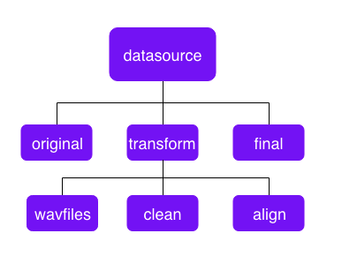

<h1>Initialiseer een mappenstructuur.</h1>
<p>(c) Koray</p>
<p>Dit is nodig om voor het structureel werken met data. Het is altijd handig om een goede structuur te hebben voor het opslaan, verwerken en aanmaken van de data. Dit maakt de paden naar de data overzichtelijk.</p>


```python
from subprocess import call

def changeAccesRights(folderPath, user, code):
    commando = 'chgrp ' + user + ' ' + folderPath
    call(commando, shell=True)

    commando = 'chmod -R ' + code + ' ' + folderPath
    call(commando, shell=True)

def initDirStructure(parentdirectory, user):
    # Level 1
    newFol = '/datb/aphasia/languagedata/' + parentdirectory
#     commando = 'rm -R ' + newFol
#     call(commando, shell=True)

    commando = 'mkdir ' + newFol
    call(commando, shell=True)
    
    changeAccesRights(newFol, user, '777')

    # Level 2
    newFol = '/datb/aphasia/languagedata/' + parentdirectory + '/original'
#     commando = 'rm -R ' + newFol
#     call(commando, shell=True)
    commando = 'mkdir ' + newFol
    call(commando, shell=True)
    changeAccesRights(newFol, user, '777')

    newFol = '/datb/aphasia/languagedata/' + parentdirectory + '/transform'
#     commando = 'rm -R ' + newFol
#     call(commando, shell=True)
    commando = 'mkdir ' + newFol
    call(commando, shell=True)
    changeAccesRights(newFol, user, '777')

    newFol = '/datb/aphasia/languagedata/' + parentdirectory + '/final'
#     commando = 'rm -R ' + newFol
#     call(commando, shell=True)
    commando = 'mkdir ' + newFol
    call(commando, shell=True)
    changeAccesRights(newFol, user, '777')

    # Level 3
    newFol = '/datb/aphasia/languagedata/' + parentdirectory + '/transform/clean'
#     commando = 'rm -R ' + newFol
#     call(commando, shell=True)
    commando = 'mkdir ' + newFol
    call(commando, shell=True)
    changeAccesRights(newFol, user, '777')

    newFol = '/datb/aphasia/languagedata/' + parentdirectory + '/transform/align'
#     commando = 'rm -R ' + newFol
#     call(commando, shell=True)
    commando = 'mkdir ' + newFol
    call(commando, shell=True)
    changeAccesRights(newFol, user, '777')

    newFol = '/datb/aphasia/languagedata/' + parentdirectory + '/transform/wavfiles'
#     commando = 'rm -R ' + newFol
#     call(commando, shell=True)
    commando = 'mkdir ' + newFol
    call(commando, shell=True)
    changeAccesRights(newFol, user, '777')

    print('Finished')
    
initDirStructure('corpus', '15068145')
```

    Finished


<p>De naam datasource spreekt voor zich, E.G. Uva of VoxForge data collectie. In het map original staan de originele bestanden opgeslagen dus zoals ze van de source worden ontvangen. Het map transform bestaat uit wavfiles, clean en align. Wavfiles bevat de geconverteerde audiobestanden naar extensie Wav. Hierdoor hoef je niet iedere keer een conversie te uitvoeren, wat invloed heeft op de snelheid van het runnen van je transformatie Script. Clean bevat de tekstbestanden die zijn opgeschoond van ongewenste karakters of ongestructureerde body. Hierdoor zijn ze klaar voor het Aligment proces van de zinnen of gebruikt worden voor een ander doel dat vraagt om een gestructureerde body. In het map Align worden audiosegmenten opgeslagen met daarbij behorende zinnen.</p>

