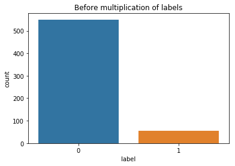
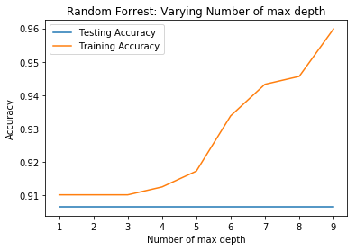

```python
import os, io, wave, csv, json, re, glob
import librosa
import numpy as np
import pandas as pd
import matplotlib.pyplot as plt
import scipy.io.wavfile as wav
from scipy.fftpack import dct
import matplotlib.cm as cm
import matplotlib as mpl
import collections
```


```python
from sklearn.ensemble import RandomForestClassifier
from sklearn.model_selection import train_test_split
from sklearn.metrics import log_loss
```


```python
datasetDir = '/datb/aphasia/languagedata/voxforge/dataset/'
```


```python
# Using Pandas for reading dataset csv
df_difference = pd.read_csv(datasetDir + 'datasetboundary_difference.csv', sep=',', skiprows=1, names=['region', 'label', 'sample_rate'])
df_nondifference = pd.read_csv(datasetDir + 'datasetboundary.csv', sep=',', skiprows=1, names=['region', 'label', 'sample_rate'])

print('Head:')
print(df_difference.head())
print('----------------')
print('Tail:')
print(df_difference.tail())
```

    Head:
                                                  region  label  sample_rate
    0  -0.005469213298211175|0.7779622038417742|0.677...      1        16000
    1  0.15707023369072176|-2.79486428991484|-1.73821...      0        16000
    2  -0.009104294089205933|-1.5565812334774602|-0.9...      0        16000
    3  -0.02562862411608719|1.7597042965140952|1.1330...      0        16000
    4  0.01737656392452429|2.224576509890566|-1.98389...      0        16000
    ----------------
    Tail:
                                                    region  label  sample_rate
    600  -0.1273367044986294|1.528383272412631|-0.74687...      0        16000
    601  -0.07745201518940412|-0.34143072185179413|1.89...      0        16000
    602  -0.014281864881123957|-1.5094740532703619|2.45...      0        16000
    603  -0.030374956625269078|-1.572207751864089|0.562...      0        16000
    604  0.09874311495447757|-0.7347260751012792|-1.307...      0        16000


```python
a = [float(x) for x in df_difference.iloc[0,0].split('|')]
a = np.array(a).reshape(5, 13)

fig = plt.figure(1)
T = 5
ax2 = fig.add_subplot(111)
ax2.imshow(np.flipud(a.T), cmap=cm.jet, aspect='auto', extent=[0,T,0,13])
ax2.set_title('Region: 5ms', fontsize=15)
ax2.set_ylabel('MFCC Coefficents', fontsize=10)
ax2.set_xlabel('Time (s)', fontsize=10)
```


    Text(0.5, 0, 'Time (s)')


```python
def generateMoreData(dataframe, X, y, label, multiply):
    # EG. 55x6=330
    pos_list = [i for i, x in enumerate(dataframe.label) if x == label]
    
    more_data_x_pos = []

    for x in range(multiply):
        for pos in pos_list:
            more_data_x_pos.append(X[pos])
    
    more_data_y_pos = [1 for i in range(len(more_data_x_pos))]
    
    y = np.concatenate((y, more_data_y_pos), axis=None)

    for x in more_data_x_pos:
        X.append(x)
        
    return [X, y]
```


```python
# # Get input data
X = []

for x in df_difference.region:
    trans = [float(y) for y in x.split('|')] # 0,1
    X.append(trans)

# # Get labels
y = [int(x) for x in df_difference.label]

more_data = generateMoreData(df_difference, X, y, 1, 6)

X = more_data[0]
y = more_data[1]
```


```python
# Split data with train_test_split()
X_train, X_test, y_train, y_test = train_test_split(X, y, test_size=0.30, random_state=42, stratify=y)
```


```python
# Init RandomForestClassifier
clf = RandomForestClassifier(n_estimators=100, max_depth=2,random_state=42)

# X_train = np.array(X_train)
# X_test = np.array(X_test)
# y_train = np.array(y_train)
# y_test = np.array(y_test)

# Fit de dataset
clf.fit(X_train, y_train)
```


    RandomForestClassifier(bootstrap=True, class_weight=None, criterion='gini',
                max_depth=2, max_features='auto', max_leaf_nodes=None,
                min_impurity_decrease=0.0, min_impurity_split=None,
                min_samples_leaf=1, min_samples_split=2,
                min_weight_fraction_leaf=0.0, n_estimators=100, n_jobs=None,
                oob_score=False, random_state=42, verbose=0, warm_start=False)


```python
pred = clf.predict(X_test)
pred
```


    array([0, 0, 0, 0, 0, 0, 0, 1, 0, 0, 0, 0, 0, 0, 0, 0, 0, 0, 0, 0, 0, 0,
           0, 0, 1, 1, 0, 0, 0, 0, 0, 0, 0, 0, 0, 0, 0, 0, 0, 0, 0, 0, 0, 1,
           0, 1, 0, 0, 0, 0, 1, 0, 0, 0, 0, 1, 0, 0, 1, 0, 0, 0, 0, 0, 1, 0,
           0, 0, 0, 0, 0, 1, 1, 0, 0, 0, 0, 0, 0, 0, 0, 0, 0, 0, 0, 1, 0, 0,
           0, 0, 0, 0, 0, 1, 1, 0, 0, 0, 0, 0, 0, 0, 0, 1, 0, 0, 0, 0, 0, 0,
           0, 0, 0, 0, 0, 1, 0, 0, 0, 0, 0, 0, 0, 0, 0, 0, 0, 0, 0, 0, 0, 0,
           1, 0, 0, 0, 0, 0, 0, 0, 0, 1, 0, 0, 0, 0, 0, 1, 0, 0, 0, 0, 0, 0,
           0, 0, 0, 0, 0, 1, 0, 0, 0, 0, 0, 0, 0, 0, 0, 0, 0, 0, 1, 0, 0, 1,
           0, 0, 0, 1, 0, 0, 0, 0, 0, 0, 1, 1, 0, 0, 1, 0, 0, 0, 0, 0, 0, 0,
           1, 0, 1, 0, 0, 0, 1, 0, 0, 0, 1, 0, 0, 0, 0, 0, 0, 1, 0, 0, 0, 0,
           0, 0, 0, 0, 0, 0, 0, 0, 0, 0, 0, 0, 1, 1, 0, 0, 0, 0, 0, 0, 0, 0,
           0, 0, 0, 0, 0, 0, 0, 0, 0, 0, 0, 0, 1, 0, 0, 0, 0, 0, 0, 0, 0, 1,
           0, 1, 0, 0, 0, 0, 0, 0, 0, 0, 0, 1, 0, 0, 0, 1, 0])


```python
clf_probs = clf.predict_proba(X_test[:6])
# score = log_loss(y_test, clf_probs)

# print(clf_probs)

train_score = clf.score(X_train, y_train)
test_score = clf.score(X_test, y_test)
print('Train_score:{}'.format(train_score))
print('Test_score:{}'.format(test_score))
```

    Train_score:0.7155963302752294
    Test_score:0.701067615658363


```python
from sklearn.metrics import classification_report
from sklearn.metrics import confusion_matrix

print(confusion_matrix(y_test, pred))

print(classification_report(y_test, pred))
```

    [[162   3]
     [ 81  35]]
                  precision    recall  f1-score   support
    
               0       0.67      0.98      0.79       165
               1       0.92      0.30      0.45       116
    
       micro avg       0.70      0.70      0.70       281
       macro avg       0.79      0.64      0.62       281
    weighted avg       0.77      0.70      0.65       281
    


```python
from sklearn.model_selection import cross_val_score

cv_result = cross_val_score(clf, X_train, y_train, cv=5)
print("cross_val_score")
print(cv_result)
print(np.mean(cv_result))
```

    cross_val_score
    [0.6870229  0.6870229  0.70229008 0.64122137 0.67692308]
    0.6788960657662948


```python

```


```python

```


```python

```


```python

```


```python

```


```python
import seaborn as sns

y_data = pd.DataFrame({'label':y})
fig , ax = plt.subplots(figsize=(6,4))
sns.countplot(x='label', data=df)
plt.title("Before multiplication of labels")
plt.show()
```





```python
import seaborn as sns

y_data = pd.DataFrame({'label':y})
fig , ax = plt.subplots(figsize=(6,4))
sns.countplot(x='label', data=y_data)
plt.title("After multiplication of labels")
plt.show()
```


```python
max_depth = np.arange(1, 10)
train_accuracy = np.empty(len(max_depth))
test_accuracy = np.empty(len(max_depth))

for i, k in enumerate(n_estimators):
    # Setup a k-NN Classifier with k neighbors: knn
    clf = RandomForestClassifier(n_estimators=100, max_depth=k, random_state=42)

    # Fit the classifier to the training data
    clf.fit(X_train, y_train)
    
    #Compute accuracy on the training set
    train_accuracy[i] = clf.score(X_train, y_train)

    #Compute accuracy on the testing set
    test_accuracy[i] = clf.score(X_test, y_test)
    
# plt.title('Random Forrest: Varying Number of n_estimators')
plt.title('Random Forrest: Varying Number of max depth')
plt.plot(n_estimators, test_accuracy, label = 'Testing Accuracy')
plt.plot(n_estimators, train_accuracy, label = 'Training Accuracy')
plt.legend()
plt.xlabel('Number of max depth')
plt.ylabel('Accuracy')
plt.show()
```





<h3>DecisionTree vs RandomForrestClassifier</h3>


```python
from sklearn.tree import DecisionTreeClassifier
from sklearn.model_selection import cross_val_score

# # Get input data
X = []

for x in df_nondifference.region:
    trans = [float(y) for y in x.split('|')] # 0,1
    X.append(trans)

# # Get labels
y = [int(x) for x in df_nondifference.label]
```


```python
# Split data with train_test_split()
X_train, X_test, y_train, y_test = train_test_split(X, y, test_size=0.30, random_state=42, stratify=y)
```


```python
names = ['DecisionTree', 'RandomForrest']

max_depth = 5

classifiers = [DecisionTreeClassifier(max_depth=max_depth, random_state=42), 
               RandomForestClassifier(n_estimators=100, max_depth=max_depth,random_state=42)]

X_train, X_test, y_train, y_test = train_test_split(X, y, test_size=0.30, random_state=42, stratify=y)

for name, cls in zip(names, classifiers):
    
    cross_score = cross_val_score(cls, X_train, y_train, cv=5)
    print('CLS :{}'.format(name))
    print('CV score:{}'.format(cross_score))
    
    cls.fit(X_train, y_train)

    train_score = cls.score(X_train, y_train)
    test_score = cls.score(X_test, y_test)
    print('Train_score:{}'.format(train_score))
    print('Test_score:{}'.format(test_score))
    print('--------------------')
    
```

    CLS :DecisionTree
    CV score:[0.82352941 0.89411765 0.89411765 0.85714286 0.8452381 ]
    Train_score:0.9456264775413712
    Test_score:0.8736263736263736
    --------------------
    CLS :RandomForrest
    CV score:[0.90588235 0.90588235 0.90588235 0.91666667 0.91666667]
    Train_score:0.91725768321513
    Test_score:0.9065934065934066
    --------------------


<h3>DecisionTree classifier</h3>


```python
from sklearn.tree import DecisionTreeClassifier
from sklearn.model_selection import cross_val_score
from sklearn.metrics import classification_report

def generateMoreData(dataframe, X, y, label, multiply):
    # EG. 55x6=330
    pos_list = [i for i, x in enumerate(dataframe.label) if x == label]
    
    more_data_x_pos = []

    for x in range(multiply):
        for pos in pos_list:
            more_data_x_pos.append(X[pos])
    
    more_data_y_pos = [1 for i in range(len(more_data_x_pos))]
    
    y = np.concatenate((y, more_data_y_pos), axis=None)

    for x in more_data_x_pos:
        X.append(x)
        
    return [X, y]
    

# # Get input data
X = []

for x in df_difference.region:
    trans = [float(y) for y in x.split('|')] # 0,1
    X.append(trans)
        
# # Get labels
y = [int(x) for x in df_nondifference.label]

more_data = generateMoreData(df_nondifference, X, y, 1, 6)

X = more_data[0]
y = more_data[1]

print('X:{}, y:{}'.format(len(X), len(y)))

# Split data with train_test_split()
X_train, X_test, y_train, y_test = train_test_split(X, y, test_size=0.30, random_state=42, stratify=y)
```

    X:935, y:935


```python
tree = DecisionTreeClassifier(max_depth=5, random_state=42)
cross_val_score(tree, X_train, y_train, cv=5)
```


    array([0.76335878, 0.7480916 , 0.83969466, 0.77099237, 0.70769231])


```python
tree.fit(X_train, y_train)

pred = tree.predict(X_test)
pred
```


    array([0, 0, 0, 0, 0, 1, 0, 1, 0, 0, 0, 1, 0, 1, 1, 0, 1, 0, 0, 0, 1, 1,
           0, 0, 1, 1, 0, 0, 0, 0, 0, 0, 0, 1, 0, 1, 0, 0, 0, 0, 1, 0, 0, 1,
           0, 1, 0, 0, 0, 0, 1, 0, 0, 1, 0, 1, 0, 0, 1, 0, 1, 1, 0, 0, 1, 1,
           0, 1, 1, 0, 1, 0, 1, 0, 1, 1, 0, 1, 0, 0, 0, 0, 1, 0, 0, 1, 0, 0,
           0, 0, 0, 0, 0, 1, 1, 0, 0, 1, 1, 1, 1, 0, 1, 1, 0, 0, 0, 1, 0, 1,
           0, 1, 1, 0, 0, 1, 1, 0, 1, 1, 1, 0, 0, 0, 0, 0, 1, 1, 1, 0, 0, 1,
           1, 0, 0, 1, 0, 0, 1, 1, 0, 1, 0, 1, 0, 0, 0, 1, 0, 1, 0, 1, 0, 1,
           0, 0, 0, 1, 0, 1, 0, 0, 1, 0, 0, 0, 0, 0, 0, 0, 0, 0, 1, 0, 0, 1,
           1, 1, 0, 1, 0, 0, 1, 0, 0, 0, 1, 1, 0, 0, 1, 0, 0, 0, 1, 0, 0, 1,
           1, 0, 1, 0, 0, 0, 1, 0, 0, 0, 1, 1, 0, 1, 0, 0, 0, 1, 0, 0, 0, 0,
           1, 0, 1, 0, 1, 0, 1, 1, 1, 1, 0, 0, 1, 1, 1, 0, 0, 0, 0, 0, 1, 1,
           1, 0, 1, 1, 1, 0, 1, 0, 1, 1, 1, 0, 1, 0, 1, 0, 0, 0, 0, 0, 0, 1,
           1, 1, 0, 0, 1, 0, 1, 1, 1, 0, 1, 1, 1, 0, 0, 1, 0])


```python
train_score = tree.score(X_train, y_train)
test_score = tree.score(X_test, y_test)
print('Train_score:{}'.format(train_score))
print('Test_score:{}'.format(test_score))

y_true = y_test
y_pred = tree.predict(X_test)

target_names = ['class 0', 'class 1']
print(classification_report(y_true, y_pred, target_names=target_names))
```

    Train_score:0.8853211009174312
    Test_score:0.8042704626334519
                  precision    recall  f1-score   support
    
         class 0       0.84      0.83      0.83       165
         class 1       0.76      0.77      0.76       116
    
       micro avg       0.80      0.80      0.80       281
       macro avg       0.80      0.80      0.80       281
    weighted avg       0.80      0.80      0.80       281
    


<h2>TSNE classificatie (Stochastic Neighbor Embedding)</h2>


```python

```


```python
from sklearn.manifold import TSNE

df_difference = pd.read_csv(datasetDir + 'datasetboundary_difference.csv', sep=',', skiprows=1, names=['region', 'label', 'sample_rate'])

data = []

for x in df_difference.loc[:, 'region']:
    trans = [float(y) for y in x.split('|')] # 0,1
    data.append(trans)
    
dataframe = pd.DataFrame(data)

tsne = TSNE(random_state=42)
digits_tsne = tsne.fit_transform(dataframe.values)
```


```python
target = df.label

plt.figure(figsize=(7,7))
plt.xlim(digits_tsne[:, 0].min(), digits_tsne[:,0].max() + 1)
plt.ylim(digits_tsne[:, 1].min(), digits_tsne[:,1].max() + 1)

colors = ['#ff0000', '#339933']

for i in range(len(dataframe.values)):
    plt.text(digits_tsne[i, 0], digits_tsne[i,1], 
             str(target[i]), color=colors[0 if target[i] == 0 else 1],
             fontdict={'weight':'bold', 'size':15})
    
plt.xlabel("feature 0")
plt.xlabel("feature 1")
```


    Text(0.5, 0, 'feature 1')


<h2>GradientBoosting Classifier</h2>


```python
from sklearn.ensemble import GradientBoostingClassifier

# # Get input data
X = []

for x in df_nondifference.region:
    trans = [float(y) for y in x.split('|')] # 0,1
    X.append(trans)

# # Get labels
y = [int(x) for x in df_nondifference.label]
```


```python
# Split data with train_test_split()
X_train, X_test, y_train, y_test = train_test_split(X, y, test_size=0.30, random_state=42, stratify=y)

# gbrt = GradientBoostingClassifier(random_state=0, max_depth=1)
gbrt = GradientBoostingClassifier(random_state=0, learning_rate=0.01)
gbrt.fit(X_train, y_train)
```


    GradientBoostingClassifier(criterion='friedman_mse', init=None,
                  learning_rate=0.01, loss='deviance', max_depth=3,
                  max_features=None, max_leaf_nodes=None,
                  min_impurity_decrease=0.0, min_impurity_split=None,
                  min_samples_leaf=1, min_samples_split=2,
                  min_weight_fraction_leaf=0.0, n_estimators=100,
                  n_iter_no_change=None, presort='auto', random_state=0,
                  subsample=1.0, tol=0.0001, validation_fraction=0.1,
                  verbose=0, warm_start=False)


```python
train_score = gbrt.score(X_train, y_train)
test_score = gbrt.score(X_test, y_test)
print('Train_score:{}'.format(train_score))
print('Test_score:{}'.format(test_score))
```

    Train_score:0.91725768321513
    Test_score:0.9010989010989011


```python
from sklearn.metrics import classification_report

y_true = y_test
y_pred = gbrt.predict(X_test)
target_names = ['class 0', 'class 1']
print(classification_report(y_true, y_pred, target_names=target_names))
```

                  precision    recall  f1-score   support
    
         class 0       0.91      0.99      0.95       165
         class 1       0.00      0.00      0.00        17
    
       micro avg       0.90      0.90      0.90       182
       macro avg       0.45      0.50      0.47       182
    weighted avg       0.82      0.90      0.86       182
    


```python
from sklearn import svm, datasets
from sklearn.model_selection import GridSearchCV

Cs = [0.001, 0.01, 0.1, 1, 10]
gammas = [0.001, 0.01, 0.1, 1]
parameters = {'C': Cs, 'gamma' : gammas}

svc = svm.SVC(gamma="scale")
clf = GridSearchCV(svc, parameters, cv=5)
clf.fit(X_train, y_train)

print(clf.best_params_)
```

    {'C': 0.001, 'gamma': 0.001}


<h2>MLP Classifier (Multilayer Perceptron)</h2>


```python
from sklearn.neural_network import MLPClassifier

df_difference = pd.read_csv(datasetDir + 'datasetboundary_difference.csv', sep=',', skiprows=1, names=['region', 'label', 'sample_rate'])
```


```python
# # Get input data
X = []

for x in df_difference.region:
    trans = [float(y) for y in x.split('|')] # 0,1
    X.append(trans)

# # Get labels
y = [int(x) for x in df_difference.label]

more_data = generateMoreData(df_difference, X, y, 1, 6)

X = more_data[0]
y = more_data[1]

print('X:{}'.format(len(X)))
print('y:{}'.format(len(y)))
```

    X:935
    y:935


```python
X_train, X_test, y_train, y_test = train_test_split(X, y, test_size=0.30, random_state=42, stratify=y)
```


```python
from sklearn.preprocessing import StandardScaler

scaler = StandardScaler()

scaler.fit(X_train)

X_train = scaler.transform(X_train)
X_test = scaler.transform(X_test)
```


```python
mlp = MLPClassifier(activation='relu', solver='adam', alpha=1e-5, learning_rate='constant', learning_rate_init=0.001, 
                    hidden_layer_sizes=(1,), random_state=1, max_iter=2000)

mlp.fit(X_train, y_train)
```


    MLPClassifier(activation='relu', alpha=1e-05, batch_size='auto', beta_1=0.9,
           beta_2=0.999, early_stopping=False, epsilon=1e-08,
           hidden_layer_sizes=(1,), learning_rate='constant',
           learning_rate_init=0.001, max_iter=2000, momentum=0.9,
           n_iter_no_change=10, nesterovs_momentum=True, power_t=0.5,
           random_state=1, shuffle=True, solver='adam', tol=0.0001,
           validation_fraction=0.1, verbose=False, warm_start=False)


```python
from sklearn.metrics import classification_report,confusion_matrix

predictions = mlp.predict(X_test)

print(classification_report(y_test,predictions))
```

                  precision    recall  f1-score   support
    
               0       0.70      0.83      0.76       165
               1       0.67      0.49      0.57       116
    
       micro avg       0.69      0.69      0.69       281
       macro avg       0.68      0.66      0.66       281
    weighted avg       0.69      0.69      0.68       281
    


```python
train_score = mlp.score(X_train, y_train)
test_score = mlp.score(X_test, y_test)
print('Train_score:{}'.format(train_score))
print('Test_score:{}'.format(test_score))
```

    Train_score:0.7859327217125383
    Test_score:0.6903914590747331


```python

```
