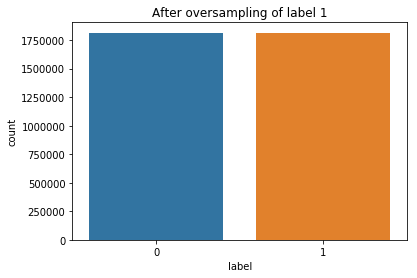
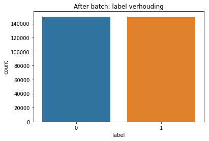
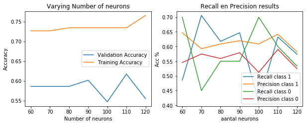
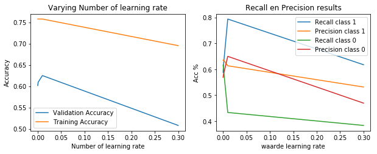
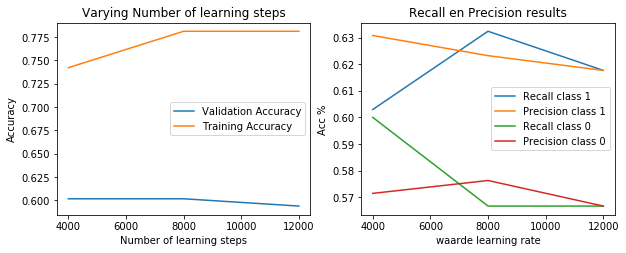

<h1>Phoneme classifier met Bi-Directional LSTM</h1>
<p>(c) Koray</p>
<p>In deze notebook gebruik ik een Bi-d LSTM Classifier om een Phoneme boundary classifier te trainen. Het doel is een hoge percentage validation acc en een recall op class 1.</p>
<p>Het model wordt getraind met verschillende datasets die zijn gegenereerd m.b.v. Phoneme Boundary Generator (CORPUS NL data). De datasets zijn: </p>
<p>- dataset met N milliseconden regio</p>
<p>- dataset met alleen de verschil tussen N milliseconden van links en N milliseconden van rechts per woord.</p>
<br>
<p>De volgende punten komen aanbod:</p>
<p>- Inlezen data</p>
<p>- Oversampling van de data om skewed classes te voorkomen</p>
<p>- Model Selection</p>
<p>- Trainen model</p>
<p>- Evaluatie</p>
<p>- Conclusie</p>


```python
import tensorflow as tf
from tensorflow.contrib import rnn
import numpy as np
import pandas as pd
import seaborn as sns
import matplotlib.pyplot as plt
import os
from sklearn.model_selection import train_test_split

import os, io, wave, csv, json, re, glob
import librosa
import scipy.io.wavfile as wav
from scipy.fftpack import dct
import matplotlib.cm as cm
import matplotlib as mpl

from sklearn.externals import joblib

from sklearn.model_selection import train_test_split
from sklearn.metrics import recall_score
from sklearn.metrics import precision_score

from sklearn.metrics import precision_score, recall_score, f1_score, confusion_matrix, classification_report
```

<h3>Kies een GPU voor de Tensorflow Session</h3>


```python
os.environ["CUDA_VISIBLE_DEVICES"]="1"

config = tf.ConfigProto(device_count = {'GPU': 0})
config.gpu_options.per_process_gpu_memory_fraction = 0.5
config.gpu_options.allow_growth = True
```

<h3>Benodigde methoden</h3>


```python
# Deze methode verricht oversampling
def getBatchData(X_more, y_more, size):
    """
    X_more = de input data
    y_more = de label data
    size = de maximum grootte die je wenst bijv. 300000 data totaal
    """
    
    pos_list = [i for i, x in enumerate(y_more) if x == 1][:int(size/2)]
    neg_list = [i for i, x in enumerate(y_more) if x == 0][:int(size/2)]

    balancedDataX = np.concatenate(([X_more[pos] for pos in pos_list], [X_more[neg] for neg in neg_list]), axis=0)
    
    balancedDataY = np.concatenate(([y_more[pos] for pos in pos_list], [y_more[neg] for neg in neg_list]), axis=0)
        
    return [balancedDataX, balancedDataY]


# Deze methode balanceerd de verhouding tussen 0 en 1 labels. Deze methode doet dus oversampling.
def generateMoreData(dataframe, X, y, label, multiply):
    # EG. 55x6=330
    pos_list = [i for i, x in enumerate(dataframe.label) if x == label]
    
    more_data_x_pos = []

    for x in range(multiply):
        for pos in pos_list:
            more_data_x_pos.append(X[pos])
    
    more_data_y_pos = [1 for i in range(len(more_data_x_pos))]
    
    y = np.concatenate((y, more_data_y_pos), axis=None)

    for x in more_data_x_pos:
        X.append(x)
        
    return [X, y]


# Voor het plotten van de val en train acc resultaten
def plotResult(train_acc, val_acc, num, xlabel, title):
    plt.title(title)
    plt.plot(num, val_acc, label = 'Validation Accuracy')
    plt.plot(num, train_acc, label = 'Training Accuracy')
    plt.legend()
    plt.xlabel(xlabel)
    plt.ylabel('Accuracy')
    plt.show()
    print(f'Max validation acc.: {max(val_acc)}')
    
    
# Voor het plotten van Recall en Precision resultaten
def plotRecallPrecision(recall_scorelist, precision_scorelist, num, title, xlabel):
    recall_1 = list(map(lambda x: x[1], recall_scorelist))
    precision_1 = list(map(lambda x: x[1], precision_scorelist))
    recall_0 = list(map(lambda x: x[0], recall_scorelist))
    precision_0 = list(map(lambda x: x[0], precision_scorelist))
    plt.title(title)
    plt.plot(num, recall_1, label = 'Recall class 1')
    plt.plot(num, precision_1, label = 'Precision class 1')
    plt.plot(num, recall_0, label = 'Recall class 0')
    plt.plot(num, precision_0, label = 'Precision class 0')
    plt.legend()
    plt.xlabel(xlabel)
    plt.ylabel('Acc %')
    plt.show()
    

def plotResults(train_acc, val_acc, num1, recall_scorelist, precision_scorelist, num, xlabel, title1, xlabel2, title2, figsize):
    #     For train and val acc.
    fig = plt.figure(1, figsize=figsize)
    subplot_num = 220
    
    ax1 = fig.add_subplot(subplot_num+1)
    ax1.set_title(title1)
    ax1.plot(num1, val_acc, label = 'Validation Accuracy')
    ax1.plot(num1, train_acc, label = 'Training Accuracy')
    ax1.legend()
    ax1.set_ylabel('Accuracy')
    ax1.set_xlabel(xlabel)
    
    #     For recall and precision.
    ax2 = fig.add_subplot(subplot_num+2)
    
    recall_1 = list(map(lambda x: x[1], recall_scorelist))
    precision_1 = list(map(lambda x: x[1], precision_scorelist))
    recall_0 = list(map(lambda x: x[0], recall_scorelist))
    precision_0 = list(map(lambda x: x[0], precision_scorelist))
    
    ax2.set_title(title2)
    ax2.plot(num, recall_1, label = 'Recall class 1')
    ax2.plot(num, precision_1, label = 'Precision class 1')
    ax2.plot(num, recall_0, label = 'Recall class 0')
    ax2.plot(num, precision_0, label = 'Precision class 0')
    ax2.legend()
    ax2.set_xlabel(xlabel2)
    ax2.set_ylabel('Acc %')
        
#     plt.tight_layout()
    plt.subplots_adjust(top=6, right=4)

    
# Get data from dataframe
def getData(df):
    # Get input
    X = []

    for x in df.region:
        trans = [float(y) for y in x.split('|')]
        X.append(trans)

    # Get labels
    y = [int(x) for x in df.label]
    
    return [X, y]
```

<h3>Inlezen data</h3>
<p>- dataset met N milliseconden regio</p>
<p>- dataset met alleen de verschil tussen N milliseconden van links en N milliseconden van rechts per woord</p>


```python
# Filepath to the dataset csv file.
datasetDir = '/datb/aphasia/languagedata/corpus/dataset/'
```

<p>Hieronder wordt de dataset met N milliseconden regio ingelezen.</p>


```python
df_nondifference = pd.read_csv(datasetDir + 'datasetboundary_10ms_v1.csv', 
                               sep=',', skiprows=1, 
                               names=['region', 'label', 'sample_rate', 'begin', 'end', 'audiopath']).dropna(subset=['region'])

print('Dataset met N milliseconden regio:')
print(df_nondifference.head(11))
```

    Dataset met N milliseconden regio:
                                                   region  label  sample_rate  \
    0   0.45186446629700117|-2.2411709727700626|-4.803...      0        16000   
    1   -0.12845238308858561|1.580986614981171|0.24997...      0        16000   
    2   -0.11602922572367262|-1.2346745188543071|0.756...      0        16000   
    3   -0.09618923144771045|-0.40988938072728764|0.55...      0        16000   
    4   0.024768099066800175|0.71369664198569|-0.13309...      0        16000   
    5   0.1044214207149338|0.898956367962499|1.1497730...      1        16000   
    6   0.08121620572303315|-1.035433675786434|1.50680...      0        16000   
    7   0.08336445623273932|-0.4601872940794867|1.2417...      0        16000   
    8   0.014788770364876313|-0.14207770864079167|1.14...      0        16000   
    9   0.012305554601820746|0.31417087651911013|-0.00...      0        16000   
    10  0.09737044751156035|-0.7906800137754187|-1.803...      0        16000   
    
        begin  end                                          audiopath  
    0     895  905  /datb/aphasia/languagedata/corpus/transform/wa...  
    1     885  895  /datb/aphasia/languagedata/corpus/transform/wa...  
    2     875  885  /datb/aphasia/languagedata/corpus/transform/wa...  
    3     865  875  /datb/aphasia/languagedata/corpus/transform/wa...  
    4     855  865  /datb/aphasia/languagedata/corpus/transform/wa...  
    5     905  915  /datb/aphasia/languagedata/corpus/transform/wa...  
    6     915  925  /datb/aphasia/languagedata/corpus/transform/wa...  
    7     925  935  /datb/aphasia/languagedata/corpus/transform/wa...  
    8     935  945  /datb/aphasia/languagedata/corpus/transform/wa...  
    9     945  955  /datb/aphasia/languagedata/corpus/transform/wa...  
    10    955  965  /datb/aphasia/languagedata/corpus/transform/wa...  


<p>Hieronder wordt de dataset met alleen de verschil tussen N milliseconden van links en N milliseconden van rechts per woord.</p>


```python
df_difference = pd.read_csv(datasetDir + 'datasetboundary_difference_v1.csv', sep=',', skiprows=1, 
                            names=['region', 'label', 'sample_rate', 'begin', 'end', 'audiopath']).dropna(subset=['region'])

print('Dataset met alleen de verschil tussen N milliseconden van links en N milliseconden van rechts per woord:')
print(df_difference.head(11))
```

    Dataset met alleen de verschil tussen N milliseconden van links en N milliseconden van rechts per woord:
                                                   region  label  sample_rate  \
    0   0.36866650181047195|-3.596968847597437|-4.6059...      0        16000   
    1   -0.31153354921552145|3.65936756280274|-0.48901...      0        16000   
    2   0.27301986697927416|-4.077293211282512|3.87560...      0        16000   
    3   -0.08086209394662731|-1.2120730322023252|1.640...      0        16000   
    4   0.1631079235638232|0.5408029547782245|-0.46767...      0        16000   
    5   0.09655880215074149|0.060164999575823|1.667178...      1        16000   
    6   -0.21325791147118736|-0.35849504013023537|2.11...      0        16000   
    7   0.18078562501697065|-0.8526064971178349|1.7536...      0        16000   
    8   -0.16972292026351923|-0.3809575915222724|2.775...      0        16000   
    9   0.10028121640081551|0.22036522357270044|0.8767...      0        16000   
    10  -0.05175431833054417|-0.6277919384862718|-0.07...      0        16000   
    
        begin  end                                          audiopath  
    0     895  905  /datb/aphasia/languagedata/corpus/transform/wa...  
    1     885  895  /datb/aphasia/languagedata/corpus/transform/wa...  
    2     875  885  /datb/aphasia/languagedata/corpus/transform/wa...  
    3     865  875  /datb/aphasia/languagedata/corpus/transform/wa...  
    4     855  865  /datb/aphasia/languagedata/corpus/transform/wa...  
    5     905  915  /datb/aphasia/languagedata/corpus/transform/wa...  
    6     915  925  /datb/aphasia/languagedata/corpus/transform/wa...  
    7     925  935  /datb/aphasia/languagedata/corpus/transform/wa...  
    8     935  945  /datb/aphasia/languagedata/corpus/transform/wa...  
    9     945  955  /datb/aphasia/languagedata/corpus/transform/wa...  
    10    955  965  /datb/aphasia/languagedata/corpus/transform/wa...  


<h1>- Dataset: df_nondifference</h1>

<h2>Oversampling</h2>


```python
fig , ax = plt.subplots(figsize=(6,4))
sns.countplot(x='label', data=df_nondifference)
plt.title("Before oversampling of labels")
plt.show()
```


```python
X, y = getData(df_nondifference)

print(f'X: {len(X)}, y: {len(y)}')
```

    X: 1996212, y: 1996212


<p>Oversampling data</p>


```python
multiply = 9
label = 1

balancedX, balancedY = generateMoreData(df_nondifference, X, y, label, multiply)

print(f'X: {len(balancedX)}, y: {len(balancedY)}')
```

    X: 3629478, y: 3629478


```python
fig , ax = plt.subplots(figsize=(6,4))
sns.countplot(x='label', data=pd.DataFrame({'label':balancedY}))
plt.title(f"After oversampling of label {label}")
```


    Text(0.5, 1.0, 'After oversampling of label 1')





<p>Een batch data gebruiken om een model te testen zodat niet hele dataset wordt gebruikt.</p>


```python
batch_size = 300000

X_batch, y_batch = getBatchData(balancedX, balancedY, batch_size)

print(f'X: {len(X_batch)}, y: {len(y_batch)}')
```

    X: 300000, y: 300000


<p>Een plot van de verhouding van de labels na batchen.</p>


```python
fig , ax = plt.subplots(figsize=(6,4))
sns.countplot(x='label', data=pd.DataFrame({'label':y_batch}))
plt.title(f"After batch: label verhouding")
```


    Text(0.5, 1.0, 'After batch: label verhouding')





<h3>Model selection</h3>
<p>Eerst kijk ik naar welke waarde het beste kan worden gebruikt bij de hyperparameters "num neurons", "learning rate" en "training steps".</p>


```python
N_INSTANCES = len(X_batch)

# One hot encoding for labels
labels_ = np.zeros((N_INSTANCES, 2))
labels_[np.arange(N_INSTANCES), y_batch] = 1

print(labels_.shape)
```

    (300000, 2)


```python
TEST_SIZE = 0.3
RANDOM_STATE = 42

X_train, X_test, y_train, y_test = train_test_split(X_batch, labels_,
                                                    test_size=TEST_SIZE,
                                                    random_state=RANDOM_STATE)
```


```python
print('X_train:{}'.format(X_train.shape))
print('X_test:{}'.format(X_test.shape))
print('y_train:{}'.format(y_train.shape))
print('y_test:{}'.format(y_test.shape))
```

    X_train:(210000, 130)
    X_test:(90000, 130)
    y_train:(210000, 2)
    y_test:(90000, 2)


```python
# Training Parameters
# learning_rate = 0.001
training_steps = 4000
batch_size = 128
display_step = 1
```


```python
# Network Parameters
num_input = 13 # Data input (data shape: 10x13=130) <- 13 MFCCs Coefficients
timesteps = 10 # timesteps <- 10 milliseconden
num_neurons = 70
num_classes = 2
```


```python
# Aantal neurons voor de Classifier
num_neurons = np.arange(60, 130, 10)
train_acc_neuron = np.empty(len(num_neurons))
val_acc_neuron = np.empty(len(num_neurons))
```


```python
# Verschillende learning rate waardes voor de Classifier
num_learningrate = [0.3, 0.01, 0.001, 0.0001]
train_acc_lrate = np.empty(len(num_learningrate))
val_acc_lrate = np.empty(len(num_learningrate))
```


```python
# Aantal trainingsteps voor de Classifier
num_steps_arr = [4000, 8000, 12000]
train_acc_steps = np.empty(len(num_steps_arr))
val_acc_steps = np.empty(len(num_steps_arr))
```


```python
# Voor evalueren Recall score bij verschillende hyperparameter waarden
recall_scorelist = []
precision_scorelist = []
```


```python
hist_train_acc = []
hist_val_acc = []
```


```python
# Alleen voor 1x runnen van de training dus na de model selectie
train_acc = np.empty(1)
val_acc = np.empty(1)
```


```python
def next_batch(num, data, labels):
    '''
    Return a total of `num` random samples and labels. 
    '''
    idx = np.arange(0 , len(data))
    np.random.shuffle(idx)
    idx = idx[:num]
    data_shuffle = [data[ i] for i in idx]
    labels_shuffle = [labels[ i] for i in idx]

    return np.asarray(data_shuffle), np.asarray(labels_shuffle)


def initPlaceholders(timesteps, num_input, num_classes):
    X = tf.placeholder('float', [None, timesteps, num_input])
    Y = tf.placeholder('float', [None, num_classes])
    
    return [X, Y]


def initVariable(num_neurons, num_classes):
    weights = {
        'out': tf.Variable(tf.random_normal([2*num_neurons, num_classes]))
    }

    biases = {
        'out': tf.Variable(tf.random_normal([num_classes]))
    }
    
    return [weights, biases]
    

def BiRNN(x, weights, biases, num_neurons, timesteps):
    # Prepare data shape to match `rnn` function requirements
    # Current data input shape: (batch_size, timesteps, n_input)
    # Required shape: 'timesteps' tensors list of shape (batch_size, num_input)

    # Unstack to get a list of 'timesteps' tensors of shape (batch_size, num_input)
    x = tf.unstack(x, timesteps, 1)
    
    initializer = tf.contrib.layers.xavier_initializer()

    # Define lstm cells with tensorflow
    # Forward direction cell
    lstm_fw_cell = rnn.LSTMCell(num_neurons, forget_bias=1.0, initializer=initializer)
    # Backward direction cell
    lstm_bw_cell = rnn.LSTMCell(num_neurons, forget_bias=1.0, initializer=initializer)

    # Get lstm cell output
    try:
        outputs, _, _ = rnn.static_bidirectional_rnn(lstm_fw_cell, lstm_bw_cell, x, dtype=tf.float32)
    except Exception: # Old TensorFlow version only returns outputs not states
        outputs = rnn.static_bidirectional_rnn(lstm_fw_cell, lstm_bw_cell, x, dtype=tf.float32)

    # Linear activation, using rnn inner loop last output
    return tf.matmul(outputs[-1], weights['out']) + biases['out']


def runSession(index, config, training_steps, batch_size, X_train, y_train, timesteps, num_input, train_op, loss_op, accuracy, logits):
    # Initialize the variables (i.e. assign their default value)
    init = tf.global_variables_initializer()

    # Start training
    with tf.Session(config=config) as sess:

        # Run the initializer
        sess.run(init)

        for step in range(1, training_steps+1):

            batch_x, batch_y = next_batch(batch_size, X_train, y_train)
            
            batch_x = batch_x.reshape((batch_size, timesteps, num_input))

            # Run optimization op (backprop)
            sess.run(train_op, feed_dict={X: batch_x, Y: batch_y})

            if step % display_step == 0 or step == 1:
                # Calculate batch loss and accuracy
                loss, acc = sess.run([loss_op, accuracy], feed_dict={X: batch_x,
                                                                     Y: batch_y})

                hist_train_acc.append(acc)

        # Calculate accuracy for 128 test data
        test_len = 128
        test_data = X_test[:test_len].reshape((-1, timesteps, num_input))
        test_label = y_test[:test_len]
        
        y_p = tf.argmax(logits, 1)
        
        val_accuracy, y_pred = sess.run([accuracy, y_p], feed_dict={X: test_data, Y: test_label})
        y_true = np.argmax(test_label, 1)

        train_acc[index] = max(hist_train_acc)
        val_acc[index] = val_accuracy
        recall_scorelist.append(recall_score(y_true, y_pred, pos_label=1, average=None))
        precision_scorelist.append(precision_score(y_true, y_pred, pos_label=1, average=None))
```


```python
print("In progress..")
for i, k in enumerate(num_learningrate):
    tf.reset_default_graph()
    
    print(f'Iteratie: {i}, learningrate: {k}')
    X, Y = initPlaceholders(timesteps, num_input, num_classes)

    weights, biases = initVariable(num_neurons, num_classes)
    
    logits = BiRNN(X, weights, biases, num_neurons, timesteps)
    
    prediction = tf.nn.softmax(logits)

    # Define loss and optimizer
    loss_op = tf.reduce_mean(tf.nn.softmax_cross_entropy_with_logits(logits=logits, labels=Y))

    optimizer = tf.train.AdamOptimizer(learning_rate=k)

    train_op = optimizer.minimize(loss_op)
    
    # Evaluate model (with test logits, for dropout to be disabled)
    correct_pred = tf.equal(tf.argmax(prediction, 1), tf.argmax(Y, 1))
    accuracy = tf.reduce_mean(tf.cast(correct_pred, tf.float32))
    
    # run and train model
    print("Training model..")
    runSession(i, config, training_steps, batch_size, X_train, y_train, 
               timesteps, num_input, train_op, loss_op, accuracy, logits)
    
print("Finished")
```

    In progress..
    Iteratie: 0, learningrate: 0.3
    Training model..
    Iteratie: 1, learningrate: 0.01
    Training model..
    Iteratie: 2, learningrate: 0.001
    Training model..
    Iteratie: 3, learningrate: 0.0001
    Training model..
    Finished


<p>Hier kijk ik naar welke waarde voor de hyperparameter "num neurons" beste resultaat geeft.</p>


```python
plotResults(train_acc_neuron, val_acc_neuron, num_neurons,
                    recall_scorelist, precision_scorelist, num_neurons, 
                    'Number of neurons', 'Varying Number of neurons', 
                    'aantal neurons', 'Recall en Precision results', (2,1))

print('In deze plots kunnen we zien dat de Recall bij 70 neurons het hoogst is bij class 1 en laagst bij class 0.')
print('In de linker plot zien we dat we te maken hebben met overfitting na 60 neurons.')
print('Aangezien de focus op class 1 ligt is 70 neurons interessant.')
```

    In deze plots kunnen we zien dat de Recall bij 70 neurons het hoogst is bij class 1 en laagst bij class 0.
    In de linker plot zien we dat we te maken hebben met overfitting na 60 neurons.
    Aangezien de focus op class 1 ligt is 70 neurons interessant.





<p>Hier kijk ik naar welke waarde voor de hyperparameter "learning rate" beste resultaat geeft.</p>


```python
plotResults(train_acc_lrate, val_acc_lrate, num_learningrate,
                    recall_scorelist, precision_scorelist, num_learningrate, 
                    'Number of learning rate', 'Varying Number of learning rate', 
                    'waarde learning rate', 'Recall en Precision results', (2,1))

print('In de plot van learning rate kunnen we zien dat de validation accuracy en Recall score bij class 1 \
omlaag gaat bij hoger learning rate.')
```

    In de plot van learning rate kunnen we zien dat de validation accuracy en Recall score bij class 1 omlaag gaat bij hoger learning rate.





<p>Hier kijk ik naar de aantal training steps voor een beste resultaat.</p>


```python
plotResults(train_acc_steps, val_acc_steps, num_steps_arr,
                    recall_scorelist, precision_scorelist, num_steps_arr, 
                    'Number of learning steps', 'Varying Number of learning steps', 
                    'waarde learning rate', 'Recall en Precision results', (2,1))

print('In de plot van learning steps kunnen we zien dat de validation accuracy en Recall score bij class 1 \
het hoogst is bij circa 8200 learning steps.')
```

    In de plot van learning steps kunnen we zien dat de validation accuracy en Recall score bij class 1 het hoogst is bij circa 8200 learning steps.





<h3>Trainen model</h3>
<p>Van de resultaten hierboven zien we dat 70 neurons met 8200 learning steps hoogste Recall score geeft op class 1. Deze waardes  gaan we gebruiken om een Bi-LSTM classifier te trainen.</p>


```python
# Delete unwanted element
indexToDelete = 640417
print(len(balancedX))
print(len(balancedY))

balancedX.pop(indexToDelete)
balancedY = np.delete(balancedY, indexToDelete, 0)

print(len(balancedX))
print(len(balancedY))
```

    3629478
    3629478
    3629477
    3629477


<p>Initialiseer one hot encoding</p>


```python
<p>Initialiseer split</p>X_arr = np.array(balancedX)
Y_arr = np.array(balancedY)

N_INSTANCES = len(X_arr)

# One hot encoding for labels
labels_ = np.zeros((N_INSTANCES, 2))
labels_[np.arange(N_INSTANCES), Y_arr] = 1

print(labels_.shape)
```

    (3629477, 2)


<p>Initialiseer split</p>


```python
<h3>Initialiseer split</h3>TEST_SIZE = 0.3
RANDOM_STATE = 42

X_train, X_test, y_train, y_test = train_test_split(X_arr, labels_,
                                                    test_size=TEST_SIZE,
                                                    random_state=RANDOM_STATE)
```


```python
print('X_train:{}'.format(X_train.shape))
print('X_test:{}'.format(X_test.shape))
print('y_train:{}'.format(y_train.shape))
print('y_test:{}'.format(y_test.shape))
```

    X_train:(2540633, 130)
    X_test:(1088844, 130)
    y_train:(2540633, 2)
    y_test:(1088844, 2)


```python
# Training Parameters
learning_rate = 0.001
training_steps = 8200
batch_size = 128
display_step = 1
```


```python
# Network Parameters
num_input = 13
timesteps = 10
num_neurons = 70
num_classes = 2
```


```python
print("In progress..")
for i in range(0,1):
    tf.reset_default_graph()
    
    X, Y = initPlaceholders(timesteps, num_input, num_classes)

    weights, biases = initVariable(num_neurons, num_classes)
    
    logits = BiRNN(X, weights, biases, num_neurons, timesteps)
    
    prediction = tf.nn.softmax(logits)

    # Define loss and optimizer
    loss_op = tf.reduce_mean(tf.nn.softmax_cross_entropy_with_logits(logits=logits, labels=Y))

    optimizer = tf.train.AdamOptimizer(learning_rate=learning_rate)

    train_op = optimizer.minimize(loss_op)
    
    # Evaluate model (with test logits, for dropout to be disabled)
    correct_pred = tf.equal(tf.argmax(prediction, 1), tf.argmax(Y, 1))
    accuracy = tf.reduce_mean(tf.cast(correct_pred, tf.float32))
    
    # run and train model
    print("Training model..")
    runSession(i, config, training_steps, batch_size, X_train, y_train, 
               timesteps, num_input, train_op, loss_op, accuracy, logits)
    
print("Finished")
```

    In progress..
    Training model..
    Finished


<h3>Evaluatie</h3>
<p>Hier wordt gekeken naar de train, validation score, Precision en Recall. Bij de evaluatie is het van belang dat class 1 een hoge Recall score geeft. In iedergeval hoger dan class 0.</p>


```python
print(f'Training acc. {train_acc}')
print(f'Validation acc. {val_acc}')
print('---------------------------')
print(f'Recall score [class 1]: {recall_scorelist[0][1]}')
print(f'Precision score [class 1]: {precision_scorelist[0][1]}')
```

    Training acc. [0.7734375]
    Validation acc. [0.5390625]
    ---------------------------
    Recall score [class 1]: 0.7169811320754716
    Precision score [class 1]: 0.4634146341463415


<h1>- Dataset: df_difference</h1>
<p>Hier voeren we hetzelfde proces uit als met de dataset "df_nondifference" maar dan trainen we een MLP met de dataset "df_difference".</p>

<h3>Oversampling</h3>


```python
fig , ax = plt.subplots(figsize=(6,4))
sns.countplot(x='label', data=df_difference)
plt.title("Before oversampling of labels")
plt.show()
```


```python
X_diff, y_diff = getData(df_difference)
print(f'X: {len(X_diff)}, y: {len(y_diff)}')
```

    X: 1996202, y: 1996202


<p>Oversampling data</p>


```python
multiply = 9
label = 1

balancedX_diff, balancedY_diff = generateMoreData(df_difference, X_diff, y_diff, label, multiply)

print(f'X: {len(balancedX_diff)}, y: {len(balancedY_diff)}')
```

    X: 3629459, y: 3629459


```python
fig , ax = plt.subplots(figsize=(6,4))
sns.countplot(x='label', data=pd.DataFrame({'label':balancedY_diff}))
plt.title(f"After oversampling of label {label}")
```


    Text(0.5, 1.0, 'After oversampling of label 1')


<p>Initialiseer one hot encoding</p>


```python
X_arr = np.array(balancedX_diff)
Y_arr = np.array(balancedY_diff)

N_INSTANCES = len(X_arr)

# One hot encoding for labels
labels_ = np.zeros((N_INSTANCES, 2))
labels_[np.arange(N_INSTANCES), Y_arr] = 1

print(labels_.shape)
```

    (3629459, 2)


<p>Initialiseer split</p>


```python
TEST_SIZE = 0.3
RANDOM_STATE = 42

X_train, X_test, y_train, y_test = train_test_split(X_arr, labels_,
                                                    test_size=TEST_SIZE,
                                                    random_state=RANDOM_STATE)
```


```python
print('X_train:{}'.format(X_train.shape))
print('X_test:{}'.format(X_test.shape))
print('y_train:{}'.format(y_train.shape))
print('y_test:{}'.format(y_test.shape))
```

    X_train:(2540621, 65)
    X_test:(1088838, 65)
    y_train:(2540621, 2)
    y_test:(1088838, 2)


<h3>Trainen model</h3>


```python
# Training Parameters
learning_rate = 0.001
training_steps = 8200
batch_size = 128
display_step = 1
```


```python
# Network Parameters
num_input = 13
timesteps = 5
num_neurons = 70
num_classes = 2
```


```python
print("In progress..")
for i in range(0,1):
    tf.reset_default_graph()
    
    X, Y = initPlaceholders(timesteps, num_input, num_classes)

    weights, biases = initVariable(num_neurons, num_classes)
    
    logits = BiRNN(X, weights, biases, num_neurons, timesteps)
    
    prediction = tf.nn.softmax(logits)

    # Define loss and optimizer
    loss_op = tf.reduce_mean(tf.nn.softmax_cross_entropy_with_logits(logits=logits, labels=Y))

    optimizer = tf.train.AdamOptimizer(learning_rate=learning_rate)

    train_op = optimizer.minimize(loss_op)
    
    # Evaluate model (with test logits, for dropout to be disabled)
    correct_pred = tf.equal(tf.argmax(prediction, 1), tf.argmax(Y, 1))
    accuracy = tf.reduce_mean(tf.cast(correct_pred, tf.float32))
    
    # run and train model
    print("Training model..")
    runSession(i, config, training_steps, batch_size, X_train, y_train, 
               timesteps, num_input, train_op, loss_op, accuracy, logits)
    
print("Finished")
```

    In progress..
    Training model..
    Finished


<h3>Evaluatie</h3>
<p>Hier wordt gekeken naar de train, validation score, Precision en Recall. Bij de evaluatie is het van belang dat class 1 een hoge Recall score geeft. In iedergeval hoger dan class 0.</p>


```python
print(f'Training acc. {train_acc}')
print(f'Validation acc. {val_acc}')
print('---------------------------')
print(f'Recall score [class 1]: {recall_scorelist[0][1]}')
print(f'Precision score [class 1]: {precision_scorelist[0][1]}')
```

    Training acc. [0.7109375]
    Validation acc. [0.546875]
    ---------------------------
    Recall score [class 1]: 0.45454545454545453
    Precision score [class 1]: 0.5769230769230769


<h3>Conclusie</h3>
<p>Uit deze resultaten zien we dat de dataset zonder verschil dus "df_nondifference" met Bi-LSTM een vergelijkbaar validation acc geeft en een hoger RECALL score op class 1 dan bij de dataset met verschil "df_difference".</p>
