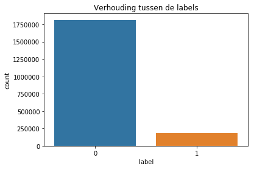

<h1>Phoneme boundary data generator V3</h1>
<p>(c) Koray </p>
<p>Deze algoritme gebruikt de CORPUS NL data collectie voor het genereren van dataset om een phoneme boundary classifier te kunnen trainen. Deze versie van de generator slaat alleen de verschillen in de subregions op in de dataset. Uiteraard worden ze eerst omgezet naar MFCCs voordat hij begint met het genereren van data. Dit doe ik om te zien of de Recall score beter wordt.</p>


```python
import os, io, wave, csv, json, re, glob
import librosa
import numpy as np
import seaborn as sns
import pandas as pd
import matplotlib.pyplot as plt
import scipy.io.wavfile as wav
from scipy.fftpack import dct
import matplotlib.cm as cm
import matplotlib as mpl
from pydub import AudioSegment

from python_speech_features import mfcc
from python_speech_features import delta
from python_speech_features import logfbank
from python_speech_features import get_filterbanks
from python_speech_features import fbank
```

<h3>Benodigde methoden</h3>
<p>Deze methoden zijn van belang voor het uitvoeren van het proces. Elke methode heeft een eigen beschrijving van zijn functie.</p>


```python
# Voor het inlezen van bestanden uit een map.
def getFiles(folderpath, amount=None):
    files = glob.glob(folderpath + '*')
    size = len(files)
    return files[0:amount if amount is not None else size]


# Voor het krijgen van de juiste sample tijd
def getTime(seconds, sample_rate):
    return int(seconds * sample_rate)


# Methode om het verschil van twee subregions terug te geven
def getDifferences(region, frame_size):
    sub_frame = int(frame_size/2)
    return region[0:sub_frame] - region[sub_frame:frame_size]


# Methode om de features van de verschil van de subregios uit de regios te kunnen krijgen.
def getRegionsFeaturesDifference(features_mfcc, side, boundary, frame_size, times):
    leftRegion = []
    rightRegion = []

    if 'L' in side:
        for walk in range(0, times):
            frame = boundary - (frame_size * walk)
            left = frame - frame_size
            right = frame
            differenceRegion = getDifferences(features_mfcc[left:right], frame_size)
            leftRegion.append([differenceRegion, left, right])

    if 'R' in side:
        for walk in range(0, times):
            frame = boundary + (frame_size * walk)
            left = frame
            right = frame + frame_size
            differenceRegion = getDifferences(features_mfcc[left:right], frame_size)
            rightRegion.append([differenceRegion, left, right])

    return leftRegion if 'L' in side else rightRegion


# Voor het exporteren van een data naar een CSV bestand.
def exportDataCSV(region, label, sample_rate, audiopath, writer):
    regionFeatures = '|'.join(['{:}'.format(x) for x in region[0].flatten()])
    writer.writerow({'region': regionFeatures, 'label': label, 'sample_rate': sample_rate, 
                     'begin':region[1], 'end':region[2], 'audiopath':audiopath})


# Voor het exporteren van data naar een CSV bestand.
def exportDatasCSV(regions, label, sample_rate, audiopath, writer):
    for region in regions:
        exportDataCSV(region, label, sample_rate, audiopath, writer)
```


```python
# Voor het krijgen van features van een audio signaal
def getSignalMFCC(signal, sample_rate):
    mfcc_feat = mfcc(signal, sample_rate, winlen=0.010, winstep=0.001, nfft=512, ceplifter=22)
    return delta(mfcc_feat, 2)


# Een aangepaste variant van de MFCC methode waar de lifter methode niet wordt toegepast.
def getAdjustedMFCC(signal,samplerate=16000,winlen=0.010,winstep=0.001,numcep=13,
         nfilt=26,nfft=1024,lowfreq=0,highfreq=None,preemph=0.97,ceplifter=22,appendEnergy=True,
         winfunc=lambda x:np.ones((x,))):

    feat,energy = fbank(signal,samplerate,winlen,winstep,nfilt,nfft,lowfreq,highfreq,preemph,winfunc)
    feat = np.log(feat)
    feat = dct(feat, type=2, axis=1, norm='ortho')[:,:numcep]
#     feat = lifter(feat,ceplifter)
    if appendEnergy: feat[:,0] = np.log(energy)
    return feat


# Voor het krijgen van tijdsduur van een signaal
def getAudioDuration(signal, sample_rate):
    return signal.shape[0] / float(sample_rate)
```


```python
# Waar de dataset opgeslagen moet worden
datasetDir = '/datb/aphasia/languagedata/corpus/dataset/'

# Waar de bestanden die nodig zijn voor de generator zijn opgeslagen
folderpath = '/datb/aphasia/languagedata/corpus/final/'
```

<h3>De generator stap</h3>
<p>Hier wordt de generator uitgevoerd.</p>


```python
# Get all csv files
files = getFiles(folderpath)

multiply_ms = int(1000)
subRegion = int(10)
tsubRegion = int(subRegion / 2)
size_region = 5

# Save dataset in a csv file
with open(datasetDir + 'datasetboundary_difference_v1.csv', 'w') as toWrite:

    fieldnames = ['region', 'label', 'sample_rate', 'begin', 'end', 'audiopath']
    writer = csv.DictWriter(toWrite, fieldnames=fieldnames, quoting=csv.QUOTE_ALL, delimiter=',')

    writer.writeheader()

    for x in range(0, len(files)):

        filedict = readDict(files[x])
        audiopath = filedict[0]['audiopath']
        
#       Read audio
        sample_rate, audio = wav.read(audiopath)
        
#       Transform audio to mfcc to get features
        features_mfcc = getSignalMFCC(audio, sample_rate)

        count = 1
        while count < len(filedict):
            # Get prev and current word element
            prevW = filedict[count - 1]
            currW = filedict[count]
            
            # Get prev end-time and current begin-time
            boundaryL = int(float(prevW['end']) * multiply_ms)
            boundaryR = int(float(currW['begin']) * multiply_ms)
            
            try:
    #           # Get (true) left and right subregion frames
                tsubRegionL = features_mfcc[boundaryL-tsubRegion:boundaryL]
                tsubRegionR = features_mfcc[boundaryR:boundaryR + tsubRegion]

    #           # Get difference of (false) subregions from left and right
                nRegionLfeatures = getRegionsFeaturesDifference(features_mfcc, 'L', boundaryL - tsubRegion, subRegion, size_region)
                nRegionRfeatures = getRegionsFeaturesDifference(features_mfcc, 'R', boundaryR + tsubRegion, subRegion, size_region)            

                # Difference (true) left subregion and right subregion to ONE True region
                tRegionFeatures = tsubRegionL - tsubRegionR

                tRegionFeatures = [tRegionFeatures, int(boundaryL-tsubRegion), int(boundaryR+tsubRegion)]

    #           # Export to CSV
                exportDatasCSV(nRegionLfeatures, 0, sample_rate, audiopath, writer)

                exportDataCSV(tRegionFeatures, 1, sample_rate, audiopath, writer)

                exportDatasCSV(nRegionRfeatures, 0, sample_rate, audiopath, writer)
            
            except ValueError:
                print('Audiopath: {}'.format(audiopath))

            count += 1

print('finished')
```

    /datb/aphasia/languagedata/corpus/final/fn004915.csv
    Audio duration: 16.1256875, rate:16000
    /datb/aphasia/languagedata/corpus/final/fn002854.csv
    Audio duration: 19.5649375, rate:16000
    /datb/aphasia/languagedata/corpus/final/fn002059.csv
    Audio duration: 18.4049375, rate:16000
    /datb/aphasia/languagedata/corpus/final/fn003438.csv
    Audio duration: 20.1878125, rate:16000
    /datb/aphasia/languagedata/corpus/final/fn006104.csv
    Audio duration: 16.7724375, rate:16000
    /datb/aphasia/languagedata/corpus/final/fn007102.csv
    Audio duration: 316.1926875, rate:16000
    /datb/aphasia/languagedata/corpus/final/fn004375.csv
    Audio duration: 32.8996875, rate:16000
    /datb/aphasia/languagedata/corpus/final/fn000095.csv
    Audio duration: 915.98225, rate:16000
    /datb/aphasia/languagedata/corpus/final/fn004851.csv
    Audio duration: 15.8928125, rate:16000
    /datb/aphasia/languagedata/corpus/final/fn007146.csv
    Audio duration: 310.12575, rate:16000
    /datb/aphasia/languagedata/corpus/final/fn001679.csv
    Audio duration: 19.0458125, rate:16000
    /datb/aphasia/languagedata/corpus/final/fn001025.csv
    Audio duration: 238.968375, rate:16000
    /datb/aphasia/languagedata/corpus/final/fn003585.csv
    Audio duration: 21.06625, rate:16000
    /datb/aphasia/languagedata/corpus/final/fn006090.csv
    Audio duration: 12.414625, rate:16000
    /datb/aphasia/languagedata/corpus/final/fn001538.csv
    Audio duration: 241.7045, rate:16000
    /datb/aphasia/languagedata/corpus/final/fn002034.csv
    Audio duration: 18.947875, rate:16000
    /datb/aphasia/languagedata/corpus/final/fn005083.csv
    Audio duration: 18.447125, rate:16000
    /datb/aphasia/languagedata/corpus/final/fn009113.csv
    Audio duration: 606.577, rate:16000
    /datb/aphasia/languagedata/corpus/final/fn001300.csv
    Audio duration: 239.8675, rate:16000
    /datb/aphasia/languagedata/corpus/final/fn004234.csv
    Audio duration: 18.0405, rate:16000
    /datb/aphasia/languagedata/corpus/final/fn005290.csv
    Audio duration: 18.80525, rate:16000
    /datb/aphasia/languagedata/corpus/final/fn001663.csv
    Audio duration: 12.32125, rate:16000
    /datb/aphasia/languagedata/corpus/final/fn001485.csv
    Audio duration: 240.10425, rate:16000
    /datb/aphasia/languagedata/corpus/final/fn006345.csv
    Audio duration: 22.011625, rate:16000
    /datb/aphasia/languagedata/corpus/final/fn002676.csv
    Audio duration: 19.805, rate:16000
    /datb/aphasia/languagedata/corpus/final/fn001039.csv
    Audio duration: 229.9753125, rate:16000
    /datb/aphasia/languagedata/corpus/final/fn006078.csv
    Audio duration: 17.925, rate:16000
    /datb/aphasia/languagedata/corpus/final/fn001925.csv
    Audio duration: 19.3470625, rate:16000
    /datb/aphasia/languagedata/corpus/final/fn007158.csv
    Audio duration: 55.786625, rate:16000
    /datb/aphasia/languagedata/corpus/final/fn001358.csv
    Audio duration: 242.9263125, rate:16000
    /datb/aphasia/languagedata/corpus/final/fn006029.csv
    Audio duration: 25.965, rate:16000
    /datb/aphasia/languagedata/corpus/final/fn007254.csv
    Audio duration: 173.2963125, rate:16000
    /datb/aphasia/languagedata/corpus/final/fn003022.csv
    Audio duration: 18.6166875, rate:16000
    /datb/aphasia/languagedata/corpus/final/fn005607.csv
    Audio duration: 17.0200625, rate:16000
    /datb/aphasia/languagedata/corpus/final/fn006396.csv
    Audio duration: 18.7261875, rate:16000
    /datb/aphasia/languagedata/corpus/final/fn001601.csv
    Audio duration: 20.4340625, rate:16000
    /datb/aphasia/languagedata/corpus/final/fn001304.csv
    Audio duration: 243.3814375, rate:16000
    /datb/aphasia/languagedata/corpus/final/fn007129.csv
    Audio duration: 164.2681875, rate:16000
    /datb/aphasia/languagedata/corpus/final/fn004722.csv
    Audio duration: 19.7493125, rate:16000
    /datb/aphasia/languagedata/corpus/final/fn001805.csv
    Audio duration: 24.3238125, rate:16000
    /datb/aphasia/languagedata/corpus/final/fn005567.csv
    Audio duration: 18.933, rate:16000
    /datb/aphasia/languagedata/corpus/final/fn006221.csv
    Audio duration: 15.7386875, rate:16000
    /datb/aphasia/languagedata/corpus/final/fn003577.csv
    Audio duration: 18.0518125, rate:16000
    /datb/aphasia/languagedata/corpus/final/fn005334.csv
    Audio duration: 19.9425, rate:16000
    /datb/aphasia/languagedata/corpus/final/fn002067.csv
    Audio duration: 13.505125, rate:16000
    /datb/aphasia/languagedata/corpus/final/fn007193.csv
    Audio duration: 136.301125, rate:16000
    /datb/aphasia/languagedata/corpus/final/fn006100.csv
    Audio duration: 16.4168125, rate:16000
    /datb/aphasia/languagedata/corpus/final/fn004914.csv
    Audio duration: 18.66475, rate:16000
    /datb/aphasia/languagedata/corpus/final/fn002070.csv
    Audio duration: 20.82325, rate:16000
    /datb/aphasia/languagedata/corpus/final/fn001473.csv
    Audio duration: 240.7469375, rate:16000
    /datb/aphasia/languagedata/corpus/final/fn007215.csv
    Audio duration: 342.3695, rate:16000
    /datb/aphasia/languagedata/corpus/final/fn002066.csv
    Audio duration: 18.734, rate:16000
    /datb/aphasia/languagedata/corpus/final/fn003406.csv
    Audio duration: 21.6145625, rate:16000
    /datb/aphasia/languagedata/corpus/final/fn005410.csv
    Audio duration: 18.39575, rate:16000
    /datb/aphasia/languagedata/corpus/final/fn001942.csv
    Audio duration: 20.8468125, rate:16000
    /datb/aphasia/languagedata/corpus/final/fn003181.csv
    Audio duration: 11.592625, rate:16000
    /datb/aphasia/languagedata/corpus/final/fn006425.csv
    Audio duration: 17.836625, rate:16000
    /datb/aphasia/languagedata/corpus/final/fn004184.csv
    Audio duration: 18.7609375, rate:16000
    /datb/aphasia/languagedata/corpus/final/fn002069.csv
    Audio duration: 13.1940625, rate:16000
    /datb/aphasia/languagedata/corpus/final/fn003480.csv
    Audio duration: 17.27125, rate:16000
    /datb/aphasia/languagedata/corpus/final/fn002118.csv
    Audio duration: 16.4875625, rate:16000
    /datb/aphasia/languagedata/corpus/final/fn001536.csv
    Audio duration: 238.6384375, rate:16000
    /datb/aphasia/languagedata/corpus/final/fn001769.csv
    Audio duration: 18.9879375, rate:16000
    /datb/aphasia/languagedata/corpus/final/fn005029.csv
    Audio duration: 18.627875, rate:16000
    /datb/aphasia/languagedata/corpus/final/fn002094.csv
    Audio duration: 15.57975, rate:16000
    /datb/aphasia/languagedata/corpus/final/fn006239.csv
    Audio duration: 37.839, rate:16000
    /datb/aphasia/languagedata/corpus/final/fn005247.csv
    Audio duration: 17.725625, rate:16000
    /datb/aphasia/languagedata/corpus/final/fn001076.csv
    Audio duration: 225.4915, rate:16000
    /datb/aphasia/languagedata/corpus/final/fn006077.csv
    Audio duration: 22.962375, rate:16000
    /datb/aphasia/languagedata/corpus/final/fn007139.csv
    Audio duration: 201.061625, rate:16000
    /datb/aphasia/languagedata/corpus/final/fn001639.csv
    Audio duration: 12.0055, rate:16000
    /datb/aphasia/languagedata/corpus/final/fn002068.csv
    Audio duration: 23.1888125, rate:16000
    /datb/aphasia/languagedata/corpus/final/fn001271.csv
    Audio duration: 230.597625, rate:16000
    /datb/aphasia/languagedata/corpus/final/fn004477.csv
    Audio duration: 18.4899375, rate:16000
    /datb/aphasia/languagedata/corpus/final/fn009109.csv
    Audio duration: 559.0995625, rate:16000
    /datb/aphasia/languagedata/corpus/final/fn001505.csv
    Audio duration: 238.3045, rate:16000
    /datb/aphasia/languagedata/corpus/final/fn003221.csv
    Audio duration: 19.9253125, rate:16000
    /datb/aphasia/languagedata/corpus/final/fn001126.csv
    Audio duration: 234.2413125, rate:16000
    /datb/aphasia/languagedata/corpus/final/fn003462.csv
    Audio duration: 20.8475625, rate:16000
    /datb/aphasia/languagedata/corpus/final/fn007288.csv
    Audio duration: 197.4704375, rate:16000
    /datb/aphasia/languagedata/corpus/final/fn004336.csv
    Audio duration: 19.3300625, rate:16000
    /datb/aphasia/languagedata/corpus/final/fn003814.csv
    Audio duration: 16.806375, rate:16000
    /datb/aphasia/languagedata/corpus/final/fn001931.csv
    Audio duration: 18.3154375, rate:16000
    /datb/aphasia/languagedata/corpus/final/fn009099.csv
    Audio duration: 595.674625, rate:16000
    /datb/aphasia/languagedata/corpus/final/fn004476.csv
    Audio duration: 16.1595, rate:16000
    /datb/aphasia/languagedata/corpus/final/fn004800.csv
    Audio duration: 22.931125, rate:16000
    /datb/aphasia/languagedata/corpus/final/fn004728.csv
    Audio duration: 18.0934375, rate:16000
    /datb/aphasia/languagedata/corpus/final/fn001015.csv
    Audio duration: 229.17375, rate:16000
    /datb/aphasia/languagedata/corpus/final/fn000927.csv
    Audio duration: 566.646375, rate:16000
    /datb/aphasia/languagedata/corpus/final/fn007359.csv
    Audio duration: 305.7458125, rate:16000
    /datb/aphasia/languagedata/corpus/final/fn005734.csv
    Audio duration: 14.067625, rate:16000
    /datb/aphasia/languagedata/corpus/final/fn001800.csv
    Audio duration: 21.9818125, rate:16000
    /datb/aphasia/languagedata/corpus/final/fn004608.csv
    Audio duration: 18.4031875, rate:16000
    /datb/aphasia/languagedata/corpus/final/fn005207.csv
    Audio duration: 18.4365, rate:16000
    /datb/aphasia/languagedata/corpus/final/fn004576.csv
    Audio duration: 19.575875, rate:16000
    /datb/aphasia/languagedata/corpus/final/fn007119.csv
    Audio duration: 256.186375, rate:16000
    /datb/aphasia/languagedata/corpus/final/fn001384.csv
    Audio duration: 242.707375, rate:16000
    /datb/aphasia/languagedata/corpus/final/fn001735.csv
    Audio duration: 15.1365, rate:16000
    /datb/aphasia/languagedata/corpus/final/fn004232.csv
    Audio duration: 19.8445625, rate:16000
    /datb/aphasia/languagedata/corpus/final/fn003721.csv
    Audio duration: 20.3479375, rate:16000
    /datb/aphasia/languagedata/corpus/final/fn002142.csv
    Audio duration: 18.4171875, rate:16000
    /datb/aphasia/languagedata/corpus/final/fn001655.csv
    Audio duration: 16.0545625, rate:16000
    /datb/aphasia/languagedata/corpus/final/fn007250.csv
    Audio duration: 348.200625, rate:16000
    /datb/aphasia/languagedata/corpus/final/fn004957.csv
    Audio duration: 23.01825, rate:16000
    /datb/aphasia/languagedata/corpus/final/fn003740.csv
    Audio duration: 23.1930625, rate:16000
    /datb/aphasia/languagedata/corpus/final/fn005443.csv
    Audio duration: 20.6309375, rate:16000
    /datb/aphasia/languagedata/corpus/final/fn001023.csv
    Audio duration: 229.7945, rate:16000
    /datb/aphasia/languagedata/corpus/final/fn007121.csv
    Audio duration: 487.17425, rate:16000
    /datb/aphasia/languagedata/corpus/final/fn006009.csv
    Audio duration: 18.178625, rate:16000
    /datb/aphasia/languagedata/corpus/final/fn009129.csv
    Audio duration: 597.7949375, rate:16000
    /datb/aphasia/languagedata/corpus/final/fn006130.csv
    Audio duration: 20.1745, rate:16000
    /datb/aphasia/languagedata/corpus/final/fn003849.csv
    Audio duration: 18.8896875, rate:16000
    /datb/aphasia/languagedata/corpus/final/fn007122.csv
    Audio duration: 529.49075, rate:16000
    /datb/aphasia/languagedata/corpus/final/fn001180.csv
    Audio duration: 232.581625, rate:16000
    /datb/aphasia/languagedata/corpus/final/fn007152.csv
    Audio duration: 313.2836875, rate:16000
    /datb/aphasia/languagedata/corpus/final/fn001534.csv
    Audio duration: 240.0938125, rate:16000
    /datb/aphasia/languagedata/corpus/final/fn001085.csv
    Audio duration: 246.50375, rate:16000
    /datb/aphasia/languagedata/corpus/final/fn002689.csv
    Audio duration: 20.219625, rate:16000
    /datb/aphasia/languagedata/corpus/final/fn000115.csv
    Audio duration: 593.77375, rate:16000
    /datb/aphasia/languagedata/corpus/final/fn001840.csv
    Audio duration: 13.064625, rate:16000
    /datb/aphasia/languagedata/corpus/final/fn007290.csv
    Audio duration: 396.0859375, rate:16000
    /datb/aphasia/languagedata/corpus/final/fn003817.csv
    Audio duration: 18.29425, rate:16000
    /datb/aphasia/languagedata/corpus/final/fn002057.csv
    Audio duration: 19.239125, rate:16000
    /datb/aphasia/languagedata/corpus/final/fn004577.csv
    Audio duration: 20.2066875, rate:16000
    /datb/aphasia/languagedata/corpus/final/fn004837.csv
    Audio duration: 14.00975, rate:16000
    /datb/aphasia/languagedata/corpus/final/fn005360.csv
    Audio duration: 24.651875, rate:16000
    /datb/aphasia/languagedata/corpus/final/fn003776.csv
    Audio duration: 20.88225, rate:16000
    /datb/aphasia/languagedata/corpus/final/fn005677.csv
    Audio duration: 19.6465625, rate:16000
    /datb/aphasia/languagedata/corpus/final/fn001475.csv
    Audio duration: 240.8218125, rate:16000
    /datb/aphasia/languagedata/corpus/final/fn005704.csv
    Audio duration: 17.8166875, rate:16000
    /datb/aphasia/languagedata/corpus/final/fn001520.csv
    Audio duration: 238.656625, rate:16000
    /datb/aphasia/languagedata/corpus/final/fn000106.csv
    Audio duration: 945.253625, rate:16000
    /datb/aphasia/languagedata/corpus/final/fn003306.csv
    Audio duration: 14.9315625, rate:16000
    /datb/aphasia/languagedata/corpus/final/fn005994.csv
    Audio duration: 18.7825625, rate:16000
    /datb/aphasia/languagedata/corpus/final/fn001685.csv
    Audio duration: 16.81175, rate:16000
    /datb/aphasia/languagedata/corpus/final/fn002792.csv
    Audio duration: 19.6008125, rate:16000
    /datb/aphasia/languagedata/corpus/final/fn004449.csv
    Audio duration: 17.205125, rate:16000
    /datb/aphasia/languagedata/corpus/final/fn000045.csv
    Audio duration: 244.453375, rate:16000
    /datb/aphasia/languagedata/corpus/final/fn001917.csv
    Audio duration: 17.49275, rate:16000
    /datb/aphasia/languagedata/corpus/final/fn001829.csv
    Audio duration: 14.3286875, rate:16000
    /datb/aphasia/languagedata/corpus/final/fn001261.csv
    Audio duration: 238.3586875, rate:16000
    /datb/aphasia/languagedata/corpus/final/fn003790.csv
    Audio duration: 18.913125, rate:16000
    /datb/aphasia/languagedata/corpus/final/fn006456.csv
    Audio duration: 19.8264375, rate:16000
    /datb/aphasia/languagedata/corpus/final/fn003349.csv
    Audio duration: 18.263125, rate:16000
    /datb/aphasia/languagedata/corpus/final/fn001938.csv
    Audio duration: 22.576875, rate:16000
    /datb/aphasia/languagedata/corpus/final/fn003476.csv
    Audio duration: 22.7655625, rate:16000
    /datb/aphasia/languagedata/corpus/final/fn002107.csv
    Audio duration: 18.6026875, rate:16000
    /datb/aphasia/languagedata/corpus/final/fn007130.csv
    Audio duration: 343.3919375, rate:16000
    /datb/aphasia/languagedata/corpus/final/fn001381.csv
    Audio duration: 236.2258125, rate:16000
    /datb/aphasia/languagedata/corpus/final/fn001452.csv
    Audio duration: 239.86775, rate:16000
    /datb/aphasia/languagedata/corpus/final/fn001150.csv
    Audio duration: 241.0986875, rate:16000
    /datb/aphasia/languagedata/corpus/final/fn000869.csv
    Audio duration: 599.4646875, rate:16000
    /datb/aphasia/languagedata/corpus/final/fn004484.csv
    Audio duration: 19.3788125, rate:16000
    /datb/aphasia/languagedata/corpus/final/fn001297.csv
    Audio duration: 238.433875, rate:16000
    /datb/aphasia/languagedata/corpus/final/fn001436.csv
    Audio duration: 236.05375, rate:16000
    /datb/aphasia/languagedata/corpus/final/fn003760.csv
    Audio duration: 17.876, rate:16000
    /datb/aphasia/languagedata/corpus/final/fn007104.csv
    Audio duration: 171.2703125, rate:16000
    /datb/aphasia/languagedata/corpus/final/fn004264.csv
    Audio duration: 18.9348125, rate:16000
    /datb/aphasia/languagedata/corpus/final/fn002956.csv
    Audio duration: 19.9964375, rate:16000
    /datb/aphasia/languagedata/corpus/final/fn003748.csv
    Audio duration: 19.738625, rate:16000
    /datb/aphasia/languagedata/corpus/final/fn003197.csv
    Audio duration: 23.7620625, rate:16000
    /datb/aphasia/languagedata/corpus/final/fn005750.csv
    Audio duration: 23.366125, rate:16000
    /datb/aphasia/languagedata/corpus/final/fn004605.csv
    Audio duration: 17.9048125, rate:16000
    /datb/aphasia/languagedata/corpus/final/fn006578.csv
    Audio duration: 21.0780625, rate:16000
    /datb/aphasia/languagedata/corpus/final/fn001188.csv
    Audio duration: 236.4823125, rate:16000
    /datb/aphasia/languagedata/corpus/final/fn003003.csv
    Audio duration: 25.2143125, rate:16000
    /datb/aphasia/languagedata/corpus/final/fn006324.csv
    Audio duration: 18.461625, rate:16000
    /datb/aphasia/languagedata/corpus/final/fn006282.csv
    Audio duration: 18.0790625, rate:16000
    /datb/aphasia/languagedata/corpus/final/fn004623.csv
    Audio duration: 15.7663125, rate:16000
    /datb/aphasia/languagedata/corpus/final/fn006151.csv
    Audio duration: 17.6625625, rate:16000
    /datb/aphasia/languagedata/corpus/final/fn001788.csv
    Audio duration: 9.0608125, rate:16000
    /datb/aphasia/languagedata/corpus/final/fn001497.csv
    Audio duration: 237.5535, rate:16000
    /datb/aphasia/languagedata/corpus/final/fn001362.csv
    Audio duration: 244.703, rate:16000
    /datb/aphasia/languagedata/corpus/final/fn007287.csv
    Audio duration: 486.7511875, rate:16000
    /datb/aphasia/languagedata/corpus/final/fn002848.csv
    Audio duration: 18.4648125, rate:16000
    /datb/aphasia/languagedata/corpus/final/fn004417.csv
    Audio duration: 17.856875, rate:16000
    /datb/aphasia/languagedata/corpus/final/fn002968.csv
    Audio duration: 19.5039375, rate:16000
    /datb/aphasia/languagedata/corpus/final/fn007109.csv
    Audio duration: 274.7683125, rate:16000
    /datb/aphasia/languagedata/corpus/final/fn005714.csv
    Audio duration: 17.0111875, rate:16000
    /datb/aphasia/languagedata/corpus/final/fn004606.csv
    Audio duration: 17.3115, rate:16000
    /datb/aphasia/languagedata/corpus/final/fn003684.csv
    Audio duration: 19.4625, rate:16000
    /datb/aphasia/languagedata/corpus/final/fn001509.csv
    Audio duration: 243.611, rate:16000
    /datb/aphasia/languagedata/corpus/final/fn002618.csv
    Audio duration: 22.4971875, rate:16000
    /datb/aphasia/languagedata/corpus/final/fn002115.csv
    Audio duration: 17.1669375, rate:16000
    /datb/aphasia/languagedata/corpus/final/fn003477.csv
    Audio duration: 18.1774375, rate:16000
    /datb/aphasia/languagedata/corpus/final/fn004873.csv
    Audio duration: 16.02225, rate:16000
    /datb/aphasia/languagedata/corpus/final/fn000081.csv
    Audio duration: 889.976125, rate:16000
    /datb/aphasia/languagedata/corpus/final/fn005873.csv
    Audio duration: 16.321375, rate:16000
    /datb/aphasia/languagedata/corpus/final/fn004995.csv
    Audio duration: 18.5454375, rate:16000
    /datb/aphasia/languagedata/corpus/final/fn001322.csv
    Audio duration: 242.369, rate:16000
    /datb/aphasia/languagedata/corpus/final/fn001130.csv
    Audio duration: 238.8626875, rate:16000
    /datb/aphasia/languagedata/corpus/final/fn002114.csv
    Audio duration: 18.0898125, rate:16000
    /datb/aphasia/languagedata/corpus/final/fn002744.csv
    Audio duration: 15.6225, rate:16000
    /datb/aphasia/languagedata/corpus/final/fn001118.csv
    Audio duration: 234.899625, rate:16000
    /datb/aphasia/languagedata/corpus/final/fn001963.csv
    Audio duration: 24.0169375, rate:16000
    /datb/aphasia/languagedata/corpus/final/fn007240.csv
    Audio duration: 206.696875, rate:16000
    /datb/aphasia/languagedata/corpus/final/fn003226.csv
    Audio duration: 9.29725, rate:16000
    /datb/aphasia/languagedata/corpus/final/fn005228.csv
    Audio duration: 21.80875, rate:16000
    /datb/aphasia/languagedata/corpus/final/fn003827.csv
    Audio duration: 18.1794375, rate:16000
    /datb/aphasia/languagedata/corpus/final/fn001101.csv
    Audio duration: 224.784625, rate:16000
    /datb/aphasia/languagedata/corpus/final/fn005993.csv
    Audio duration: 20.2499375, rate:16000
    /datb/aphasia/languagedata/corpus/final/fn006375.csv
    Audio duration: 11.2645625, rate:16000
    /datb/aphasia/languagedata/corpus/final/fn001624.csv
    Audio duration: 35.2781875, rate:16000
    /datb/aphasia/languagedata/corpus/final/fn004571.csv
    Audio duration: 19.8098125, rate:16000
    /datb/aphasia/languagedata/corpus/final/fn002095.csv
    Audio duration: 18.283, rate:16000
    /datb/aphasia/languagedata/corpus/final/fn001030.csv
    Audio duration: 220.600625, rate:16000
    /datb/aphasia/languagedata/corpus/final/fn001007.csv
    Audio duration: 228.2761875, rate:16000
    /datb/aphasia/languagedata/corpus/final/fn007269.csv
    Audio duration: 95.30625, rate:16000
    /datb/aphasia/languagedata/corpus/final/fn003504.csv
    Audio duration: 15.711875, rate:16000
    /datb/aphasia/languagedata/corpus/final/fn003374.csv
    Audio duration: 20.154625, rate:16000
    /datb/aphasia/languagedata/corpus/final/fn005034.csv
    Audio duration: 16.8479375, rate:16000
    /datb/aphasia/languagedata/corpus/final/fn005023.csv
    Audio duration: 17.48525, rate:16000
    /datb/aphasia/languagedata/corpus/final/fn001837.csv
    Audio duration: 17.2519375, rate:16000
    /datb/aphasia/languagedata/corpus/final/fn000146.csv
    Audio duration: 916.5635625, rate:16000
    /datb/aphasia/languagedata/corpus/final/fn001222.csv
    Audio duration: 241.2526875, rate:16000
    /datb/aphasia/languagedata/corpus/final/fn007267.csv
    Audio duration: 201.4736875, rate:16000
    /datb/aphasia/languagedata/corpus/final/fn009045.csv
    Audio duration: 343.7663125, rate:16000
    /datb/aphasia/languagedata/corpus/final/fn001083.csv
    Audio duration: 238.504625, rate:16000
    /datb/aphasia/languagedata/corpus/final/fn004159.csv
    Audio duration: 27.0910625, rate:16000
    /datb/aphasia/languagedata/corpus/final/fn003799.csv
    Audio duration: 15.6435625, rate:16000
    /datb/aphasia/languagedata/corpus/final/fn009126.csv
    Audio duration: 233.1864375, rate:16000
    /datb/aphasia/languagedata/corpus/final/fn003761.csv
    Audio duration: 18.0036875, rate:16000
    /datb/aphasia/languagedata/corpus/final/fn007195.csv
    Audio duration: 325.2593125, rate:16000
    /datb/aphasia/languagedata/corpus/final/fn001463.csv
    Audio duration: 237.541, rate:16000
    /datb/aphasia/languagedata/corpus/final/fn003291.csv
    Audio duration: 18.8150625, rate:16000
    /datb/aphasia/languagedata/corpus/final/fn003388.csv
    Audio duration: 20.8465, rate:16000
    /datb/aphasia/languagedata/corpus/final/fn006219.csv
    Audio duration: 20.931375, rate:16000
    /datb/aphasia/languagedata/corpus/final/fn005828.csv
    Audio duration: 16.43875, rate:16000
    /datb/aphasia/languagedata/corpus/final/fn007262.csv
    Audio duration: 284.968625, rate:16000
    /datb/aphasia/languagedata/corpus/final/fn002050.csv
    Audio duration: 16.45075, rate:16000
    /datb/aphasia/languagedata/corpus/final/fn009107.csv
    Audio duration: 306.289375, rate:16000
    /datb/aphasia/languagedata/corpus/final/fn007366.csv
    Audio duration: 215.399875, rate:16000
    /datb/aphasia/languagedata/corpus/final/fn001160.csv
    Audio duration: 225.6209375, rate:16000
    /datb/aphasia/languagedata/corpus/final/fn005343.csv
    Audio duration: 16.824375, rate:16000
    /datb/aphasia/languagedata/corpus/final/fn007186.csv
    Audio duration: 544.3656875, rate:16000
    /datb/aphasia/languagedata/corpus/final/fn003084.csv
    Audio duration: 18.562125, rate:16000
    /datb/aphasia/languagedata/corpus/final/fn003458.csv
    Audio duration: 34.1201875, rate:16000
    /datb/aphasia/languagedata/corpus/final/fn004370.csv
    Audio duration: 19.256375, rate:16000
    /datb/aphasia/languagedata/corpus/final/fn007252.csv
    Audio duration: 479.72425, rate:16000
    /datb/aphasia/languagedata/corpus/final/fn002081.csv
    Audio duration: 17.35525, rate:16000
    /datb/aphasia/languagedata/corpus/final/fn001629.csv
    Audio duration: 28.922125, rate:16000
    /datb/aphasia/languagedata/corpus/final/fn009130.csv
    Audio duration: 312.2809375, rate:16000
    /datb/aphasia/languagedata/corpus/final/fn004106.csv
    Audio duration: 18.06875, rate:16000
    /datb/aphasia/languagedata/corpus/final/fn002614.csv
    Audio duration: 22.1205625, rate:16000
    /datb/aphasia/languagedata/corpus/final/fn001390.csv
    Audio duration: 240.476875, rate:16000
    /datb/aphasia/languagedata/corpus/final/fn001609.csv
    Audio duration: 27.97925, rate:16000
    /datb/aphasia/languagedata/corpus/final/fn007150.csv
    Audio duration: 594.1, rate:16000
    /datb/aphasia/languagedata/corpus/final/fn007110.csv
    Audio duration: 182.0483125, rate:16000
    /datb/aphasia/languagedata/corpus/final/fn001645.csv
    Audio duration: 24.81, rate:16000
    /datb/aphasia/languagedata/corpus/final/fn001107.csv
    Audio duration: 236.787125, rate:16000
    /datb/aphasia/languagedata/corpus/final/fn001230.csv
    Audio duration: 230.7965, rate:16000
    /datb/aphasia/languagedata/corpus/final/fn001977.csv
    Audio duration: 17.7235625, rate:16000
    /datb/aphasia/languagedata/corpus/final/fn009091.csv
    Audio duration: 612.908125, rate:16000
    /datb/aphasia/languagedata/corpus/final/fn002947.csv
    Audio duration: 20.847625, rate:16000
    /datb/aphasia/languagedata/corpus/final/fn005376.csv
    Audio duration: 18.3283125, rate:16000
    /datb/aphasia/languagedata/corpus/final/fn003031.csv
    Audio duration: 21.0698125, rate:16000
    /datb/aphasia/languagedata/corpus/final/fn003190.csv
    Audio duration: 19.436375, rate:16000
    /datb/aphasia/languagedata/corpus/final/fn001330.csv
    Audio duration: 247.230375, rate:16000
    /datb/aphasia/languagedata/corpus/final/fn004841.csv
    Audio duration: 22.2100625, rate:16000
    /datb/aphasia/languagedata/corpus/final/fn004498.csv
    Audio duration: 19.10275, rate:16000
    /datb/aphasia/languagedata/corpus/final/fn007134.csv
    Audio duration: 203.297875, rate:16000
    /datb/aphasia/languagedata/corpus/final/fn002102.csv
    Audio duration: 11.354125, rate:16000
    /datb/aphasia/languagedata/corpus/final/fn004034.csv
    Audio duration: 17.7746875, rate:16000
    /datb/aphasia/languagedata/corpus/final/fn001066.csv
    Audio duration: 234.4044375, rate:16000
    /datb/aphasia/languagedata/corpus/final/fn007289.csv
    Audio duration: 724.718, rate:16000
    /datb/aphasia/languagedata/corpus/final/fn001456.csv
    Audio duration: 242.4234375, rate:16000
    /datb/aphasia/languagedata/corpus/final/fn009076.csv
    Audio duration: 409.146875, rate:16000
    /datb/aphasia/languagedata/corpus/final/fn001807.csv
    Audio duration: 20.5783125, rate:16000
    /datb/aphasia/languagedata/corpus/final/fn004554.csv
    Audio duration: 19.7096875, rate:16000
    /datb/aphasia/languagedata/corpus/final/fn007189.csv
    Audio duration: 583.378125, rate:16000
    /datb/aphasia/languagedata/corpus/final/fn000156.csv
    Audio duration: 888.944, rate:16000
    /datb/aphasia/languagedata/corpus/final/fn001128.csv
    Audio duration: 233.3335, rate:16000
    /datb/aphasia/languagedata/corpus/final/fn001965.csv
    Audio duration: 22.96575, rate:16000
    /datb/aphasia/languagedata/corpus/final/fn004693.csv
    Audio duration: 18.3010625, rate:16000
    /datb/aphasia/languagedata/corpus/final/fn005586.csv
    Audio duration: 14.5945625, rate:16000
    /datb/aphasia/languagedata/corpus/final/fn007255.csv
    Audio duration: 354.1565, rate:16000
    /datb/aphasia/languagedata/corpus/final/fn001137.csv
    Audio duration: 228.489, rate:16000
    /datb/aphasia/languagedata/corpus/final/fn005643.csv
    Audio duration: 19.6985625, rate:16000
    /datb/aphasia/languagedata/corpus/final/fn001398.csv
    Audio duration: 242.2550625, rate:16000
    /datb/aphasia/languagedata/corpus/final/fn004294.csv
    Audio duration: 14.1981875, rate:16000
    /datb/aphasia/languagedata/corpus/final/fn000140.csv
    Audio duration: 1084.054125, rate:16000
    /datb/aphasia/languagedata/corpus/final/fn002026.csv
    Audio duration: 20.618625, rate:16000
    /datb/aphasia/languagedata/corpus/final/fn002173.csv
    Audio duration: 16.8390625, rate:16000
    /datb/aphasia/languagedata/corpus/final/fn006225.csv
    Audio duration: 13.1895, rate:16000
    /datb/aphasia/languagedata/corpus/final/fn001279.csv
    Audio duration: 234.5986875, rate:16000
    /datb/aphasia/languagedata/corpus/final/fn007159.csv
    Audio duration: 167.304625, rate:16000
    /datb/aphasia/languagedata/corpus/final/fn007280.csv
    Audio duration: 310.5378125, rate:16000
    /datb/aphasia/languagedata/corpus/final/fn001526.csv
    Audio duration: 239.55775, rate:16000
    /datb/aphasia/languagedata/corpus/final/fn002673.csv
    Audio duration: 13.17725, rate:16000
    /datb/aphasia/languagedata/corpus/final/fn004392.csv
    Audio duration: 18.021125, rate:16000
    /datb/aphasia/languagedata/corpus/final/fn003826.csv
    Audio duration: 16.2513125, rate:16000
    /datb/aphasia/languagedata/corpus/final/fn005853.csv
    Audio duration: 16.4526875, rate:16000
    /datb/aphasia/languagedata/corpus/final/fn001850.csv
    Audio duration: 18.620375, rate:16000
    /datb/aphasia/languagedata/corpus/final/fn003038.csv
    Audio duration: 21.29375, rate:16000
    /datb/aphasia/languagedata/corpus/final/fn002720.csv
    Audio duration: 18.589375, rate:16000
    /datb/aphasia/languagedata/corpus/final/fn005887.csv
    Audio duration: 21.06425, rate:16000
    /datb/aphasia/languagedata/corpus/final/fn001481.csv
    Audio duration: 242.7275625, rate:16000
    /datb/aphasia/languagedata/corpus/final/fn001080.csv
    Audio duration: 224.906375, rate:16000
    /datb/aphasia/languagedata/corpus/final/fn000177.csv
    Audio duration: 1137.1934375, rate:16000
    /datb/aphasia/languagedata/corpus/final/fn001684.csv
    Audio duration: 17.3264375, rate:16000
    /datb/aphasia/languagedata/corpus/final/fn005685.csv
    Audio duration: 20.372125, rate:16000
    /datb/aphasia/languagedata/corpus/final/fn006641.csv
    Audio duration: 19.5906875, rate:16000
    /datb/aphasia/languagedata/corpus/final/fn001182.csv
    Audio duration: 232.3056875, rate:16000
    /datb/aphasia/languagedata/corpus/final/fn001698.csv
    Audio duration: 24.037625, rate:16000
    /datb/aphasia/languagedata/corpus/final/fn006368.csv
    Audio duration: 24.5099375, rate:16000
    /datb/aphasia/languagedata/corpus/final/fn004670.csv
    Audio duration: 21.40625, rate:16000
    /datb/aphasia/languagedata/corpus/final/fn002770.csv
    Audio duration: 12.310625, rate:16000
    /datb/aphasia/languagedata/corpus/final/fn004545.csv
    Audio duration: 18.399375, rate:16000
    /datb/aphasia/languagedata/corpus/final/fn004838.csv
    Audio duration: 19.0901875, rate:16000
    /datb/aphasia/languagedata/corpus/final/fn007103.csv
    Audio duration: 425.3748125, rate:16000
    /datb/aphasia/languagedata/corpus/final/fn005898.csv
    Audio duration: 19.2826875, rate:16000
    /datb/aphasia/languagedata/corpus/final/fn001824.csv
    Audio duration: 10.5078125, rate:16000
    /datb/aphasia/languagedata/corpus/final/fn003640.csv
    Audio duration: 17.85175, rate:16000
    /datb/aphasia/languagedata/corpus/final/fn003591.csv
    Audio duration: 22.82125, rate:16000
    /datb/aphasia/languagedata/corpus/final/fn001410.csv
    Audio duration: 209.005375, rate:16000
    /datb/aphasia/languagedata/corpus/final/fn006160.csv
    Audio duration: 19.548125, rate:16000
    /datb/aphasia/languagedata/corpus/final/fn007101.csv
    Audio duration: 270.06825, rate:16000
    /datb/aphasia/languagedata/corpus/final/fn009009.csv
    Audio duration: 152.50975, rate:16000
    /datb/aphasia/languagedata/corpus/final/fn003985.csv
    Audio duration: 18.275875, rate:16000
    /datb/aphasia/languagedata/corpus/final/fn007198.csv
    Audio duration: 417.9279375, rate:16000
    /datb/aphasia/languagedata/corpus/final/fn001665.csv
    Audio duration: 19.2585, rate:16000
    /datb/aphasia/languagedata/corpus/final/fn001507.csv
    Audio duration: 239.059125, rate:16000
    /datb/aphasia/languagedata/corpus/final/fn001836.csv
    Audio duration: 18.8803125, rate:16000
    /datb/aphasia/languagedata/corpus/final/fn001289.csv
    Audio duration: 244.2886875, rate:16000
    /datb/aphasia/languagedata/corpus/final/fn002867.csv
    Audio duration: 17.313375, rate:16000
    /datb/aphasia/languagedata/corpus/final/fn007277.csv
    Audio duration: 382.94925, rate:16000
    /datb/aphasia/languagedata/corpus/final/fn001374.csv
    Audio duration: 240.6356875, rate:16000
    /datb/aphasia/languagedata/corpus/final/fn001382.csv
    Audio duration: 243.157375, rate:16000
    /datb/aphasia/languagedata/corpus/final/fn007235.csv
    Audio duration: 350.1035, rate:16000
    /datb/aphasia/languagedata/corpus/final/fn001699.csv
    Audio duration: 16.8458125, rate:16000
    /datb/aphasia/languagedata/corpus/final/fn004830.csv
    Audio duration: 18.6855, rate:16000
    /datb/aphasia/languagedata/corpus/final/fn006430.csv
    Audio duration: 18.7120625, rate:16000
    /datb/aphasia/languagedata/corpus/final/fn001250.csv
    Audio duration: 230.7513125, rate:16000
    /datb/aphasia/languagedata/corpus/final/fn001812.csv
    Audio duration: 21.679, rate:16000
    /datb/aphasia/languagedata/corpus/final/fn004368.csv
    Audio duration: 18.027625, rate:16000
    /datb/aphasia/languagedata/corpus/final/fn004753.csv
    Audio duration: 20.2639375, rate:16000
    /datb/aphasia/languagedata/corpus/final/fn004956.csv
    Audio duration: 19.80575, rate:16000
    /datb/aphasia/languagedata/corpus/final/fn007268.csv
    Audio duration: 332.431375, rate:16000
    /datb/aphasia/languagedata/corpus/final/fn003409.csv
    Audio duration: 22.8825625, rate:16000
    /datb/aphasia/languagedata/corpus/final/fn001354.csv
    Audio duration: 242.952625, rate:16000
    /datb/aphasia/languagedata/corpus/final/fn003789.csv
    Audio duration: 19.1933125, rate:16000
    /datb/aphasia/languagedata/corpus/final/fn002159.csv
    Audio duration: 17.861125, rate:16000
    /datb/aphasia/languagedata/corpus/final/fn007265.csv
    Audio duration: 431.847125, rate:16000
    /datb/aphasia/languagedata/corpus/final/fn003972.csv
    Audio duration: 19.39875, rate:16000
    /datb/aphasia/languagedata/corpus/final/fn005772.csv
    Audio duration: 19.4666875, rate:16000
    /datb/aphasia/languagedata/corpus/final/fn005614.csv
    Audio duration: 19.9286875, rate:16000
    /datb/aphasia/languagedata/corpus/final/fn000162.csv
    Audio duration: 860.5855625, rate:16000
    /datb/aphasia/languagedata/corpus/final/fn000089.csv
    Audio duration: 591.43, rate:16000
    /datb/aphasia/languagedata/corpus/final/fn001756.csv
    Audio duration: 18.6279375, rate:16000
    /datb/aphasia/languagedata/corpus/final/fn007259.csv
    Audio duration: 270.000625, rate:16000
    /datb/aphasia/languagedata/corpus/final/fn005715.csv
    Audio duration: 16.6186875, rate:16000
    /datb/aphasia/languagedata/corpus/final/fn001949.csv
    Audio duration: 54.7199375, rate:16000
    /datb/aphasia/languagedata/corpus/final/fn005042.csv
    Audio duration: 16.3840625, rate:16000
    /datb/aphasia/languagedata/corpus/final/fn006435.csv
    Audio duration: 20.2158125, rate:16000
    /datb/aphasia/languagedata/corpus/final/fn003193.csv
    Audio duration: 16.409375, rate:16000
    /datb/aphasia/languagedata/corpus/final/fn001206.csv
    Audio duration: 234.117, rate:16000
    /datb/aphasia/languagedata/corpus/final/fn007237.csv
    Audio duration: 228.24475, rate:16000
    /datb/aphasia/languagedata/corpus/final/fn007216.csv
    Audio duration: 85.800625, rate:16000
    /datb/aphasia/languagedata/corpus/final/fn001442.csv
    Audio duration: 239.7961875, rate:16000
    /datb/aphasia/languagedata/corpus/final/fn006190.csv
    Audio duration: 23.233375, rate:16000
    /datb/aphasia/languagedata/corpus/final/fn001602.csv
    Audio duration: 20.9533125, rate:16000
    /datb/aphasia/languagedata/corpus/final/fn006319.csv
    Audio duration: 17.163125, rate:16000
    /datb/aphasia/languagedata/corpus/final/fn006022.csv
    Audio duration: 21.5230625, rate:16000
    /datb/aphasia/languagedata/corpus/final/fn004945.csv
    Audio duration: 18.968125, rate:16000
    /datb/aphasia/languagedata/corpus/final/fn001953.csv
    Audio duration: 18.8903125, rate:16000
    /datb/aphasia/languagedata/corpus/final/fn001001.csv
    Audio duration: 240.6814375, rate:16000
    /datb/aphasia/languagedata/corpus/final/fn002632.csv
    Audio duration: 19.4481875, rate:16000
    /datb/aphasia/languagedata/corpus/final/fn002678.csv
    Audio duration: 17.5214375, rate:16000
    /datb/aphasia/languagedata/corpus/final/fn005215.csv
    Audio duration: 21.08975, rate:16000
    /datb/aphasia/languagedata/corpus/final/fn007108.csv
    Audio duration: 311.8469375, rate:16000
    /datb/aphasia/languagedata/corpus/final/fn001647.csv
    Audio duration: 21.3909375, rate:16000
    /datb/aphasia/languagedata/corpus/final/fn000920.csv
    Audio duration: 538.5766875, rate:16000
    /datb/aphasia/languagedata/corpus/final/fn007105.csv
    Audio duration: 150.8664375, rate:16000
    /datb/aphasia/languagedata/corpus/final/fn001826.csv
    Audio duration: 19.587125, rate:16000
    /datb/aphasia/languagedata/corpus/final/fn002156.csv
    Audio duration: 19.1516875, rate:16000
    /datb/aphasia/languagedata/corpus/final/fn005109.csv
    Audio duration: 19.9045625, rate:16000
    /datb/aphasia/languagedata/corpus/final/fn003764.csv
    Audio duration: 17.7024375, rate:16000
    /datb/aphasia/languagedata/corpus/final/fn006206.csv
    Audio duration: 17.7474375, rate:16000
    /datb/aphasia/languagedata/corpus/final/fn005057.csv
    Audio duration: 15.0890625, rate:16000
    /datb/aphasia/languagedata/corpus/final/fn009121.csv
    Audio duration: 593.965375, rate:16000
    /datb/aphasia/languagedata/corpus/final/fn002063.csv
    Audio duration: 19.4335625, rate:16000
    /datb/aphasia/languagedata/corpus/final/fn001950.csv
    Audio duration: 21.366125, rate:16000
    /datb/aphasia/languagedata/corpus/final/fn003251.csv
    Audio duration: 16.325125, rate:16000
    /datb/aphasia/languagedata/corpus/final/fn004138.csv
    Audio duration: 16.915875, rate:16000
    /datb/aphasia/languagedata/corpus/final/fn001226.csv
    Audio duration: 239.441125, rate:16000
    /datb/aphasia/languagedata/corpus/final/fn002058.csv
    Audio duration: 22.5895, rate:16000
    /datb/aphasia/languagedata/corpus/final/fn004672.csv
    Audio duration: 17.6286875, rate:16000
    /datb/aphasia/languagedata/corpus/final/fn002056.csv
    Audio duration: 18.937625, rate:16000
    /datb/aphasia/languagedata/corpus/final/fn005698.csv
    Audio duration: 18.3129375, rate:16000
    /datb/aphasia/languagedata/corpus/final/fn007245.csv
    Audio duration: 173.7969375, rate:16000
    /datb/aphasia/languagedata/corpus/final/fn001631.csv
    Audio duration: 24.0888125, rate:16000
    /datb/aphasia/languagedata/corpus/final/fn003528.csv
    Audio duration: 18.31475, rate:16000
    /datb/aphasia/languagedata/corpus/final/fn005347.csv
    Audio duration: 21.871625, rate:16000
    /datb/aphasia/languagedata/corpus/final/fn003162.csv
    Audio duration: 22.8705, rate:16000
    /datb/aphasia/languagedata/corpus/final/fn004248.csv
    Audio duration: 20.0495, rate:16000
    /datb/aphasia/languagedata/corpus/final/fn005507.csv
    Audio duration: 15.9715, rate:16000
    /datb/aphasia/languagedata/corpus/final/fn006590.csv
    Audio duration: 19.558625, rate:16000
    /datb/aphasia/languagedata/corpus/final/fn003545.csv
    Audio duration: 17.7773125, rate:16000
    /datb/aphasia/languagedata/corpus/final/fn007131.csv
    Audio duration: 338.953625, rate:16000
    /datb/aphasia/languagedata/corpus/final/fn001847.csv
    Audio duration: 20.5425, rate:16000
    /datb/aphasia/languagedata/corpus/final/fn003987.csv
    Audio duration: 17.2441875, rate:16000
    /datb/aphasia/languagedata/corpus/final/fn009088.csv
    Audio duration: 221.246375, rate:16000
    /datb/aphasia/languagedata/corpus/final/fn001460.csv
    Audio duration: 233.488875, rate:16000
    /datb/aphasia/languagedata/corpus/final/fn000086.csv
    Audio duration: 970.8005, rate:16000
    /datb/aphasia/languagedata/corpus/final/fn000876.csv
    Audio duration: 601.9234375, rate:16000
    /datb/aphasia/languagedata/corpus/final/fn009146.csv
    Audio duration: 498.166375, rate:16000
    /datb/aphasia/languagedata/corpus/final/fn007249.csv
    Audio duration: 529.5890625, rate:16000
    /datb/aphasia/languagedata/corpus/final/fn003339.csv
    Audio duration: 19.640875, rate:16000
    /datb/aphasia/languagedata/corpus/final/fn002910.csv
    Audio duration: 15.712875, rate:16000
    /datb/aphasia/languagedata/corpus/final/fn001723.csv
    Audio duration: 20.4835, rate:16000
    /datb/aphasia/languagedata/corpus/final/fn001295.csv
    Audio duration: 235.6418125, rate:16000
    /datb/aphasia/languagedata/corpus/final/fn004166.csv
    Audio duration: 33.8964375, rate:16000
    /datb/aphasia/languagedata/corpus/final/fn001088.csv
    Audio duration: 232.694875, rate:16000
    /datb/aphasia/languagedata/corpus/final/fn001052.csv
    Audio duration: 242.8718125, rate:16000
    /datb/aphasia/languagedata/corpus/final/fn004534.csv
    Audio duration: 17.2996875, rate:16000
    /datb/aphasia/languagedata/corpus/final/fn004671.csv
    Audio duration: 11.9050625, rate:16000
    /datb/aphasia/languagedata/corpus/final/fn003320.csv
    Audio duration: 19.696, rate:16000
    /datb/aphasia/languagedata/corpus/final/fn002087.csv
    Audio duration: 15.4628125, rate:16000
    /datb/aphasia/languagedata/corpus/final/fn001035.csv
    Audio duration: 247.2485625, rate:16000
    /datb/aphasia/languagedata/corpus/final/fn004174.csv
    Audio duration: 19.8254375, rate:16000
    /datb/aphasia/languagedata/corpus/final/fn000044.csv
    Audio duration: 454.4480625, rate:16000
    /datb/aphasia/languagedata/corpus/final/fn004101.csv
    Audio duration: 21.9271875, rate:16000
    /datb/aphasia/languagedata/corpus/final/fn004532.csv
    Audio duration: 18.41575, rate:16000
    /datb/aphasia/languagedata/corpus/final/fn007120.csv
    Audio duration: 253.0206875, rate:16000
    /datb/aphasia/languagedata/corpus/final/fn001332.csv
    Audio duration: 244.3119375, rate:16000
    /datb/aphasia/languagedata/corpus/final/fn002759.csv
    Audio duration: 26.1550625, rate:16000
    /datb/aphasia/languagedata/corpus/final/fn003160.csv
    Audio duration: 21.7029375, rate:16000
    /datb/aphasia/languagedata/corpus/final/fn001097.csv
    Audio duration: 226.6619375, rate:16000
    /datb/aphasia/languagedata/corpus/final/fn001642.csv
    Audio duration: 26.4755, rate:16000
    /datb/aphasia/languagedata/corpus/final/fn003706.csv
    Audio duration: 21.8035625, rate:16000
    /datb/aphasia/languagedata/corpus/final/fn003032.csv
    Audio duration: 22.6978125, rate:16000
    /datb/aphasia/languagedata/corpus/final/fn004395.csv
    Audio duration: 8.9205625, rate:16000
    /datb/aphasia/languagedata/corpus/final/fn002018.csv
    Audio duration: 26.3019375, rate:16000
    /datb/aphasia/languagedata/corpus/final/fn003069.csv
    Audio duration: 11.8725, rate:16000
    /datb/aphasia/languagedata/corpus/final/fn001691.csv
    Audio duration: 17.5874375, rate:16000
    /datb/aphasia/languagedata/corpus/final/fn009128.csv
    Audio duration: 625.876, rate:16000
    /datb/aphasia/languagedata/corpus/final/fn005494.csv
    Audio duration: 18.160625, rate:16000
    /datb/aphasia/languagedata/corpus/final/fn001791.csv
    Audio duration: 20.71375, rate:16000
    /datb/aphasia/languagedata/corpus/final/fn007418.csv
    Audio duration: 314.816125, rate:16000
    /datb/aphasia/languagedata/corpus/final/fn000059.csv
    Audio duration: 343.1928125, rate:16000
    /datb/aphasia/languagedata/corpus/final/fn007160.csv
    Audio duration: 208.844375, rate:16000
    /datb/aphasia/languagedata/corpus/final/fn003652.csv
    Audio duration: 17.1024375, rate:16000
    /datb/aphasia/languagedata/corpus/final/fn002922.csv
    Audio duration: 16.6291875, rate:16000
    /datb/aphasia/languagedata/corpus/final/fn003836.csv
    Audio duration: 18.165625, rate:16000
    /datb/aphasia/languagedata/corpus/final/fn000924.csv
    Audio duration: 480.7120625, rate:16000
    /datb/aphasia/languagedata/corpus/final/fn009143.csv
    Audio duration: 599.190625, rate:16000
    /datb/aphasia/languagedata/corpus/final/fn004389.csv
    Audio duration: 13.585, rate:16000
    /datb/aphasia/languagedata/corpus/final/fn004363.csv
    Audio duration: 20.142125, rate:16000
    /datb/aphasia/languagedata/corpus/final/fn006053.csv
    Audio duration: 18.060625, rate:16000
    /datb/aphasia/languagedata/corpus/final/fn004015.csv
    Audio duration: 17.1543125, rate:16000
    /datb/aphasia/languagedata/corpus/final/fn004508.csv
    Audio duration: 17.4465625, rate:16000
    /datb/aphasia/languagedata/corpus/final/fn004619.csv
    Audio duration: 22.1544375, rate:16000
    /datb/aphasia/languagedata/corpus/final/fn007116.csv
    Audio duration: 239.1506875, rate:16000
    /datb/aphasia/languagedata/corpus/final/fn004204.csv
    Audio duration: 18.2778125, rate:16000
    /datb/aphasia/languagedata/corpus/final/fn007123.csv
    Audio duration: 285.54725, rate:16000
    /datb/aphasia/languagedata/corpus/final/fn004578.csv
    Audio duration: 20.965625, rate:16000
    /datb/aphasia/languagedata/corpus/final/fn001342.csv
    Audio duration: 244.7971875, rate:16000
    /datb/aphasia/languagedata/corpus/final/fn001932.csv
    Audio duration: 18.78325, rate:16000
    /datb/aphasia/languagedata/corpus/final/fn005353.csv
    Audio duration: 22.500875, rate:16000
    /datb/aphasia/languagedata/corpus/final/fn001967.csv
    Audio duration: 30.534625, rate:16000
    /datb/aphasia/languagedata/corpus/final/fn000008.csv
    Audio duration: 682.5293125, rate:16000
    /datb/aphasia/languagedata/corpus/final/fn002691.csv
    Audio duration: 27.9719375, rate:16000
    /datb/aphasia/languagedata/corpus/final/fn007107.csv
    Audio duration: 192.9395, rate:16000
    /datb/aphasia/languagedata/corpus/final/fn001556.csv
    Audio duration: 241.445, rate:16000
    /datb/aphasia/languagedata/corpus/final/fn001308.csv
    Audio duration: 246.78675, rate:16000
    /datb/aphasia/languagedata/corpus/final/fn007124.csv
    Audio duration: 329.902375, rate:16000
    /datb/aphasia/languagedata/corpus/final/fn002139.csv
    Audio duration: 35.9654375, rate:16000
    /datb/aphasia/languagedata/corpus/final/fn004076.csv
    Audio duration: 22.3501875, rate:16000
    /datb/aphasia/languagedata/corpus/final/fn007248.csv
    Audio duration: 400.857625, rate:16000
    /datb/aphasia/languagedata/corpus/final/fn001477.csv
    Audio duration: 240.6024375, rate:16000
    /datb/aphasia/languagedata/corpus/final/fn001832.csv
    Audio duration: 8.33725, rate:16000
    /datb/aphasia/languagedata/corpus/final/fn001440.csv
    Audio duration: 241.2988125, rate:16000
    /datb/aphasia/languagedata/corpus/final/fn002097.csv
    Audio duration: 32.895625, rate:16000
    /datb/aphasia/languagedata/corpus/final/fn001328.csv
    Audio duration: 249.416, rate:16000
    /datb/aphasia/languagedata/corpus/final/fn001893.csv
    Audio duration: 20.59125, rate:16000
    /datb/aphasia/languagedata/corpus/final/fn004858.csv
    Audio duration: 18.33675, rate:16000
    /datb/aphasia/languagedata/corpus/final/fn002939.csv
    Audio duration: 17.471, rate:16000
    /datb/aphasia/languagedata/corpus/final/fn003915.csv
    Audio duration: 17.1051875, rate:16000
    /datb/aphasia/languagedata/corpus/final/fn001078.csv
    Audio duration: 224.3073125, rate:16000
    /datb/aphasia/languagedata/corpus/final/fn003393.csv
    Audio duration: 20.4524375, rate:16000
    /datb/aphasia/languagedata/corpus/final/fn004378.csv
    Audio duration: 18.0370625, rate:16000
    /datb/aphasia/languagedata/corpus/final/fn000155.csv
    Audio duration: 937.9485625, rate:16000
    /datb/aphasia/languagedata/corpus/final/fn001265.csv
    Audio duration: 237.3831875, rate:16000
    /datb/aphasia/languagedata/corpus/final/fn007192.csv
    Audio duration: 266.1195, rate:16000
    /datb/aphasia/languagedata/corpus/final/fn005876.csv
    Audio duration: 20.9191875, rate:16000
    /datb/aphasia/languagedata/corpus/final/fn003199.csv
    Audio duration: 17.213625, rate:16000
    /datb/aphasia/languagedata/corpus/final/fn006266.csv
    Audio duration: 18.0088125, rate:16000
    /datb/aphasia/languagedata/corpus/final/fn007157.csv
    Audio duration: 650.7968125, rate:16000
    /datb/aphasia/languagedata/corpus/final/fn001522.csv
    Audio duration: 238.2404375, rate:16000
    /datb/aphasia/languagedata/corpus/final/fn003835.csv
    Audio duration: 22.314125, rate:16000
    /datb/aphasia/languagedata/corpus/final/fn003546.csv
    Audio duration: 17.9603125, rate:16000
    /datb/aphasia/languagedata/corpus/final/fn004870.csv
    Audio duration: 15.729875, rate:16000
    /datb/aphasia/languagedata/corpus/final/fn004171.csv
    Audio duration: 20.078375, rate:16000
    /datb/aphasia/languagedata/corpus/final/fn007493.csv
    Audio duration: 344.0384375, rate:16000
    /datb/aphasia/languagedata/corpus/final/fn001532.csv
    Audio duration: 237.566, rate:16000
    /datb/aphasia/languagedata/corpus/final/fn001269.csv
    Audio duration: 243.4734375, rate:16000
    /datb/aphasia/languagedata/corpus/final/fn006390.csv
    Audio duration: 13.0815, rate:16000
    /datb/aphasia/languagedata/corpus/final/fn005825.csv
    Audio duration: 17.222, rate:16000
    /datb/aphasia/languagedata/corpus/final/fn003614.csv
    Audio duration: 14.7165, rate:16000
    /datb/aphasia/languagedata/corpus/final/fn001479.csv
    Audio duration: 241.189875, rate:16000
    /datb/aphasia/languagedata/corpus/final/fn005726.csv
    Audio duration: 18.142125, rate:16000
    /datb/aphasia/languagedata/corpus/final/fn000131.csv
    Audio duration: 994.981625, rate:16000
    /datb/aphasia/languagedata/corpus/final/fn005386.csv
    Audio duration: 16.46975, rate:16000
    /datb/aphasia/languagedata/corpus/final/fn006529.csv
    Audio duration: 21.2835, rate:16000
    /datb/aphasia/languagedata/corpus/final/fn003327.csv
    Audio duration: 18.7874375, rate:16000
    /datb/aphasia/languagedata/corpus/final/fn004136.csv
    Audio duration: 19.0346875, rate:16000
    /datb/aphasia/languagedata/corpus/final/fn001604.csv
    Audio duration: 26.5678125, rate:16000
    /datb/aphasia/languagedata/corpus/final/fn001993.csv
    Audio duration: 29.722, rate:16000
    /datb/aphasia/languagedata/corpus/final/fn003808.csv
    Audio duration: 17.4508125, rate:16000
    /datb/aphasia/languagedata/corpus/final/fn002865.csv
    Audio duration: 8.3726875, rate:16000
    /datb/aphasia/languagedata/corpus/final/fn007133.csv
    Audio duration: 160.74675, rate:16000
    /datb/aphasia/languagedata/corpus/final/fn001493.csv
    Audio duration: 242.251875, rate:16000
    /datb/aphasia/languagedata/corpus/final/fn005587.csv
    Audio duration: 16.6795, rate:16000
    /datb/aphasia/languagedata/corpus/final/fn006192.csv
    Audio duration: 12.4503125, rate:16000
    /datb/aphasia/languagedata/corpus/final/fn004760.csv
    Audio duration: 24.94975, rate:16000
    /datb/aphasia/languagedata/corpus/final/fn005683.csv
    Audio duration: 19.71225, rate:16000
    /datb/aphasia/languagedata/corpus/final/fn000890.csv
    Audio duration: 599.840875, rate:16000
    /datb/aphasia/languagedata/corpus/final/fn001378.csv
    Audio duration: 247.6305, rate:16000
    /datb/aphasia/languagedata/corpus/final/fn001424.csv
    Audio duration: 241.4801875, rate:16000
    /datb/aphasia/languagedata/corpus/final/fn003599.csv
    Audio duration: 21.5984375, rate:16000
    /datb/aphasia/languagedata/corpus/final/fn003633.csv
    Audio duration: 19.1148125, rate:16000
    /datb/aphasia/languagedata/corpus/final/fn004341.csv
    Audio duration: 14.4464375, rate:16000
    /datb/aphasia/languagedata/corpus/final/fn005788.csv
    Audio duration: 16.0928125, rate:16000
    /datb/aphasia/languagedata/corpus/final/fn004035.csv
    Audio duration: 16.9821875, rate:16000
    /datb/aphasia/languagedata/corpus/final/fn005167.csv
    Audio duration: 17.3751875, rate:16000
    /datb/aphasia/languagedata/corpus/final/fn000007.csv
    Audio duration: 292.87525, rate:16000
    /datb/aphasia/languagedata/corpus/final/fn004070.csv
    Audio duration: 15.9745625, rate:16000
    /datb/aphasia/languagedata/corpus/final/fn006201.csv
    Audio duration: 17.1840625, rate:16000
    /datb/aphasia/languagedata/corpus/final/fn004041.csv
    Audio duration: 15.0879375, rate:16000
    /datb/aphasia/languagedata/corpus/final/fn001971.csv
    Audio duration: 11.7269375, rate:16000
    /datb/aphasia/languagedata/corpus/final/fn009149.csv
    Audio duration: 194.59625, rate:16000
    /datb/aphasia/languagedata/corpus/final/fn001192.csv
    Audio duration: 234.165875, rate:16000
    /datb/aphasia/languagedata/corpus/final/fn007128.csv
    Audio duration: 219.0396875, rate:16000
    /datb/aphasia/languagedata/corpus/final/fn001404.csv
    Audio duration: 237.4855, rate:16000
    /datb/aphasia/languagedata/corpus/final/fn001491.csv
    Audio duration: 244.919875, rate:16000
    /datb/aphasia/languagedata/corpus/final/fn005098.csv
    Audio duration: 19.391, rate:16000
    /datb/aphasia/languagedata/corpus/final/fn003439.csv
    Audio duration: 19.3951875, rate:16000
    /datb/aphasia/languagedata/corpus/final/fn003421.csv
    Audio duration: 22.1255, rate:16000
    /datb/aphasia/languagedata/corpus/final/fn001285.csv
    Audio duration: 237.4544375, rate:16000
    /datb/aphasia/languagedata/corpus/final/fn001560.csv
    Audio duration: 240.8211875, rate:16000
    /datb/aphasia/languagedata/corpus/final/fn002647.csv
    Audio duration: 18.0169375, rate:16000
    /datb/aphasia/languagedata/corpus/final/fn001946.csv
    Audio duration: 26.7418125, rate:16000
    /datb/aphasia/languagedata/corpus/final/fn007296.csv
    Audio duration: 434.636875, rate:16000
    /datb/aphasia/languagedata/corpus/final/fn001823.csv
    Audio duration: 12.158625, rate:16000
    /datb/aphasia/languagedata/corpus/final/fn005986.csv
    Audio duration: 19.01775, rate:16000
    /datb/aphasia/languagedata/corpus/final/fn000868.csv
    Audio duration: 599.47775, rate:16000
    /datb/aphasia/languagedata/corpus/final/fn007136.csv
    Audio duration: 313.214, rate:16000
    /datb/aphasia/languagedata/corpus/final/fn001550.csv
    Audio duration: 239.7933125, rate:16000
    /datb/aphasia/languagedata/corpus/final/fn002157.csv
    Audio duration: 19.6434375, rate:16000
    /datb/aphasia/languagedata/corpus/final/fn002831.csv
    Audio duration: 18.9623125, rate:16000
    /datb/aphasia/languagedata/corpus/final/fn003639.csv
    Audio duration: 20.5085625, rate:16000
    /datb/aphasia/languagedata/corpus/final/fn000887.csv
    Audio duration: 605.0673125, rate:16000
    /datb/aphasia/languagedata/corpus/final/fn001109.csv
    Audio duration: 225.9151875, rate:16000
    /datb/aphasia/languagedata/corpus/final/fn003218.csv
    Audio duration: 18.193125, rate:16000
    /datb/aphasia/languagedata/corpus/final/fn004195.csv
    Audio duration: 21.30275, rate:16000
    /datb/aphasia/languagedata/corpus/final/fn005080.csv
    Audio duration: 17.6000625, rate:16000
    /datb/aphasia/languagedata/corpus/final/fn004740.csv
    Audio duration: 18.9425625, rate:16000
    /datb/aphasia/languagedata/corpus/final/fn007187.csv
    Audio duration: 227.648375, rate:16000
    /datb/aphasia/languagedata/corpus/final/fn002880.csv
    Audio duration: 17.3235, rate:16000
    /datb/aphasia/languagedata/corpus/final/fn004637.csv
    Audio duration: 19.72825, rate:16000
    /datb/aphasia/languagedata/corpus/final/fn003130.csv
    Audio duration: 20.0105625, rate:16000
    /datb/aphasia/languagedata/corpus/final/fn007207.csv
    Audio duration: 359.2718125, rate:16000
    /datb/aphasia/languagedata/corpus/final/fn000888.csv
    Audio duration: 596.19075, rate:16000
    /datb/aphasia/languagedata/corpus/final/fn001144.csv
    Audio duration: 230.3225, rate:16000
    /datb/aphasia/languagedata/corpus/final/fn003041.csv
    Audio duration: 21.3333125, rate:16000
    /datb/aphasia/languagedata/corpus/final/fn003006.csv
    Audio duration: 20.7250625, rate:16000
    /datb/aphasia/languagedata/corpus/final/fn000912.csv
    Audio duration: 491.335125, rate:16000
    /datb/aphasia/languagedata/corpus/final/fn007151.csv
    Audio duration: 267.5984375, rate:16000
    /datb/aphasia/languagedata/corpus/final/fn001501.csv
    Audio duration: 240.791125, rate:16000
    /datb/aphasia/languagedata/corpus/final/fn000882.csv
    Audio duration: 597.5256875, rate:16000
    /datb/aphasia/languagedata/corpus/final/fn007138.csv
    Audio duration: 136.7075, rate:16000
    /datb/aphasia/languagedata/corpus/final/fn000178.csv
    Audio duration: 1103.636375, rate:16000
    /datb/aphasia/languagedata/corpus/final/fn007331.csv
    Audio duration: 272.3874375, rate:16000
    /datb/aphasia/languagedata/corpus/final/fn003924.csv
    Audio duration: 16.0563125, rate:16000
    /datb/aphasia/languagedata/corpus/final/fn005741.csv
    Audio duration: 20.822125, rate:16000
    /datb/aphasia/languagedata/corpus/final/fn005492.csv
    Audio duration: 18.5265, rate:16000
    /datb/aphasia/languagedata/corpus/final/fn001516.csv
    Audio duration: 238.9904375, rate:16000
    /datb/aphasia/languagedata/corpus/final/fn006028.csv
    Audio duration: 13.9306875, rate:16000
    /datb/aphasia/languagedata/corpus/final/fn007353.csv
    Audio duration: 412.482125, rate:16000
    /datb/aphasia/languagedata/corpus/final/fn003072.csv
    Audio duration: 17.2281875, rate:16000
    /datb/aphasia/languagedata/corpus/final/fn001394.csv
    Audio duration: 239.543125, rate:16000
    /datb/aphasia/languagedata/corpus/final/fn006443.csv
    Audio duration: 20.0136875, rate:16000
    /datb/aphasia/languagedata/corpus/final/fn003883.csv
    Audio duration: 19.0743125, rate:16000
    /datb/aphasia/languagedata/corpus/final/fn003465.csv
    Audio duration: 20.181875, rate:16000
    /datb/aphasia/languagedata/corpus/final/fn007311.csv
    Audio duration: 501.0285625, rate:16000
    /datb/aphasia/languagedata/corpus/final/fn007324.csv
    Audio duration: 621.644625, rate:16000
    /datb/aphasia/languagedata/corpus/final/fn009138.csv
    Audio duration: 525.62575, rate:16000
    /datb/aphasia/languagedata/corpus/final/fn001499.csv
    Audio duration: 242.6239375, rate:16000
    /datb/aphasia/languagedata/corpus/final/fn004993.csv
    Audio duration: 13.9338125, rate:16000
    /datb/aphasia/languagedata/corpus/final/fn002965.csv
    Audio duration: 20.3429375, rate:16000
    /datb/aphasia/languagedata/corpus/final/fn001951.csv
    Audio duration: 19.5445625, rate:16000
    /datb/aphasia/languagedata/corpus/final/fn001334.csv
    Audio duration: 249.2110625, rate:16000
    /datb/aphasia/languagedata/corpus/final/fn000137.csv
    Audio duration: 830.9135625, rate:16000
    /datb/aphasia/languagedata/corpus/final/fn001318.csv
    Audio duration: 245.5410625, rate:16000
    /datb/aphasia/languagedata/corpus/final/fn004961.csv
    Audio duration: 21.833875, rate:16000
    /datb/aphasia/languagedata/corpus/final/fn004499.csv
    Audio duration: 12.739, rate:16000
    /datb/aphasia/languagedata/corpus/final/fn001210.csv
    Audio duration: 245.0841875, rate:16000
    /datb/aphasia/languagedata/corpus/final/fn001943.csv
    Audio duration: 20.30275, rate:16000
    /datb/aphasia/languagedata/corpus/final/fn003521.csv
    Audio duration: 17.3633125, rate:16000
    /datb/aphasia/languagedata/corpus/final/fn001032.csv
    Audio duration: 242.818625, rate:16000
    /datb/aphasia/languagedata/corpus/final/fn000875.csv
    Audio duration: 604.9815, rate:16000
    /datb/aphasia/languagedata/corpus/final/fn003478.csv
    Audio duration: 18.4355, rate:16000
    /datb/aphasia/languagedata/corpus/final/fn001962.csv
    Audio duration: 19.0559375, rate:16000
    /datb/aphasia/languagedata/corpus/final/fn001989.csv
    Audio duration: 21.569875, rate:16000
    /datb/aphasia/languagedata/corpus/final/fn001306.csv
    Audio duration: 236.5209375, rate:16000
    /datb/aphasia/languagedata/corpus/final/fn007127.csv
    Audio duration: 176.2545625, rate:16000
    /datb/aphasia/languagedata/corpus/final/fn003308.csv
    Audio duration: 21.114125, rate:16000
    /datb/aphasia/languagedata/corpus/final/fn005917.csv
    Audio duration: 19.894125, rate:16000
    /datb/aphasia/languagedata/corpus/final/fn007333.csv
    Audio duration: 456.411375, rate:16000
    /datb/aphasia/languagedata/corpus/final/fn001344.csv
    Audio duration: 246.226625, rate:16000
    /datb/aphasia/languagedata/corpus/final/fn001238.csv
    Audio duration: 240.5546875, rate:16000
    /datb/aphasia/languagedata/corpus/final/fn000043.csv
    Audio duration: 342.878375, rate:16000
    /datb/aphasia/languagedata/corpus/final/fn001244.csv
    Audio duration: 236.0885, rate:16000
    /datb/aphasia/languagedata/corpus/final/fn003182.csv
    Audio duration: 23.7755625, rate:16000
    /datb/aphasia/languagedata/corpus/final/fn003892.csv
    Audio duration: 17.6445625, rate:16000
    /datb/aphasia/languagedata/corpus/final/fn001465.csv
    Audio duration: 240.215125, rate:16000
    /datb/aphasia/languagedata/corpus/final/fn005579.csv
    Audio duration: 14.9559375, rate:16000
    /datb/aphasia/languagedata/corpus/final/fn001776.csv
    Audio duration: 16.7406875, rate:16000
    /datb/aphasia/languagedata/corpus/final/fn001214.csv
    Audio duration: 235.912875, rate:16000
    /datb/aphasia/languagedata/corpus/final/fn005808.csv
    Audio duration: 21.2401875, rate:16000
    /datb/aphasia/languagedata/corpus/final/fn004725.csv
    Audio duration: 19.8440625, rate:16000
    /datb/aphasia/languagedata/corpus/final/fn001548.csv
    Audio duration: 239.385625, rate:16000
    /datb/aphasia/languagedata/corpus/final/fn001017.csv
    Audio duration: 239.2293125, rate:16000
    /datb/aphasia/languagedata/corpus/final/fn001396.csv
    Audio duration: 240.5851875, rate:16000
    /datb/aphasia/languagedata/corpus/final/fn002906.csv
    Audio duration: 17.0571875, rate:16000
    /datb/aphasia/languagedata/corpus/final/fn001809.csv
    Audio duration: 16.4365, rate:16000
    /datb/aphasia/languagedata/corpus/final/fn001093.csv
    Audio duration: 225.3628125, rate:16000
    /datb/aphasia/languagedata/corpus/final/fn001724.csv
    Audio duration: 16.48925, rate:16000
    /datb/aphasia/languagedata/corpus/final/fn003965.csv
    Audio duration: 16.7649375, rate:16000
    /datb/aphasia/languagedata/corpus/final/fn001814.csv
    Audio duration: 18.2788125, rate:16000
    /datb/aphasia/languagedata/corpus/final/fn007349.csv
    Audio duration: 432.75025, rate:16000
    /datb/aphasia/languagedata/corpus/final/fn009001.csv
    Audio duration: 597.464375, rate:16000
    /datb/aphasia/languagedata/corpus/final/fn005807.csv
    Audio duration: 14.4586875, rate:16000
    /datb/aphasia/languagedata/corpus/final/fn001680.csv
    Audio duration: 16.6266875, rate:16000
    /datb/aphasia/languagedata/corpus/final/fn005620.csv
    Audio duration: 20.0005625, rate:16000
    /datb/aphasia/languagedata/corpus/final/fn004340.csv
    Audio duration: 17.3664375, rate:16000
    /datb/aphasia/languagedata/corpus/final/fn002104.csv
    Audio duration: 15.9600625, rate:16000
    /datb/aphasia/languagedata/corpus/final/fn001966.csv
    Audio duration: 19.61425, rate:16000
    /datb/aphasia/languagedata/corpus/final/fn007217.csv
    Audio duration: 373.98925, rate:16000
    /datb/aphasia/languagedata/corpus/final/fn001648.csv
    Audio duration: 17.9410625, rate:16000
    /datb/aphasia/languagedata/corpus/final/fn001849.csv
    Audio duration: 16.1030625, rate:16000
    /datb/aphasia/languagedata/corpus/final/fn005610.csv
    Audio duration: 19.51325, rate:16000
    /datb/aphasia/languagedata/corpus/final/fn003111.csv
    Audio duration: 15.886625, rate:16000
    /datb/aphasia/languagedata/corpus/final/fn007126.csv
    Audio duration: 476.5646875, rate:16000
    /datb/aphasia/languagedata/corpus/final/fn004164.csv
    Audio duration: 18.131, rate:16000
    /datb/aphasia/languagedata/corpus/final/fn004911.csv
    Audio duration: 17.4580625, rate:16000
    /datb/aphasia/languagedata/corpus/final/fn004825.csv
    Audio duration: 18.05775, rate:16000
    /datb/aphasia/languagedata/corpus/final/fn009022.csv
    Audio duration: 300.743875, rate:16000
    /datb/aphasia/languagedata/corpus/final/fn006278.csv
    Audio duration: 17.4818125, rate:16000
    /datb/aphasia/languagedata/corpus/final/fn005017.csv
    Audio duration: 17.3565, rate:16000
    /datb/aphasia/languagedata/corpus/final/fn000175.csv
    Audio duration: 816.83925, rate:16000
    /datb/aphasia/languagedata/corpus/final/fn001957.csv
    Audio duration: 21.90975, rate:16000
    /datb/aphasia/languagedata/corpus/final/fn003086.csv
    Audio duration: 16.1035625, rate:16000
    /datb/aphasia/languagedata/corpus/final/fn004939.csv
    Audio duration: 17.62725, rate:16000
    /datb/aphasia/languagedata/corpus/final/fn006639.csv
    Audio duration: 17.5156875, rate:16000
    /datb/aphasia/languagedata/corpus/final/fn001255.csv
    Audio duration: 238.440625, rate:16000
    /datb/aphasia/languagedata/corpus/final/fn004427.csv
    Audio duration: 18.684375, rate:16000
    /datb/aphasia/languagedata/corpus/final/fn001732.csv
    Audio duration: 19.779875, rate:16000
    /datb/aphasia/languagedata/corpus/final/fn004982.csv
    Audio duration: 19.24725, rate:16000
    /datb/aphasia/languagedata/corpus/final/fn001068.csv
    Audio duration: 229.461, rate:16000
    /datb/aphasia/languagedata/corpus/final/fn004894.csv
    Audio duration: 14.9405, rate:16000
    /datb/aphasia/languagedata/corpus/final/fn001257.csv
    Audio duration: 236.9494375, rate:16000
    /datb/aphasia/languagedata/corpus/final/fn001169.csv
    Audio duration: 220.4458125, rate:16000
    /datb/aphasia/languagedata/corpus/final/fn003771.csv
    Audio duration: 18.2700625, rate:16000
    /datb/aphasia/languagedata/corpus/final/fn001400.csv
    Audio duration: 244.762125, rate:16000
    /datb/aphasia/languagedata/corpus/final/fn007197.csv
    Audio duration: 118.700375, rate:16000
    /datb/aphasia/languagedata/corpus/final/fn004654.csv
    Audio duration: 19.1605625, rate:16000
    /datb/aphasia/languagedata/corpus/final/fn004784.csv
    Audio duration: 21.0348125, rate:16000
    /datb/aphasia/languagedata/corpus/final/fn000873.csv
    Audio duration: 567.49125, rate:16000
    /datb/aphasia/languagedata/corpus/final/fn004960.csv
    Audio duration: 20.0019375, rate:16000
    /datb/aphasia/languagedata/corpus/final/fn004453.csv
    Audio duration: 21.771875, rate:16000
    /datb/aphasia/languagedata/corpus/final/fn004154.csv
    Audio duration: 16.13475, rate:16000
    /datb/aphasia/languagedata/corpus/final/fn000902.csv
    Audio duration: 590.0258125, rate:16000
    /datb/aphasia/languagedata/corpus/final/fn001992.csv
    Audio duration: 49.82075, rate:16000
    /datb/aphasia/languagedata/corpus/final/fn009123.csv
    Audio duration: 602.7648125, rate:16000
    /datb/aphasia/languagedata/corpus/final/fn004713.csv
    Audio duration: 22.430875, rate:16000
    /datb/aphasia/languagedata/corpus/final/fn003173.csv
    Audio duration: 20.2208125, rate:16000
    /datb/aphasia/languagedata/corpus/final/fn007106.csv
    Audio duration: 242.28575, rate:16000
    /datb/aphasia/languagedata/corpus/final/fn004322.csv
    Audio duration: 23.592375, rate:16000
    /datb/aphasia/languagedata/corpus/final/fn001116.csv
    Audio duration: 242.3355625, rate:16000
    /datb/aphasia/languagedata/corpus/final/fn000130.csv
    Audio duration: 947.051875, rate:16000
    /datb/aphasia/languagedata/corpus/final/fn003378.csv
    Audio duration: 22.9651875, rate:16000
    /datb/aphasia/languagedata/corpus/final/fn003119.csv
    Audio duration: 20.70875, rate:16000
    /datb/aphasia/languagedata/corpus/final/fn003857.csv
    Audio duration: 18.2854375, rate:16000
    /datb/aphasia/languagedata/corpus/final/fn004807.csv
    Audio duration: 22.107625, rate:16000
    /datb/aphasia/languagedata/corpus/final/fn001336.csv
    Audio duration: 252.6631875, rate:16000
    /datb/aphasia/languagedata/corpus/final/fn006327.csv
    Audio duration: 14.1115625, rate:16000
    /datb/aphasia/languagedata/corpus/final/fn005824.csv
    Audio duration: 21.3929375, rate:16000
    /datb/aphasia/languagedata/corpus/final/fn007261.csv
    Audio duration: 212.8240625, rate:16000
    /datb/aphasia/languagedata/corpus/final/fn006134.csv
    Audio duration: 18.8215625, rate:16000
    /datb/aphasia/languagedata/corpus/final/fn001220.csv
    Audio duration: 237.0491875, rate:16000
    /datb/aphasia/languagedata/corpus/final/fn001338.csv
    Audio duration: 248.5565, rate:16000
    /datb/aphasia/languagedata/corpus/final/fn001458.csv
    Audio duration: 241.8119375, rate:16000
    /datb/aphasia/languagedata/corpus/final/fn001013.csv
    Audio duration: 238.430125, rate:16000
    /datb/aphasia/languagedata/corpus/final/fn001808.csv
    Audio duration: 20.4039375, rate:16000
    /datb/aphasia/languagedata/corpus/final/fn002974.csv
    Audio duration: 18.7651875, rate:16000
    /datb/aphasia/languagedata/corpus/final/fn001739.csv
    Audio duration: 17.425875, rate:16000
    /datb/aphasia/languagedata/corpus/final/fn004075.csv
    Audio duration: 15.3175, rate:16000
    /datb/aphasia/languagedata/corpus/final/fn001806.csv
    Audio duration: 19.6583125, rate:16000
    /datb/aphasia/languagedata/corpus/final/fn003617.csv
    Audio duration: 9.5375, rate:16000
    /datb/aphasia/languagedata/corpus/final/fn001495.csv
    Audio duration: 243.0438125, rate:16000
    /datb/aphasia/languagedata/corpus/final/fn003460.csv
    Audio duration: 20.001, rate:16000
    /datb/aphasia/languagedata/corpus/final/fn001921.csv
    Audio duration: 17.117625, rate:16000
    /datb/aphasia/languagedata/corpus/final/fn001638.csv
    Audio duration: 26.4865, rate:16000
    /datb/aphasia/languagedata/corpus/final/fn001070.csv
    Audio duration: 236.1204375, rate:16000
    /datb/aphasia/languagedata/corpus/final/fn007176.csv
    Audio duration: 247.9390625, rate:16000
    /datb/aphasia/languagedata/corpus/final/fn001364.csv
    Audio duration: 244.130875, rate:16000
    /datb/aphasia/languagedata/corpus/final/fn007391.csv
    Audio duration: 528.4803125, rate:16000
    /datb/aphasia/languagedata/corpus/final/fn007241.csv
    Audio duration: 189.7980625, rate:16000
    /datb/aphasia/languagedata/corpus/final/fn004451.csv
    Audio duration: 31.48725, rate:16000
    /datb/aphasia/languagedata/corpus/final/fn007495.csv
    Audio duration: 457.3968125, rate:16000
    /datb/aphasia/languagedata/corpus/final/fn003666.csv
    Audio duration: 18.0296875, rate:16000
    /datb/aphasia/languagedata/corpus/final/fn004840.csv
    Audio duration: 18.590625, rate:16000
    /datb/aphasia/languagedata/corpus/final/fn001711.csv
    Audio duration: 8.058125, rate:16000
    /datb/aphasia/languagedata/corpus/final/fn004828.csv
    Audio duration: 16.7255, rate:16000
    /datb/aphasia/languagedata/corpus/final/fn001961.csv
    Audio duration: 9.9378125, rate:16000
    /datb/aphasia/languagedata/corpus/final/fn001712.csv
    Audio duration: 15.5890625, rate:16000
    /datb/aphasia/languagedata/corpus/final/fn000042.csv
    Audio duration: 508.36875, rate:16000
    /datb/aphasia/languagedata/corpus/final/fn002212.csv
    Audio duration: 15.434625, rate:16000
    /datb/aphasia/languagedata/corpus/final/fn009132.csv
    Audio duration: 309.6061875, rate:16000
    /datb/aphasia/languagedata/corpus/final/fn007118.csv
    Audio duration: 339.7045625, rate:16000
    /datb/aphasia/languagedata/corpus/final/fn003572.csv
    Audio duration: 20.132, rate:16000
    /datb/aphasia/languagedata/corpus/final/fn004896.csv
    Audio duration: 23.8905625, rate:16000
    /datb/aphasia/languagedata/corpus/final/fn006455.csv
    Audio duration: 18.2418125, rate:16000
    /datb/aphasia/languagedata/corpus/final/fn001267.csv
    Audio duration: 237.9229375, rate:16000
    /datb/aphasia/languagedata/corpus/final/fn001120.csv
    Audio duration: 238.1235625, rate:16000
    /datb/aphasia/languagedata/corpus/final/fn006444.csv
    Audio duration: 20.56725, rate:16000
    /datb/aphasia/languagedata/corpus/final/fn001926.csv
    Audio duration: 15.17925, rate:16000
    /datb/aphasia/languagedata/corpus/final/fn002080.csv
    Audio duration: 21.079375, rate:16000
    /datb/aphasia/languagedata/corpus/final/fn004179.csv
    Audio duration: 16.9146875, rate:16000
    /datb/aphasia/languagedata/corpus/final/fn004899.csv
    Audio duration: 21.974625, rate:16000
    /datb/aphasia/languagedata/corpus/final/fn001216.csv
    Audio duration: 239.1954375, rate:16000
    /datb/aphasia/languagedata/corpus/final/fn000058.csv
    Audio duration: 343.073875, rate:16000
    /datb/aphasia/languagedata/corpus/final/fn007233.csv
    Audio duration: 329.0470625, rate:16000
    /datb/aphasia/languagedata/corpus/final/fn005740.csv
    Audio duration: 22.354875, rate:16000
    /datb/aphasia/languagedata/corpus/final/fn001412.csv
    Audio duration: 239.5645, rate:16000
    /datb/aphasia/languagedata/corpus/final/fn001964.csv
    Audio duration: 18.20575, rate:16000
    /datb/aphasia/languagedata/corpus/final/fn001103.csv
    Audio duration: 239.51775, rate:16000
    /datb/aphasia/languagedata/corpus/final/fn002015.csv
    Audio duration: 28.8929375, rate:16000
    /datb/aphasia/languagedata/corpus/final/fn004620.csv
    Audio duration: 19.121375, rate:16000
    /datb/aphasia/languagedata/corpus/final/fn005521.csv
    Audio duration: 20.6136875, rate:16000
    /datb/aphasia/languagedata/corpus/final/fn001105.csv
    Audio duration: 226.24075, rate:16000
    finished


<h3>Resultaat na het uitvoeren van de generator.</h3>


```python
# Using Pandas for reading dataset csv
df = pd.read_csv(datasetDir + 'datasetboundary_difference_v1.csv', sep=',', skiprows=1, names=['region', 'label', 'sample_rate', 'begin', 'end', 'audiopath'])

print(df.head(11))
```

                                                   region  label  sample_rate  \
    0   0.36866650181047195|-3.596968847597437|-4.6059...      0        16000   
    1   -0.31153354921552145|3.65936756280274|-0.48901...      0        16000   
    2   0.27301986697927416|-4.077293211282512|3.87560...      0        16000   
    3   -0.08086209394662731|-1.2120730322023252|1.640...      0        16000   
    4   0.1631079235638232|0.5408029547782245|-0.46767...      0        16000   
    5   0.09655880215074149|0.060164999575823|1.667178...      1        16000   
    6   -0.21325791147118736|-0.35849504013023537|2.11...      0        16000   
    7   0.18078562501697065|-0.8526064971178349|1.7536...      0        16000   
    8   -0.16972292026351923|-0.3809575915222724|2.775...      0        16000   
    9   0.10028121640081551|0.22036522357270044|0.8767...      0        16000   
    10  -0.05175431833054417|-0.6277919384862718|-0.07...      0        16000   
    
        begin  end                                          audiopath  
    0     895  905  /datb/aphasia/languagedata/corpus/transform/wa...  
    1     885  895  /datb/aphasia/languagedata/corpus/transform/wa...  
    2     875  885  /datb/aphasia/languagedata/corpus/transform/wa...  
    3     865  875  /datb/aphasia/languagedata/corpus/transform/wa...  
    4     855  865  /datb/aphasia/languagedata/corpus/transform/wa...  
    5     905  915  /datb/aphasia/languagedata/corpus/transform/wa...  
    6     915  925  /datb/aphasia/languagedata/corpus/transform/wa...  
    7     925  935  /datb/aphasia/languagedata/corpus/transform/wa...  
    8     935  945  /datb/aphasia/languagedata/corpus/transform/wa...  
    9     945  955  /datb/aphasia/languagedata/corpus/transform/wa...  
    10    955  965  /datb/aphasia/languagedata/corpus/transform/wa...  


```python
example_data = np.array(df.region[0].split('|'))
print(f'Aantal features: {len(example_data)}')
```

    Aantal features: 65


<h3>Verhouding van de labels 0 en 1 in de dataset.</h3>
<p>We zien hier dat de dataset kampt met skewed data. Dit kan natuurlijk opgelost worden met OVERSAMPLING.</p>


```python
fig , ax = plt.subplots(figsize=(6,4))
sns.countplot(x='label', data=df)
plt.title("Verhouding tussen de labels")
plt.show()
print('Er zijn meer 0 class data dan 1 class data.')
```





    Er zijn meer 0 class data dan 1 class data.


<p>Hieronder controleren we of we alle 742 textbestanden/wavfiles hebben gebruikt voor de generator.</p>


```python
dfList = df['audiopath'].tolist()
amountFiles = set(dfList)
print('Succesfully run: {}'.format(len(amountFiles)))

finalFolder = '/datb/aphasia/languagedata/corpus/final/*'
files = getFiles(finalFolder)

print('Aantal: {}'.format(len(files)))
```

    Succesfully run: 742
    Aantal: 742

