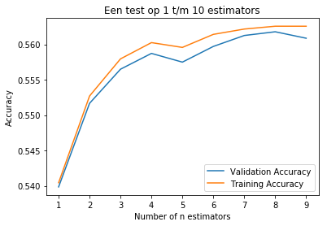
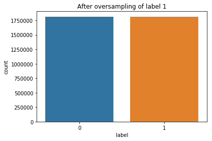

<h1>Phoneme boundary - Random forest classifier</h1>
<p>In deze notebook gebruiken we een Random Forest Classifier om een Phoneme boundary classifier te trainen. Het doel is een hoge percentage validation acc en een recall op class 1.</p>
<p>Het model wordt getraind met verschillende datasets die zijn gegenereerd m.b.v. Phoneme Boundary Generator (CORPUS NL data). De datasets zijn: </p>
<p>- dataset met N milliseconden regio</p>
<p>- dataset met alleen de verschil tussen N milliseconden van links en N milliseconden van rechts per woord.</p>
<br>
<p>De volgende punten komen aanbod:</p>
<p>- Inlezen data</p>
<p>- Oversampling van de data om skewed classes te voorkomen</p>
<p>- Model Selection</p>
<p>- Trainen model</p>
<p>- Evaluatie</p>
<p>- Conclusie</p>


```python
import os, io, wave, csv, json, re, glob
import librosa
import numpy as np
import pandas as pd
import matplotlib.pyplot as plt
import scipy.io.wavfile as wav
from scipy.fftpack import dct
import matplotlib.cm as cm
import matplotlib as mpl
import collections
from sklearn.externals import joblib
import seaborn as sns
```


```python
from sklearn.ensemble import RandomForestClassifier
from sklearn.model_selection import train_test_split
from sklearn.metrics import log_loss
```

<p>Benodigde methoden</p>


```python
# Deze methode geeft de mogelijkheid om hoeveelheid data te kunnen gebruiken om een model te trainen
def getBatchData(X_more, y_more, size):
    pos_list = [i for i, x in enumerate(y_more) if x == 1][:int(size/2)]
    neg_list = [i for i, x in enumerate(y_more) if x == 0][:int(size/2)]

    balancedDataX = np.concatenate(([X_more[pos] for pos in pos_list], [X_more[neg] for neg in neg_list]), axis=0)
    
    balancedDataY = np.concatenate(([y_more[pos] for pos in pos_list], [y_more[neg] for neg in neg_list]), axis=0)
        
    return [balancedDataX, balancedDataY]


# Deze methode balanceerd de verhouding tussen 0 en 1 labels. Deze methode doet dus oversampling.
def generateMoreData(dataframe, X, y, label, multiply):
    # EG. 55x6=330
    pos_list = [i for i, x in enumerate(dataframe.label) if x == label]
    
    more_data_x_pos = []

    for x in range(multiply):
        for pos in pos_list:
            more_data_x_pos.append(X[pos])
    
    more_data_y_pos = [1 for i in range(len(more_data_x_pos))]
    
    y = np.concatenate((y, more_data_y_pos), axis=None)

    for x in more_data_x_pos:
        X.append(x)
        
    return [X, y]


# Voor het plotten van de val en train acc resultaten
def plotResult(train_acc, val_acc, n_estimators, title):
    plt.title(title)
    plt.plot(n_estimators, val_acc, label = 'Validation Accuracy')
    plt.plot(n_estimators, train_acc, label = 'Training Accuracy')
    plt.legend()
    plt.xlabel('Number of n estimators')
    plt.ylabel('Accuracy')
    plt.show()
    print(f'Max validation acc.: {max(val_acc)}')
    
    
# Get data from dataframe
def getData(df):
    # Get input
    X = []

    for x in df.region:
        trans = [float(y) for y in x.split('|')]
        X.append(trans)

    # Get labels
    y = [int(x) for x in df.label]
    
    return [X, y]
```

<h3>Inlezen data</h3>
<p>- dataset met N milliseconden regio</p>
<p>- dataset met alleen de verschil tussen N milliseconden van links en N milliseconden van rechts per woord</p>


```python
# Filepath to the dataset csv file.
datasetDir = '/datb/aphasia/languagedata/corpus/dataset/'
```

<p>Hieronder wordt de dataset met N milliseconden regio ingelezen.</p>


```python
# Voor het weghalen van 'nan' rows in de column "region" wordt hier ook dropna gebruikt.
df_nondifference = pd.read_csv(datasetDir + 'datasetboundary_10ms_v1.csv', 
                               sep=',', skiprows=1, 
                               names=['region', 'label', 'sample_rate', 'begin', 'end', 'audiopath']).dropna(subset=['region'])

print('Dataset met N milliseconden regio:')
print(df_nondifference.head(11))
```

    Dataset met N milliseconden regio:
                                                   region  label  sample_rate  \
    0   0.45186446629700117|-2.2411709727700626|-4.803...      0        16000   
    1   -0.12845238308858561|1.580986614981171|0.24997...      0        16000   
    2   -0.11602922572367262|-1.2346745188543071|0.756...      0        16000   
    3   -0.09618923144771045|-0.40988938072728764|0.55...      0        16000   
    4   0.024768099066800175|0.71369664198569|-0.13309...      0        16000   
    5   0.1044214207149338|0.898956367962499|1.1497730...      1        16000   
    6   0.08121620572303315|-1.035433675786434|1.50680...      0        16000   
    7   0.08336445623273932|-0.4601872940794867|1.2417...      0        16000   
    8   0.014788770364876313|-0.14207770864079167|1.14...      0        16000   
    9   0.012305554601820746|0.31417087651911013|-0.00...      0        16000   
    10  0.09737044751156035|-0.7906800137754187|-1.803...      0        16000   
    
        begin  end                                          audiopath  
    0     895  905  /datb/aphasia/languagedata/corpus/transform/wa...  
    1     885  895  /datb/aphasia/languagedata/corpus/transform/wa...  
    2     875  885  /datb/aphasia/languagedata/corpus/transform/wa...  
    3     865  875  /datb/aphasia/languagedata/corpus/transform/wa...  
    4     855  865  /datb/aphasia/languagedata/corpus/transform/wa...  
    5     905  915  /datb/aphasia/languagedata/corpus/transform/wa...  
    6     915  925  /datb/aphasia/languagedata/corpus/transform/wa...  
    7     925  935  /datb/aphasia/languagedata/corpus/transform/wa...  
    8     935  945  /datb/aphasia/languagedata/corpus/transform/wa...  
    9     945  955  /datb/aphasia/languagedata/corpus/transform/wa...  
    10    955  965  /datb/aphasia/languagedata/corpus/transform/wa...  


<p>Hieronder wordt de dataset met alleen de verschil tussen N milliseconden van links en N milliseconden van rechts per woord.</p>


```python
df_difference = pd.read_csv(datasetDir + 'datasetboundary_difference_v1.csv', sep=',', skiprows=1, 
                            names=['region', 'label', 'sample_rate', 'begin', 'end', 'audiopath']).dropna(subset=['region'])

print('Dataset met alleen de verschil tussen N milliseconden van links en N milliseconden van rechts per woord:')
print(df_difference.head(11))
```

    Dataset met alleen de verschil tussen N milliseconden van links en N milliseconden van rechts per woord:
                                                   region  label  sample_rate  \
    0   0.36866650181047195|-3.596968847597437|-4.6059...      0        16000   
    1   -0.31153354921552145|3.65936756280274|-0.48901...      0        16000   
    2   0.27301986697927416|-4.077293211282512|3.87560...      0        16000   
    3   -0.08086209394662731|-1.2120730322023252|1.640...      0        16000   
    4   0.1631079235638232|0.5408029547782245|-0.46767...      0        16000   
    5   0.09655880215074149|0.060164999575823|1.667178...      1        16000   
    6   -0.21325791147118736|-0.35849504013023537|2.11...      0        16000   
    7   0.18078562501697065|-0.8526064971178349|1.7536...      0        16000   
    8   -0.16972292026351923|-0.3809575915222724|2.775...      0        16000   
    9   0.10028121640081551|0.22036522357270044|0.8767...      0        16000   
    10  -0.05175431833054417|-0.6277919384862718|-0.07...      0        16000   
    
        begin  end                                          audiopath  
    0     895  905  /datb/aphasia/languagedata/corpus/transform/wa...  
    1     885  895  /datb/aphasia/languagedata/corpus/transform/wa...  
    2     875  885  /datb/aphasia/languagedata/corpus/transform/wa...  
    3     865  875  /datb/aphasia/languagedata/corpus/transform/wa...  
    4     855  865  /datb/aphasia/languagedata/corpus/transform/wa...  
    5     905  915  /datb/aphasia/languagedata/corpus/transform/wa...  
    6     915  925  /datb/aphasia/languagedata/corpus/transform/wa...  
    7     925  935  /datb/aphasia/languagedata/corpus/transform/wa...  
    8     935  945  /datb/aphasia/languagedata/corpus/transform/wa...  
    9     945  955  /datb/aphasia/languagedata/corpus/transform/wa...  
    10    955  965  /datb/aphasia/languagedata/corpus/transform/wa...  


<h1>- Dataset: df_nondifference</h1>

<h2>Oversampling</h2>


```python
fig , ax = plt.subplots(figsize=(6,4))
sns.countplot(x='label', data=df_nondifference)
plt.title("Before oversampling of labels")
plt.show()
```


```python
X, y = getData(df_nondifference)

print(f'X: {len(X)}, y: {len(y)}')
```

    X: 1996212, y: 1996212


<p>Oversampling data</p>


```python
multiply = 9
label = 1

balancedX, balancedY = generateMoreData(df_nondifference, X, y, label, multiply)

print(f'X: {len(balancedX)}, y: {len(balancedY)}')
```

    X: 3629478, y: 3629478


```python
# Delete unwanted element
indexToDelete = 640417
print(len(balancedX))
print(len(balancedY))

balancedX.pop(indexToDelete)
balancedY = np.delete(balancedY, indexToDelete, 0)

print(len(balancedX))
print(len(balancedY))
```

    3629478
    3629478
    3629477
    3629477


```python
fig , ax = plt.subplots(figsize=(6,4))
sns.countplot(x='label', data=pd.DataFrame({'label':balancedY}))
plt.title(f"After oversampling of label {label}")
```


    Text(0.5, 1.0, 'After oversampling of label 1')


<p>Een batch data gebruiken om een model te testen zodat niet hele dataset wordt gebruikt.</p>


```python
batch_size = 100000

X_batch, y_batch = getBatchData(balancedX, balancedY, batch_size)

print(f'X: {len(X_batch)}, y: {len(y_batch)}')
```

    X: 100000, y: 100000


<p>Een plot van de verhouding van de labels na batchen.</p>


```python
fig , ax = plt.subplots(figsize=(6,4))
sns.countplot(x='label', data=pd.DataFrame({'label':y_batch}))
plt.title(f"After batch: label verhouding")
```


    Text(0.5, 1.0, 'After batch: label verhouding')


<h3>Initialiseer split</h3>


```python
# Split data with train_test_split()
test_size = 0.3
random_state = 42

X_train, X_test, y_train, y_test = train_test_split(X_batch, y_batch, 
                                                    test_size=test_size, 
                                                    random_state=random_state, 
                                                    stratify=y_batch)
```

<h3>Model selection</h3>
<p>Eerst kijk ik naar welke waarde het beste kan worden gebruikt bij de hyperparameters "max depth" en "estimators".</p>


```python
max_depth = np.arange(1, 10)
train_accuracy = np.empty(len(max_depth))
test_accuracy = np.empty(len(max_depth))

for i, k in enumerate(max_depth):
    # Setup a k-NN Classifier with k neighbors: knn
    clf = RandomForestClassifier(n_estimators=100, max_depth=k, random_state=42)

    # Fit the classifier to the training data
    clf.fit(X_train, y_train)
    
    #Compute accuracy on the training set
    train_accuracy[i] = clf.score(X_train, y_train)

    #Compute accuracy on the testing set
    test_accuracy[i] = clf.score(X_test, y_test)
    
    print(f'Iteratie: {k}')
```

    Iteratie: 1
    Iteratie: 2
    Iteratie: 3
    Iteratie: 4
    Iteratie: 5
    Iteratie: 6
    Iteratie: 7
    Iteratie: 8
    Iteratie: 9


```python
plt.title('Random Forrest: Varying Number of max depth')
plt.plot(max_depth, test_accuracy, label = 'Testing Accuracy')
plt.plot(max_depth, train_accuracy, label = 'Training Accuracy')
plt.legend()
plt.xlabel('Number of max depth')
plt.ylabel('Accuracy')
plt.show()
```


<p>Uit de plot van hierboven zien we dat het model complexer wordt dus overfit wanneer de waarde voor "Max of depth" hoger is dan 5.</p>
<p>Dit geeft mij nu de mogelijkheid om een max depth te kiezen om een grotere dataset te gebruiken voor het trainen van het model.</p>
<p>Hieronder train ik opnieuw een model maar dan met 1 miljoen dataset.</p>


```python
# batch size 1 miljoen
batch_size = 1000000

X_batch_more, y_batch_more = getBatchData(balancedX, balancedY, batch_size)

print(f'X: {len(X_batch_more)}, y: {len(y_batch_more)}')
```

    X: 1000000, y: 1000000


```python
# Split data with train_test_split()
test_size = 0.3
random_state = 42

X_train, X_test, y_train, y_test = train_test_split(X_batch_more, y_batch_more, 
                                                    test_size=test_size, 
                                                    random_state=random_state, 
                                                    stratify=y_batch_more)
```

<p>Hier kijk ik naar welke waarde voor de hyperparameter "estimators" beste resultaat geeft.</p>


```python
n_estimators = np.arange(98, 101)
train_accuracy = np.empty(len(n_estimators))
val_accuracy = np.empty(len(n_estimators))
max_depth = 5

for i, k in enumerate(n_estimators):

    clf = RandomForestClassifier(n_estimators=k, max_depth=max_depth, random_state=42)

    # Fit the classifier to the training data
    clf.fit(X_train, y_train)
    
    #Compute accuracy on the training set
    train_accuracy[i] = clf.score(X_train, y_train)

    #Compute accuracy on the val set
    val_accuracy[i] = clf.score(X_test, y_test)
    
    print(f'Num trees: {k}')
    
print('Finished')
```

    Num trees: 98
    Num trees: 99
    Num trees: 100
    Finished


```python
plotResult(train_accuracy, val_accuracy, n_estimators, 'Een test op 1 t/m 10 estimators')
```





    Max validation acc.: 0.5617766666666667


```python
plotResult(train_accuracy, val_accuracy, n_estimators, 'Een test op 20 t/m 40 estimators')
print('Hier zien we dat de waarde 32 een beste resultaat geeft.')
```


    Max validation acc.: 0.5640533333333333
    Hier zien we dat de validation ver afstaat van de training. Een vorm van overfitting.


```python
plotResult(train_accuracy, val_accuracy, n_estimators, 'Een test op 98 t/m 100 estimators')
print('Hier zien we dat de validation lijn horizontaal blijft en niet hoger gaat.')
```


    Max validation acc.: 0.5638666666666666
    Hier zien we dat de validation lijn horizontaal blijft en niet hoger gaat.


<h3>Trainen model</h3>
<p>Van de resultaten hierboven zien we dat 32 estimators hoogste validation acc geeft. Die waarde plus de waarde van max depth gaan we gebruiken om een RandomForest classifier trainen.</p>


```python
# Split data with train_test_split()
test_size = 0.3
random_state = 42

X_train, X_test, y_train, y_test = train_test_split(balancedX, balancedY, 
                                                    test_size=test_size, 
                                                    random_state=random_state, 
                                                    stratify=balancedY)
```


```python
# Hyperparameters
estimators = 32
max_depth = 5

# Init classifier
rfc = RandomForestClassifier(n_estimators=estimators, max_depth=max_depth, random_state=42)

# Fit the classifier to the training data
rfc.fit(X_train, y_train)

print('Finished')
```

    Finished


<h3>Evaluatie</h3>
<p>Hier wordt gekeken naar de train, validation score, Precision en Recall. Bij de evaluatie is het van belang dat class 1 een hoge Recall score geeft. In iedergeval hoger dan class 0.</p>


```python
train_score = rfc.score(X_train, y_train)
val_score = rfc.score(X_test, y_test)
print('Train_score:{}'.format(train_score))
print('Val_score:{}'.format(val_score))
```

    Train_score:0.5632143642942526
    Val_score:0.5624157363221912


```python
from sklearn.metrics import classification_report, confusion_matrix

predictions = rfc.predict(X_test)

print(classification_report(y_test,predictions))
```

                  precision    recall  f1-score   support
    
               0       0.57      0.54      0.55    544422
               1       0.56      0.59      0.57    544422
    
       micro avg       0.56      0.56      0.56   1088844
       macro avg       0.56      0.56      0.56   1088844
    weighted avg       0.56      0.56      0.56   1088844
    


<h1>- Dataset: df_difference</h1>

<h3>Oversampling</h3>


```python
fig , ax = plt.subplots(figsize=(6,4))
sns.countplot(x='label', data=df_difference)
plt.title("Before oversampling of labels")
plt.show()
```


```python
X_diff, y_diff = getData(df_difference)
print(f'X: {len(X_diff)}, y: {len(y_diff)}')
```

    X: 1996202, y: 1996202


<p>Oversampling data</p>


```python
multiply = 9
label = 1

balancedX_diff, balancedY_diff = generateMoreData(df_difference, X_diff, y_diff, label, multiply)

print(f'X: {len(balancedX_diff)}, y: {len(balancedY_diff)}')
```

    X: 3629459, y: 3629459


```python
fig , ax = plt.subplots(figsize=(6,4))
sns.countplot(x='label', data=pd.DataFrame({'label':balancedY_diff}))
plt.title(f"After oversampling of label {label}")
```


    Text(0.5, 1.0, 'After oversampling of label 1')





<p>Het model trainen met 1 miljoen dataset.</p>


```python
# 1 miljoen dataset
batch_size = 1000000

X_batch_diff, y_batch_diff = getBatchData(balancedX_diff, balancedY_diff, batch_size)

print(f'X: {len(X_batch_diff)}, y: {len(y_batch_diff)}')
```

    X: 1000000, y: 1000000


```python
fig , ax = plt.subplots(figsize=(6,4))
sns.countplot(x='label', data=pd.DataFrame({'label':y_batch_diff}))
plt.title(f"Kijken of de verhouding nog goed is gebleven na batchen")
```


    Text(0.5, 1.0, 'Kijken of de verhouding nog goed is gebleven na batchen')


<h3>Initialiseer split</h3>


```python
# Split data with train_test_split()
test_size = 0.3
random_state = 42

X_train, X_test, y_train, y_test = train_test_split(X_batch_diff, y_batch_diff, 
                                                    test_size=test_size, 
                                                    random_state=random_state, 
                                                    stratify=y_batch_diff)
```

<h3>Trainen model</h3>


```python
# Hyperparameters
estimators = 32
max_depth = 5

# Init classifier
rfc_diff = RandomForestClassifier(n_estimators=estimators, max_depth=max_depth, random_state=42)

# Fit the classifier to the training data
rfc_diff.fit(X_train, y_train)

print('Finished')
```

    Finished


<h3>Evaluatie</h3>
<p>Hier wordt gekeken naar de train, validation score, Precision en Recall. Bij de evaluatie is het van belang dat class 1 een hoge Recall score geeft. In iedergeval hoger dan class 0.</p>


```python
train_score = rfc_diff.score(X_train, y_train)
val_score = rfc_diff.score(X_test, y_test)
print('Train_score:{}'.format(train_score))
print('Val_score:{}'.format(val_score))
```

    Train_score:0.55655
    Val_score:0.5553833333333333


```python
predictions_diff = rfc_diff.predict(X_test)

print(classification_report(y_test, predictions_diff))
```

                  precision    recall  f1-score   support
    
               0       0.54      0.68      0.60    150000
               1       0.57      0.43      0.49    150000
    
       micro avg       0.56      0.56      0.56    300000
       macro avg       0.56      0.56      0.55    300000
    weighted avg       0.56      0.56      0.55    300000
    


<h3>Conclusie</h3>
<p>Uit deze resultaten zien we dat de dataset zonder verschil dus "df_nondifference" met Random Forest Classifier een betere validation acc en RECALL geeft op class 1 dan bij de dataset met verschil.</p>
