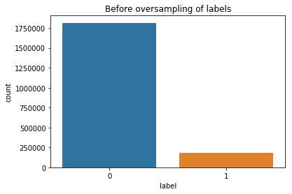

<h1>Phoneme boundary classifier with MPL (Multilayer Perceptron)</h1>
<p>(c) Koray</p>
<p>In deze notebook gebruiken we een MPL Classifier om een Phoneme boundary classifier te trainen. Het doel is een hoge percentage validation acc en een recall op class 1.</p>
<p>Het model wordt getraind met verschillende datasets die zijn gegenereerd m.b.v. Phoneme Boundary Generator (CORPUS NL data). De datasets zijn: </p>
<p>- dataset met N milliseconden regio</p>
<p>- dataset met alleen de verschil tussen N milliseconden van links en N milliseconden van rechts per woord.</p>
<br>
<p>De volgende punten komen aanbod:</p>
<p>- Inlezen data</p>
<p>- Oversampling van de data om skewed classes te voorkomen</p>
<p>- Model Selection</p>
<p>- Trainen model</p>
<p>- Evaluatie</p>
<p>- Conclusie</p>


```python
import os, io, wave, csv, json, re, glob
import librosa
import numpy as np
import pandas as pd
import matplotlib.pyplot as plt
import scipy.io.wavfile as wav
from scipy.fftpack import dct
import matplotlib.cm as cm
import matplotlib as mpl
import collections
import seaborn as sns

from sklearn.externals import joblib

from sklearn.neural_network import MLPClassifier
from sklearn.model_selection import train_test_split
from sklearn.metrics import recall_score
from sklearn.metrics import precision_score

from sklearn.metrics import classification_report, confusion_matrix
```

<h3>Benodigde methoden</h3>


```python
# Deze methode verricht oversampling
def getBatchData(X_more, y_more, size):
    """
    X_more = de input data
    y_more = de label data
    size = de maximum grootte die je wenst bijv. 300000 data totaal
    """
    
    pos_list = [i for i, x in enumerate(y_more) if x == 1][:int(size/2)]
    neg_list = [i for i, x in enumerate(y_more) if x == 0][:int(size/2)]

    balancedDataX = np.concatenate(([X_more[pos] for pos in pos_list], [X_more[neg] for neg in neg_list]), axis=0)
    
    balancedDataY = np.concatenate(([y_more[pos] for pos in pos_list], [y_more[neg] for neg in neg_list]), axis=0)
        
    return [balancedDataX, balancedDataY]


# Deze methode balanceerd de verhouding tussen 0 en 1 labels. Deze methode doet dus oversampling.
def generateMoreData(dataframe, X, y, label, multiply):
    # EG. 55x6=330
    pos_list = [i for i, x in enumerate(dataframe.label) if x == label]
    
    more_data_x_pos = []

    for x in range(multiply):
        for pos in pos_list:
            more_data_x_pos.append(X[pos])
    
    more_data_y_pos = [1 for i in range(len(more_data_x_pos))]
    
    y = np.concatenate((y, more_data_y_pos), axis=None)

    for x in more_data_x_pos:
        X.append(x)
        
    return [X, y]


# Voor het plotten van de val en train acc resultaten
def plotResult(train_acc, val_acc, num, xlabel, title):
    plt.title(title)
    plt.plot(num, val_acc, label = 'Validation Accuracy')
    plt.plot(num, train_acc, label = 'Training Accuracy')
    plt.legend()
    plt.xlabel(xlabel)
    plt.ylabel('Accuracy')
    plt.show()
    print(f'Max validation acc.: {max(val_acc)}')
    
    
# Voor het plotten van Recall en Precision resultaten
def plotRecallPrecision(recall_scorelist, precision_scorelist, num, title, xlabel):
    recall_1 = list(map(lambda x: x[1], recall_scorelist))
    precision_1 = list(map(lambda x: x[1], precision_scorelist))
    recall_0 = list(map(lambda x: x[0], recall_scorelist))
    precision_0 = list(map(lambda x: x[0], precision_scorelist))
    plt.title(title)
    plt.plot(num, recall_1, label = 'Recall class 1')
    plt.plot(num, precision_1, label = 'Precision class 1')
    plt.plot(num, recall_0, label = 'Recall class 0')
    plt.plot(num, precision_0, label = 'Precision class 0')
    plt.legend()
    plt.xlabel(xlabel)
    plt.ylabel('Acc %')
    plt.show()

    
# Get data from dataframe
def getData(df):
    # Get input
    X = []

    for x in df.region:
        trans = [float(y) for y in x.split('|')]
        X.append(trans)

    # Get labels
    y = [int(x) for x in df.label]
    
    return [X, y]
```

<h3>Inlezen data</h3>
<p>- dataset met N milliseconden regio</p>
<p>- dataset met alleen de verschil tussen N milliseconden van links en N milliseconden van rechts per woord</p>


```python
# Filepath to the dataset csv file.
datasetDir = '/datb/aphasia/languagedata/corpus/dataset/'
```

<p>Hieronder wordt de dataset met N milliseconden regio ingelezen.</p>


```python
# Voor het weghalen van 'nan' rows in de column "region" wordt hier ook dropna gebruikt.
df_nondifference = pd.read_csv(datasetDir + 'datasetboundary_10ms_v1.csv', 
                               sep=',', skiprows=1, 
                               names=['region', 'label', 'sample_rate', 'begin', 'end', 'audiopath']).dropna(subset=['region'])

print('Dataset met N milliseconden regio:')
print(df_nondifference.head(11))
```

    Dataset met N milliseconden regio:
                                                   region  label  sample_rate  \
    0   0.45186446629700117|-2.2411709727700626|-4.803...      0        16000   
    1   -0.12845238308858561|1.580986614981171|0.24997...      0        16000   
    2   -0.11602922572367262|-1.2346745188543071|0.756...      0        16000   
    3   -0.09618923144771045|-0.40988938072728764|0.55...      0        16000   
    4   0.024768099066800175|0.71369664198569|-0.13309...      0        16000   
    5   0.1044214207149338|0.898956367962499|1.1497730...      1        16000   
    6   0.08121620572303315|-1.035433675786434|1.50680...      0        16000   
    7   0.08336445623273932|-0.4601872940794867|1.2417...      0        16000   
    8   0.014788770364876313|-0.14207770864079167|1.14...      0        16000   
    9   0.012305554601820746|0.31417087651911013|-0.00...      0        16000   
    10  0.09737044751156035|-0.7906800137754187|-1.803...      0        16000   
    
        begin  end                                          audiopath  
    0     895  905  /datb/aphasia/languagedata/corpus/transform/wa...  
    1     885  895  /datb/aphasia/languagedata/corpus/transform/wa...  
    2     875  885  /datb/aphasia/languagedata/corpus/transform/wa...  
    3     865  875  /datb/aphasia/languagedata/corpus/transform/wa...  
    4     855  865  /datb/aphasia/languagedata/corpus/transform/wa...  
    5     905  915  /datb/aphasia/languagedata/corpus/transform/wa...  
    6     915  925  /datb/aphasia/languagedata/corpus/transform/wa...  
    7     925  935  /datb/aphasia/languagedata/corpus/transform/wa...  
    8     935  945  /datb/aphasia/languagedata/corpus/transform/wa...  
    9     945  955  /datb/aphasia/languagedata/corpus/transform/wa...  
    10    955  965  /datb/aphasia/languagedata/corpus/transform/wa...  


<p>Hieronder wordt de dataset met alleen de verschil tussen N milliseconden van links en N milliseconden van rechts per woord.</p>


```python
df_difference = pd.read_csv(datasetDir + 'datasetboundary_difference_v1.csv', sep=',', skiprows=1, 
                            names=['region', 'label', 'sample_rate', 'begin', 'end', 'audiopath']).dropna(subset=['region'])

print('Dataset met alleen de verschil tussen N milliseconden van links en N milliseconden van rechts per woord:')
print(df_difference.head(11))
```

    Dataset met alleen de verschil tussen N milliseconden van links en N milliseconden van rechts per woord:
                                                   region  label  sample_rate  \
    0   0.36866650181047195|-3.596968847597437|-4.6059...      0        16000   
    1   -0.31153354921552145|3.65936756280274|-0.48901...      0        16000   
    2   0.27301986697927416|-4.077293211282512|3.87560...      0        16000   
    3   -0.08086209394662731|-1.2120730322023252|1.640...      0        16000   
    4   0.1631079235638232|0.5408029547782245|-0.46767...      0        16000   
    5   0.09655880215074149|0.060164999575823|1.667178...      1        16000   
    6   -0.21325791147118736|-0.35849504013023537|2.11...      0        16000   
    7   0.18078562501697065|-0.8526064971178349|1.7536...      0        16000   
    8   -0.16972292026351923|-0.3809575915222724|2.775...      0        16000   
    9   0.10028121640081551|0.22036522357270044|0.8767...      0        16000   
    10  -0.05175431833054417|-0.6277919384862718|-0.07...      0        16000   
    
        begin  end                                          audiopath  
    0     895  905  /datb/aphasia/languagedata/corpus/transform/wa...  
    1     885  895  /datb/aphasia/languagedata/corpus/transform/wa...  
    2     875  885  /datb/aphasia/languagedata/corpus/transform/wa...  
    3     865  875  /datb/aphasia/languagedata/corpus/transform/wa...  
    4     855  865  /datb/aphasia/languagedata/corpus/transform/wa...  
    5     905  915  /datb/aphasia/languagedata/corpus/transform/wa...  
    6     915  925  /datb/aphasia/languagedata/corpus/transform/wa...  
    7     925  935  /datb/aphasia/languagedata/corpus/transform/wa...  
    8     935  945  /datb/aphasia/languagedata/corpus/transform/wa...  
    9     945  955  /datb/aphasia/languagedata/corpus/transform/wa...  
    10    955  965  /datb/aphasia/languagedata/corpus/transform/wa...  


<h1>- Dataset: df_nondifference</h1>

<h2>Oversampling</h2>


```python
fig , ax = plt.subplots(figsize=(6,4))
sns.countplot(x='label', data=df_nondifference)
plt.title("Before oversampling of labels")
plt.show()
```





```python
X, y = getData(df_nondifference)

print(f'X: {len(X)}, y: {len(y)}')
```

    X: 1996212, y: 1996212


<p>Oversampling data</p>


```python
multiply = 9
label = 1

balancedX, balancedY = generateMoreData(df_nondifference, X, y, label, multiply)

print(f'X: {len(balancedX)}, y: {len(balancedY)}')
```

    X: 3629478, y: 3629478


```python
fig , ax = plt.subplots(figsize=(6,4))
sns.countplot(x='label', data=pd.DataFrame({'label':balancedY}))
plt.title(f"After oversampling of label {label}")
```


    Text(0.5, 1.0, 'After oversampling of label 1')


<p>Een batch data gebruiken om een model te testen zodat niet hele dataset wordt gebruikt.</p>


```python
batch_size = 300000

X_batch, y_batch = getBatchData(balancedX, balancedY, batch_size)

print(f'X: {len(X_batch)}, y: {len(y_batch)}')
```

    X: 300000, y: 300000


<p>Een plot van de verhouding van de labels na batchen.</p>


```python
fig , ax = plt.subplots(figsize=(6,4))
sns.countplot(x='label', data=pd.DataFrame({'label':y_batch}))
plt.title(f"After batch: label verhouding")
```


    Text(0.5, 1.0, 'After batch: label verhouding')


<h3>Initialiseer split</h3>


```python
# Split data with train_test_split()
test_size = 0.3
random_state = 42

X_train, X_test, y_train, y_test = train_test_split(X_batch, y_batch, 
                                                    test_size=test_size, 
                                                    random_state=random_state, 
                                                    stratify=y_batch)
```

<h3>Model selection</h3>
<p>Eerst kijk ik naar welke waarde het beste kan worden gebruikt bij de hyperparameters "num neurons", "learning rate" en "num layers".</p>


```python
activation = 'relu'
solver = 'adam'
random_state = 42
max_iteratie = 2000
```


```python
# Aantal neurons voor de Classifier
num_neurons = np.arange(60, 100, 10)
train_acc_neuron = np.empty(len(num_neurons))
val_acc_neuron = np.empty(len(num_neurons))
```


```python
# Verschillende learning rate waardes voor de Classifier
num_learningrate = [0.3, 0.01, 0.001, 0.0001]
train_acc_lrate = np.empty(len(num_learningrate))
val_acc_lrate = np.empty(len(num_learningrate))
```


```python
# Aantal layers voor de Classifier
num_neuron = 70
num_layers = [(num_neuron), 
              (num_neuron, num_neuron), 
              (num_neuron,num_neuron,num_neuron)]
train_acc_layer = np.empty(len(num_layers))
val_acc_layer = np.empty(len(num_layers))
```


```python
# Voor evalueren Recall score bij verschillende hyperparameter waarden
recall_scorelist = []
precision_scorelist = []
```


```python
learningrate = 0.001

print("In progress..")
for i, k in enumerate(num_layers):
    # init MLPClassifier
    mlp = MLPClassifier(activation=activation, solver=solver, alpha=1e-5, learning_rate='constant',
                        learning_rate_init=learningrate, hidden_layer_sizes=k,
                        random_state=random_state, max_iter=max_iteratie)

    # Train MLPClassifier
    mlp.fit(X_train, y_train)
    
    #Compute accuracy on the training set
    train_acc_layer[i] = mlp.score(X_train, y_train)

    #Compute accuracy on the testing set
    val_acc_layer[i] = mlp.score(X_test, y_test)
    
    #Compute recall and precision
    y_pred = mlp.predict(X_test)
    recall_scorelist.append(recall_score(y_test, y_pred, pos_label=1, average=None))
    precision_scorelist.append(precision_score(y_test, y_pred, pos_label=1, average=None))
    
    print(f'Iteratie: {i}, neurons: {k}')
    
print("Finished")
```

    In progress..
    Iteratie: 0, neurons: 70
    Iteratie: 1, neurons: (70, 70)
    Iteratie: 2, neurons: (70, 70, 70)
    Finished


<p>Hier kijk ik naar welke waarde voor de hyperparameter "num neurons" beste resultaat geeft.</p>


```python
plotResult(train_acc_neuron, val_acc_neuron, num_neurons, 
           'Number of neurons', 'MLP: Varying Number of neurons')
print('In de plot van aantal neurons kunnen we zien dat hij kampt met overfitting na 60 neurons.')
```


    Max validation acc.: 0.6132
    In de plot van aantal neurons kunnen we zien dat hij kampt met overfitting na 60 neurons.


<p>Hier kijk ik naar welke waarde voor de hyperparameter "learning rate" beste resultaat geeft.</p>


```python
plotResult(train_acc_lrate, val_acc_lrate, num_learningrate, 
           'Number of learning rate', 'MLP: Varying Number of learning rate')
print('In de plot van learning rate kunnen we zien dat de validation accuracy omlaag gaat bij hoger learning rate.')
```


    Max validation acc.: 0.6117555555555556
    In de plot van learning rate kunnen we zien dat de validation accuracy omlaag gaat bij hoger learning rate.


<p>Hier kijk ik naar de aantal lagen voor een beste resultaat.</p>


```python
plotResult(train_acc_layer, val_acc_layer, [1,2,3], 
           'Number of layers', 'MLP: Varying Number of layers')
print('In de plot van aantal layers kunnen we zien dat de validation accuracy omlaag gaat en training accuracy hoger bij meer layers dus hij overfit.')
```


    Max validation acc.: 0.6117555555555556
    In de plot van aantal layers kunnen we zien dat de validation accuracy omlaag gaat en training accuracy hoger bij meer layers dus hij overfit.


<p>Hier kijk ik naar wat voor Recall score de verschillende waardes van de hypermeter num_neurons geven.</p>


```python
plotResult(train_acc_neuron, val_acc_neuron, num_neurons, 
           'Number of neurons', 'MLP: Varying Number of layers')

plotRecallPrecision(recall_scorelist, precision_scorelist, num_neurons, 'Recall en Precision results', 'aantal neurons')

print('In deze plots kunnen we zien dat de Recall bij 70 neurons het hoogst is bij class 1 en laagst bij class 0.')
print('Aangezien de focus op class 1 ligt is 70 neurons interessant.')
```


    Max validation acc.: 0.6132


    In deze plots kunnen we zien dat de Recall bij 70 neurons het hoogst is bij class 1 en laagst bij class 0.
    Aangezien de focus op class 1 ligt is 70 neurons interessant.


<p>Hier kijk ik naar wat voor Recall score de verschillende waardes van de hypermeter num_layers geven.</p>


```python
plotResult(train_acc_layer, val_acc_layer, [1,2,3], 
           'Number of layers', 'MLP: Varying Number of layers')

plotRecallPrecision(recall_scorelist, precision_scorelist, [1,2,3], 'Recall en Precision results', 'aantal layers')

print('In deze plots kunnen we zien dat de Recall slechter scoort bij meer dan 1 layer bij class 1.')
print('Aangezien de focus op class 1 ligt is 1 layer interessant.')
```


    Max validation acc.: 0.6089222222222223


    In deze plots kunnen we zien dat de Recall slechter scoort bij meer dan 1 layer bij class 1.
    Aangezien de focus op class 1 ligt is 1 layer interessant.


<h3>Trainen model</h3>
<p>Van de resultaten hierboven zien we dat 70 neurons met 1 laag hoogste Recall score geeft op class 1. Deze waardes  gaan we gebruiken om een MLP classifier te trainen. Deze keer met 1 miljoen data.</p>


```python
batch_size = 1000000

X_batch, y_batch = getBatchData(balancedX, balancedY, batch_size)

print(f'X: {len(X_batch)}, y: {len(y_batch)}')
```

    X: 1000000, y: 1000000


```python
fig , ax = plt.subplots(figsize=(6,4))
sns.countplot(x='label', data=pd.DataFrame({'label':y_batch}))
plt.title(f"After batch: label verhouding")
```


    Text(0.5, 1.0, 'After batch: label verhouding')


```python
# Split data with train_test_split()
test_size = 0.3
random_state = 42

X_train, X_test, y_train, y_test = train_test_split(X_batch, y_batch, 
                                                    test_size=test_size, 
                                                    random_state=random_state, 
                                                    stratify=y_batch)
```


```python
# Parameters voor de Classifier

num_neurons = 70
activation = 'relu'
solver = 'adam'
learning_rate_init = 0.001
random_state = 42
max_iteratie = 2000
hidden_layer_sizes = (num_neurons)
```

<h3>Init MLPClassifier</h3>


```python
# init MLPClassifier
print('In progress...')
mlp = MLPClassifier(activation=activation, solver=solver, alpha=1e-5, 
                    learning_rate='constant', learning_rate_init=learning_rate_init, 
                    hidden_layer_sizes=hidden_layer_sizes, random_state=random_state, max_iter=max_iteratie)

# Train MLPClassifier
mlp.fit(X_train, y_train)

print('Finished')
```

    In progress...
    Finished


<h3>Evaluatie</h3>
<p>Hier wordt gekeken naar de train, validation score, Precision en Recall. Bij de evaluatie is het van belang dat class 1 een hoge Recall score geeft. In iedergeval hoger dan class 0.</p>


```python
train_score = mlp.score(X_train, y_train)
val_score = mlp.score(X_test, y_test)
print('Train_score:{}'.format(train_score))
print('Val_score:{}'.format(val_score))
```

    Train_score:0.6371857142857142
    Val_score:0.6145333333333334


```python
from sklearn.metrics import classification_report, confusion_matrix

predictions = mlp.predict(X_test)

print(classification_report(y_test, predictions))
```

                  precision    recall  f1-score   support
    
               0       0.60      0.70      0.65    150000
               1       0.64      0.53      0.58    150000
    
       micro avg       0.61      0.61      0.61    300000
       macro avg       0.62      0.61      0.61    300000
    weighted avg       0.62      0.61      0.61    300000
    


<h1>- Dataset: df_difference</h1>
<p>Hier voeren we hetzelfde proces uit als met de dataset "df_nondifference" maar dan trainen we een MLP met de dataset "df_difference".</p>

<h3>Oversampling</h3>


```python
fig , ax = plt.subplots(figsize=(6,4))
sns.countplot(x='label', data=df_difference)
plt.title("Before oversampling of labels")
plt.show()
```


```python
X_diff, y_diff = getData(df_difference)
print(f'X: {len(X_diff)}, y: {len(y_diff)}')
```

    X: 1996202, y: 1996202


<p>Oversampling data</p>


```python
multiply = 9
label = 1

balancedX_diff, balancedY_diff = generateMoreData(df_difference, X_diff, y_diff, label, multiply)

print(f'X: {len(balancedX_diff)}, y: {len(balancedY_diff)}')
```

    X: 3629459, y: 3629459


```python
fig , ax = plt.subplots(figsize=(6,4))
sns.countplot(x='label', data=pd.DataFrame({'label':balancedY_diff}))
plt.title(f"After oversampling of label {label}")
```


    Text(0.5, 1.0, 'After oversampling of label 1')


<p>Het model trainen met 1 miljoen dataset.</p>


```python
# 1 miljoen dataset
batch_size = 1000000

X_batch_diff, y_batch_diff = getBatchData(balancedX_diff, balancedY_diff, batch_size)

print(f'X: {len(X_batch_diff)}, y: {len(y_batch_diff)}')
```

    X: 1000000, y: 1000000


```python
fig , ax = plt.subplots(figsize=(6,4))
sns.countplot(x='label', data=pd.DataFrame({'label':y_batch_diff}))
plt.title(f"Kijken of de verhouding nog goed is gebleven na batchen")
```


    Text(0.5, 1.0, 'Kijken of de verhouding nog goed is gebleven na batchen')


<h3>Initialiseer split</h3>


```python
test_size = 0.3
random_state = 42

X_train, X_test, y_train, y_test = train_test_split(X_batch_diff, y_batch_diff, 
                                                    test_size=test_size, 
                                                    random_state=random_state, 
                                                    stratify=y_batch_diff)
```

<h3>Trainen model</h3>


```python
# Parameters voor de Classifier

num_neurons = 70
activation = 'relu'
solver = 'adam'
learning_rate_init = 0.001
random_state = 42
max_iteratie = 2000
hidden_layer_sizes = (num_neurons)
```


```python
# init MLPClassifier
print('In progress...')
mlp_diff = MLPClassifier(activation=activation, solver=solver, alpha=1e-5, 
                    learning_rate='constant', learning_rate_init=learning_rate_init, 
                    hidden_layer_sizes=hidden_layer_sizes, random_state=random_state, max_iter=max_iteratie)

# Train MLPClassifier
mlp_diff.fit(X_train, y_train)

print('Finished')
```

    In progress...
    Finished


<h3>Evaluatie</h3>
<p>Hier wordt gekeken naar de train, validation score, Precision en Recall. Bij de evaluatie is het van belang dat class 1 een hoge Recall score geeft. In iedergeval hoger dan class 0.</p>


```python
train_score = mlp_diff.score(X_train, y_train)
val_score = mlp_diff.score(X_test, y_test)
print('Train_score:{}'.format(train_score))
print('Val_score:{}'.format(val_score))
```

    Train_score:0.5970057142857143
    Val_score:0.58414


```python
predictions_diff = mlp_diff.predict(X_test)

print(classification_report(y_test, predictions_diff))
```

                  precision    recall  f1-score   support
    
               0       0.58      0.60      0.59    150000
               1       0.59      0.57      0.58    150000
    
       micro avg       0.58      0.58      0.58    300000
       macro avg       0.58      0.58      0.58    300000
    weighted avg       0.58      0.58      0.58    300000
    


<h3>Conclusie</h3>
<p>Uit deze resultaten zien we dat de dataset zonder verschil dus "df_nondifference" met MLP een betere validation acc geeft maar een lager RECALL score op class 1 dan bij de dataset met verschil "df_difference".</p>
