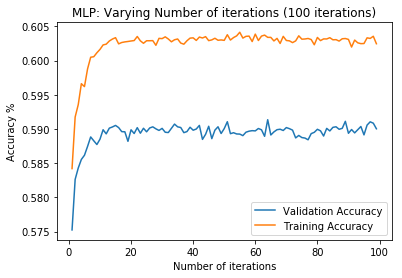

<h1>Phoneme boundary classifier with MPL Diagnosis</h1>
<p>(c) Koray</p>
<p>Deze notebook gaat over de diagnosis van de MPL Classifier. Het doel is een goed generalized model.</p>
<br>
<p>De volgende punten komen aanbod:</p>
<p>- Inlezen data</p>
<p>- Oversampling van de data om skewed classes te voorkomen</p>
<p>- Trainen model</p>
<p>- Oplossing</p>
<p>- Final model</p>
<p>- Conclusie</p>


```python
import os, io, wave, csv, json, re, glob
import librosa
import numpy as np
import pandas as pd
import matplotlib.pyplot as plt
import scipy.io.wavfile as wav
from scipy.fftpack import dct
import matplotlib.cm as cm
import matplotlib as mpl
import collections
import seaborn as sns

from sklearn.externals import joblib

from sklearn.neural_network import MLPClassifier
from sklearn.model_selection import train_test_split
from sklearn.metrics import recall_score
from sklearn.metrics import precision_score

from sklearn.metrics import classification_report, confusion_matrix

from sklearn.model_selection import learning_curve
from sklearn.model_selection import ShuffleSplit
```

<h3>Benodigde methoden</h3>


```python
# Deze methode verricht oversampling
def getBatchData(X_more, y_more, size):
    """
    X_more = de input data
    y_more = de label data
    size = de maximum grootte die je wenst bijv. 300000 data totaal
    """
    
    pos_list = [i for i, x in enumerate(y_more) if x == 1][:int(size/2)]
    neg_list = [i for i, x in enumerate(y_more) if x == 0][:int(size/2)]

    balancedDataX = np.concatenate(([X_more[pos] for pos in pos_list], [X_more[neg] for neg in neg_list]), axis=0)
    
    balancedDataY = np.concatenate(([y_more[pos] for pos in pos_list], [y_more[neg] for neg in neg_list]), axis=0)
        
    return [balancedDataX, balancedDataY]


# Deze methode balanceerd de verhouding tussen 0 en 1 labels. Deze methode doet dus oversampling.
def generateMoreData(dataframe, X, y, label, multiply):
    # EG. 55x6=330
    pos_list = [i for i, x in enumerate(dataframe.label) if x == label]
    
    more_data_x_pos = []

    for x in range(multiply):
        for pos in pos_list:
            more_data_x_pos.append(X[pos])
    
    more_data_y_pos = [1 for i in range(len(more_data_x_pos))]
    
    y = np.concatenate((y, more_data_y_pos), axis=None)

    for x in more_data_x_pos:
        X.append(x)
        
    return [X, y]


# Voor het plotten van de val en train acc resultaten
def plotResult(train_acc, val_acc, num, xlabel, title):
    plt.title(title)
    plt.plot(num, val_acc, label = 'Validation Accuracy')
    plt.plot(num, train_acc, label = 'Training Accuracy')
    plt.legend()
    plt.xlabel(xlabel)
    plt.ylabel('Accuracy %')
    plt.show()
    
    
# Voor het plotten van de val en train acc resultaten
def plotResultLines(train_acc, val_acc, num, xlabel, title, figsize):
    plt.figure(figsize=figsize)
    plt.title(title)
    plt.plot(num, val_acc, label = 'Validation Accuracy')
    plt.plot(num, train_acc, label = 'Training Accuracy')
    
    for x in num:
        plt.axvline(x=x, linewidth=1, alpha=0.5, color='k', linestyle='--')
    
    plt.legend()
    plt.xlabel(xlabel)
    plt.ylabel('Accuracy')
    plt.show()
    
    
# Voor het plotten van Recall en Precision resultaten
def plotRecallPrecision(recall_scorelist, precision_scorelist, num, title, xlabel):
    recall_1 = list(map(lambda x: x[1], recall_scorelist))
    precision_1 = list(map(lambda x: x[1], precision_scorelist))
    recall_0 = list(map(lambda x: x[0], recall_scorelist))
    precision_0 = list(map(lambda x: x[0], precision_scorelist))
    plt.title(title)
    plt.plot(num, recall_1, label = 'Recall class 1')
    plt.plot(num, precision_1, label = 'Precision class 1')
    plt.plot(num, recall_0, label = 'Recall class 0')
    plt.plot(num, precision_0, label = 'Precision class 0')
    plt.legend()
    plt.xlabel(xlabel)
    plt.ylabel('Acc %')
    plt.show()

    
# Get data from dataframe
def getData(df):
    # Get input
    X = []

    for x in df.region:
        trans = [float(y) for y in x.split('|')]
        X.append(trans)

    # Get labels
    y = [int(x) for x in df.label]
    
    return [X, y]
```

<h3>Inlezen data</h3>
<p>- dataset met N milliseconden regio</p>
<p>- dataset met alleen de verschil tussen N milliseconden van links en N milliseconden van rechts per woord</p>


```python
# Filepath to the dataset csv file.
datasetDir = '/datb/aphasia/languagedata/corpus/dataset/'
```

<p>Hieronder wordt de dataset met N milliseconden regio ingelezen.</p>


```python
# Voor het weghalen van 'nan' rows in de column "region" wordt hier ook dropna gebruikt.
df_nondifference = pd.read_csv(datasetDir + 'datasetboundary_10ms_v1.csv', 
                               sep=',', skiprows=1, 
                               names=['region', 'label', 'sample_rate', 'begin', 'end', 'audiopath']).dropna(subset=['region'])

print('Dataset met N milliseconden regio:')
print(df_nondifference.head(11))
```

    Dataset met N milliseconden regio:
                                                   region  label  sample_rate  \
    0   0.45186446629700117|-2.2411709727700626|-4.803...      0        16000   
    1   -0.12845238308858561|1.580986614981171|0.24997...      0        16000   
    2   -0.11602922572367262|-1.2346745188543071|0.756...      0        16000   
    3   -0.09618923144771045|-0.40988938072728764|0.55...      0        16000   
    4   0.024768099066800175|0.71369664198569|-0.13309...      0        16000   
    5   0.1044214207149338|0.898956367962499|1.1497730...      1        16000   
    6   0.08121620572303315|-1.035433675786434|1.50680...      0        16000   
    7   0.08336445623273932|-0.4601872940794867|1.2417...      0        16000   
    8   0.014788770364876313|-0.14207770864079167|1.14...      0        16000   
    9   0.012305554601820746|0.31417087651911013|-0.00...      0        16000   
    10  0.09737044751156035|-0.7906800137754187|-1.803...      0        16000   
    
        begin  end                                          audiopath  
    0     895  905  /datb/aphasia/languagedata/corpus/transform/wa...  
    1     885  895  /datb/aphasia/languagedata/corpus/transform/wa...  
    2     875  885  /datb/aphasia/languagedata/corpus/transform/wa...  
    3     865  875  /datb/aphasia/languagedata/corpus/transform/wa...  
    4     855  865  /datb/aphasia/languagedata/corpus/transform/wa...  
    5     905  915  /datb/aphasia/languagedata/corpus/transform/wa...  
    6     915  925  /datb/aphasia/languagedata/corpus/transform/wa...  
    7     925  935  /datb/aphasia/languagedata/corpus/transform/wa...  
    8     935  945  /datb/aphasia/languagedata/corpus/transform/wa...  
    9     945  955  /datb/aphasia/languagedata/corpus/transform/wa...  
    10    955  965  /datb/aphasia/languagedata/corpus/transform/wa...  


<h2>Oversampling</h2>


```python
fig , ax = plt.subplots(figsize=(6,4))
sns.countplot(x='label', data=df_nondifference)
plt.title("Before oversampling of labels")
plt.show()
```


```python
X, y = getData(df_nondifference)

print(f'X: {len(X)}, y: {len(y)}')
```

    X: 1996212, y: 1996212


<p>Oversampling data</p>


```python
multiply = 9
label = 1

balancedX, balancedY = generateMoreData(df_nondifference, X, y, label, multiply)

print(f'X: {len(balancedX)}, y: {len(balancedY)}')
```

    X: 3629478, y: 3629478


```python
# Delete unwanted element
indexToDelete = 640417
print(len(balancedX))
print(len(balancedY))

balancedX.pop(indexToDelete)
balancedY = np.delete(balancedY, indexToDelete, 0)

print(len(balancedX))
print(len(balancedY))
```

    3629478
    3629478
    3629477
    3629477


```python
fig , ax = plt.subplots(figsize=(6,4))
sns.countplot(x='label', data=pd.DataFrame({'label':balancedY}))
plt.title(f"After oversampling of label {label}")
```


    Text(0.5, 1.0, 'After oversampling of label 1')


<p>Een batch data gebruiken om een model te testen zodat niet hele dataset wordt gebruikt.</p>


```python
batch_size = 300000

X_batch, y_batch = getBatchData(balancedX, balancedY, batch_size)

print(f'X: {len(X_batch)}, y: {len(y_batch)}')
```

    X: 300000, y: 300000


<p>Een plot van de verhouding van de labels na batchen.</p>


```python
fig , ax = plt.subplots(figsize=(6,4))
sns.countplot(x='label', data=pd.DataFrame({'label':y_batch}))
plt.title(f"After batch: label verhouding")
```


    Text(0.5, 1.0, 'After batch: label verhouding')


<h3>Initialiseer split</h3>


```python
# Split data with train_test_split()
test_size = 0.3
random_state = 42

X_train, X_test, y_train, y_test = train_test_split(X_batch, y_batch, 
                                                    test_size=test_size, 
                                                    random_state=random_state, 
                                                    stratify=y_batch)
```


```python
# Hyperparameters
activation = 'relu'
solver = 'adam'
random_state = 42
num_neurons = 70
max_iteratie = 30
learningrate = 0.001
regularization_value = 1e-5
```


```python
# Verschillende iteraties waardes voor de Classifier
num_iter = [x for x in range(1, max_iteratie)]
train_acc_iter = np.empty(len(num_iter))
val_acc_iter = np.empty(len(num_iter))
```

<h3>Trainen model</h3>
<p>Hier wordt de MLP classifier getraind en gekeken naar het leerproces.</p>


```python
# init MLPClassifier
print('In progress...')
mlp = MLPClassifier(activation=activation, solver=solver, alpha=regularization_value, 
                    learning_rate='constant', learning_rate_init=learningrate, 
                    hidden_layer_sizes=(num_neurons), random_state=random_state, max_iter=1, warm_start=True)


for epochs in num_iter:
    # Train MLPClassifier
    mlp.fit(X_train, y_train)
    
    #Compute accuracy on the training set
    train_acc_iter[epochs-1] = mlp.score(X_train, y_train)

    #Compute accuracy on the testing set
    val_acc_iter[epochs-1] = mlp.score(X_test, y_test)
    
    #Compute recall and precision
    y_pred = mlp.predict(X_test)
    recall_scorelist.append(recall_score(y_test, y_pred, pos_label=1, average=None))
    precision_scorelist.append(precision_score(y_test, y_pred, pos_label=1, average=None))
    
    print(f'Iteratie: {epochs}')
    
print('Finished')
```

    In progress...


    /opt/jupyterhub/anaconda/lib/python3.6/site-packages/sklearn/neural_network/multilayer_perceptron.py:562: ConvergenceWarning: Stochastic Optimizer: Maximum iterations (1) reached and the optimization hasn't converged yet.
      % self.max_iter, ConvergenceWarning)


    Iteratie: 1
    Iteratie: 2
    Iteratie: 3
    Iteratie: 4
    Iteratie: 5
    Iteratie: 6
    Iteratie: 7
    Iteratie: 8
    Iteratie: 9
    Iteratie: 10
    Iteratie: 11
    Iteratie: 12
    Iteratie: 13
    Iteratie: 14
    Iteratie: 15
    Iteratie: 16
    Iteratie: 17
    Iteratie: 18
    Iteratie: 19
    Iteratie: 20
    Iteratie: 21
    Iteratie: 22
    Iteratie: 23
    Iteratie: 24
    Iteratie: 25
    Iteratie: 26
    Iteratie: 27
    Iteratie: 28
    Iteratie: 29
    Finished


<p>Hier kijk ik naar het leerproces in iteraties.</p>


```python
plotResult(train_acc_iter, val_acc_iter, num_iter, 
           'Number of iterations', 'MLP: Varying Number of iterations (100 iterations)')
print('In de plot van iterations kunnen we zien dat we kampen met HIGH VARIANCE. Dus het model is te complex.')
```


    In de plot van iterations kunnen we zien dat we kampen met HIGH VARIANCE. Dus het model is te complex.


```python
print('Een ingezoomde plot van de groeiende lijnen.')
plotResult(train_acc_iter, val_acc_iter, num_iter, 
           'Number of iterations', 'MLP: Varying Number of iterations (30 iterations)')
```

    Deze plot van iterations kunnen we zien dat we kampen met HIGH VARIANCE. Dus het model is te complex.


    In de plot van iterations kunnen we zien dat we kampen met HIGH VARIANCE. Dus het model is te complex.


<h2>Oplossing</h2>
<h3>Regularization</h3>
<p>Hier gaan we kijken naar de beste regularization waarde voor het verminderen van de overfitting.</p>


```python
# Verschillende regularization waardes voor de Classifier
num_regularization = [0, 1e-5,0.01,0.02,0.04,0.08,0.16,0.32,0.64,1.28,2.56,5.12,10.24]
train_acc_regu = np.empty(len(num_regularization))
val_acc_regu = np.empty(len(num_regularization))
```


```python
print("In progress..")
for i, k in enumerate(num_regularization):
    # init MLPClassifier
    mlp = MLPClassifier(activation=activation, solver=solver, alpha=k, learning_rate='constant',
                        learning_rate_init=learningrate, hidden_layer_sizes=(num_neurons),
                        random_state=random_state, max_iter=100)

    # Train MLPClassifier
    mlp.fit(X_train, y_train)
    
    #Compute accuracy on the training set
    train_acc_regu[i] = mlp.score(X_train, y_train)

    #Compute accuracy on the testing set
    val_acc_regu[i] = mlp.score(X_test, y_test)
    
print("Finished")
```

    In progress..
    Finished


<p>Hier kijk ik naar welke waarde voor de hyperparameter "regularization" beste resultaat geeft.</p>


```python
plotResultLines(train_acc_regu, val_acc_regu, num_regularization, 
           'Number of regularization', 'MLP: Varying Number of regularization', (15,5))

print(f'Regularization values: {num_regularization}')
print('In de plot zien we bij lage lambda waarde HiGH VARIANCE en bij hoge lambda waarde HIGH BIAS.')
print(f'De lambda waardes: {0.64, 1.28, 2.56} geven betere generalization. Dus het is niet te simpel of te complex.')
```


    Regularization values: [0, 1e-05, 0.001, 0.01, 0.02, 0.04, 0.08, 0.16, 0.32, 0.64, 1.28, 2.56, 5.12, 10.24]
    In de plot zien we bij lage lambda waarde HiGH VARIANCE en bij hoge lambda waarde HIGH BIAS.
    De lambda waardes: (0.64, 1.28, 2.56) geven betere generalization. Dus het is niet te simpel of te complex.


<h3>Training set size</h3>


```python
def next_batch(num, data, labels):
    '''
    Return a total of `num` random samples and labels. 
    '''
    idx = np.arange(0 , len(data))
    np.random.shuffle(idx)
    idx = idx[:num]
    data_shuffle = [data[ i] for i in idx]
    labels_shuffle = [labels[ i] for i in idx]

    return np.asarray(data_shuffle), np.asarray(labels_shuffle)
```


```python
# Verschillende regularization waardes voor de Classifier
num_trainingsize = [10000, 100000, 500000, 1000000]
train_acc_size = np.empty(len(num_trainingsize))
val_acc_size = np.empty(len(num_trainingsize))
```


```python
# Split data with train_test_split()
test_size = 0.3
random_state = 42

X_train, X_test, y_train, y_test = train_test_split(balancedX, balancedY, 
                                                    test_size=test_size, 
                                                    random_state=random_state, 
                                                    stratify=balancedY)
```


```python
# Hyperparameters
activation = 'relu'
solver = 'adam'
random_state = 42
num_neurons = 70
max_iteratie = 100
learningrate = 0.001
regularization_value = 0.64
```


```python
print("In progress..")
for i, k in enumerate(num_trainingsize):
    # init MLPClassifier
    mlp = MLPClassifier(activation=activation, solver=solver, alpha=regularization_value, learning_rate='constant',
                        learning_rate_init=learningrate, hidden_layer_sizes=(num_neurons),
                        random_state=random_state, max_iter=max_iteratie)
    
    batch_x, batch_y = next_batch(k, X_train, y_train)

    # Train MLPClassifier
    mlp.fit(batch_x, batch_y)
    
    #Compute accuracy on the training set
    train_acc_size[i] = mlp.score(batch_x, batch_y)

    #Compute accuracy on the testing set
    val_acc_size[i] = mlp.score(X_test, y_test)
    
print("Finished")
```

    In progress..


    /opt/jupyterhub/anaconda/lib/python3.6/site-packages/sklearn/neural_network/multilayer_perceptron.py:562: ConvergenceWarning: Stochastic Optimizer: Maximum iterations (100) reached and the optimization hasn't converged yet.
      % self.max_iter, ConvergenceWarning)


    Finished


```python
plotResult(train_acc_size, val_acc_size, num_trainingsize,
           'Training set size', 'MLP: Varying Number of training set size')
```


<p>In de plot hierboven zien we dat de training set size na circa 400000 size underfit dus HIGH BIAS.</p>

<h2>Final model</h2>
<p>Na regularization en training set size heb ik de beste waardes gekozen om overfitting en underfitting verminderen.</p>


```python
# Hyperparameters
activation = 'relu'
solver = 'adam'
random_state = 42
num_neurons = 70
max_iteratie = 100
learningrate = 0.001
regularization_value = 0.64
```


```python
# Verschillende iteraties waardes voor de Classifier
num_iter = [x for x in range(1, max_iteratie)]
train_acc_iter = np.empty(len(num_iter))
val_acc_iter = np.empty(len(num_iter))
```


```python
# Kies juiste hoeveelheid training size
batch_size = 400000

X_batch, y_batch = getBatchData(balancedX, balancedY, batch_size)

print(f'X: {len(X_batch)}, y: {len(y_batch)}')
```

    X: 400000, y: 400000


```python
# Split data with train_test_split()
test_size = 0.3
random_state = 42

X_train, X_test, y_train, y_test = train_test_split(X_batch, y_batch, 
                                                    test_size=test_size, 
                                                    random_state=random_state, 
                                                    stratify=y_batch)
```


```python
# init MLPClassifier
print('In progress...')
mlp = MLPClassifier(activation=activation, solver=solver, alpha=regularization_value, 
                    learning_rate='constant', learning_rate_init=learningrate, 
                    hidden_layer_sizes=(num_neurons), random_state=random_state, max_iter=1, warm_start=True)


for epochs in num_iter:
    # Train MLPClassifier
    mlp.fit(X_train, y_train)
    
    #Compute accuracy on the training set
    train_acc_iter[epochs-1] = mlp.score(X_train, y_train)

    #Compute accuracy on the testing set
    val_acc_iter[epochs-1] = mlp.score(X_test, y_test)
    
    print(f'Iteratie: {epochs}')
    
print('Finished')
```

    In progress...


    /opt/jupyterhub/anaconda/lib/python3.6/site-packages/sklearn/neural_network/multilayer_perceptron.py:562: ConvergenceWarning: Stochastic Optimizer: Maximum iterations (1) reached and the optimization hasn't converged yet.
      % self.max_iter, ConvergenceWarning)


    Iteratie: 1
    Iteratie: 2
    Iteratie: 3
    Iteratie: 4
    Iteratie: 5
    Iteratie: 6
    Iteratie: 7
    Iteratie: 8
    Iteratie: 9
    Iteratie: 10
    Iteratie: 11
    Iteratie: 12
    Iteratie: 13
    Iteratie: 14
    Iteratie: 15
    Iteratie: 16
    Iteratie: 17
    Iteratie: 18
    Iteratie: 19
    Iteratie: 20
    Iteratie: 21
    Iteratie: 22
    Iteratie: 23
    Iteratie: 24
    Iteratie: 25
    Iteratie: 26
    Iteratie: 27
    Iteratie: 28
    Iteratie: 29
    Iteratie: 30
    Iteratie: 31
    Iteratie: 32
    Iteratie: 33
    Iteratie: 34
    Iteratie: 35
    Iteratie: 36
    Iteratie: 37
    Iteratie: 38
    Iteratie: 39
    Iteratie: 40
    Iteratie: 41
    Iteratie: 42
    Iteratie: 43
    Iteratie: 44
    Iteratie: 45
    Iteratie: 46
    Iteratie: 47
    Iteratie: 48
    Iteratie: 49
    Iteratie: 50
    Iteratie: 51
    Iteratie: 52
    Iteratie: 53
    Iteratie: 54
    Iteratie: 55
    Iteratie: 56
    Iteratie: 57
    Iteratie: 58
    Iteratie: 59
    Iteratie: 60
    Iteratie: 61
    Iteratie: 62
    Iteratie: 63
    Iteratie: 64
    Iteratie: 65
    Iteratie: 66
    Iteratie: 67
    Iteratie: 68
    Iteratie: 69
    Iteratie: 70
    Iteratie: 71
    Iteratie: 72
    Iteratie: 73
    Iteratie: 74
    Iteratie: 75
    Iteratie: 76
    Iteratie: 77
    Iteratie: 78
    Iteratie: 79
    Iteratie: 80
    Iteratie: 81
    Iteratie: 82
    Iteratie: 83
    Iteratie: 84
    Iteratie: 85
    Iteratie: 86
    Iteratie: 87
    Iteratie: 88
    Iteratie: 89
    Iteratie: 90
    Iteratie: 91
    Iteratie: 92
    Iteratie: 93
    Iteratie: 94
    Iteratie: 95
    Iteratie: 96
    Iteratie: 97
    Iteratie: 98
    Iteratie: 99
    Finished


```python
print('In deze plot kunnen we zien dat het model niet overfit of underfit maar generalized is.')
print('De afstand tussen de training en validation is niet te klein of te groot.')
plotResult(train_acc_iter, val_acc_iter, num_iter, 
           'Number of iterations', 'MLP: Varying Number of iterations (100 iterations)')
```

    In deze plot kunnen we zien dat het model niet overfit of underfit maar generalized is.
    De afstand tussen de training en validation is niet te klein of te groot.





<h3>Conclusie</h3>
<p>Door gebruik van de juiste waarde voor regularization en juiste hoeveelheid training set size wordt het model goed generalized.</p>
