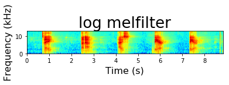
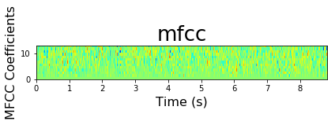
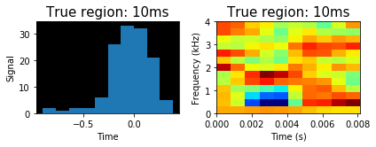
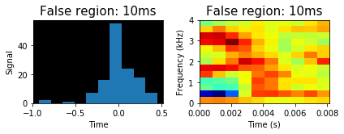

<h1>Phoneme boundary data generator</h1>
<p>(c) Koray </p>
<p>This algorithm generates dataset for training a phoneme boundary classifier</p>


```python
import os, io, wave, csv, json, re, glob
import librosa
import numpy as np
import pandas as pd
import matplotlib.pyplot as plt
import scipy.io.wavfile as wav
from scipy.fftpack import dct
import matplotlib.cm as cm
import matplotlib as mpl
from pydub import AudioSegment

from python_speech_features import mfcc
from python_speech_features import delta
from python_speech_features import logfbank
from python_speech_features import get_filterbanks
from python_speech_features import fbank
```

<h3>Benodigde methoden</h3>
<p>Deze methoden zijn van belang voor het uitvoeren van het proces. Elke methode heeft een eigen beschrijving van zijn functie.</p>


```python
# Voor het inlezen van een dictionary bestand.
def readDict(filepath):
    with open(filepath, 'r') as csvfile:
        return [sentence for sentence in csv.DictReader(csvfile)]

    
# Deze methode is om de hertz van een audio te transformeren naar de gewenste hertz
def transform_audio_hertz(audiofile, audiopath, extension, frame_rate):
    audiofile.set_frame_rate(frame_rate).set_channels(1).export(audiopath, format=extension)
    
    
def transform_audio_hertzZ(audiopath, extension, frame_rate):
    AudioSegment.from_wav(audiopath).set_frame_rate(frame_rate).set_channels(1).export(audiopath, format=extension)

    
# Voor het inlezen van bestanden uit een map.
def getFiles(folderpath, amount=None):
    files = glob.glob(folderpath + '*')
    size = len(files)
    return files[0:amount if amount is not None else size]


# Voor het krijgen van de juiste sample tijd
def getTime(seconds, sample_rate):
    return int(seconds * sample_rate)


# Methode om de audiosegmenten uit de regios te kunnen krijgen.
def getRegions(audio, side, boundary, frame_size, times, sample_rate):
    leftRegion = []
    rightRegion = []

    if 'L' in side:
        for walk in range(0, times):
            frame = boundary - (frame_size * walk)
            left = getTime(frame - frame_size, sample_rate)
            right = getTime(frame, sample_rate)
            tmpRegion = audio[left:right]
            leftRegion.append(tmpRegion)

    if 'R' in side:
        for walk in range(0, times):
            frame = boundary + (frame_size * walk)
            left = getTime(frame, sample_rate)
            right = getTime(frame + frame_size, sample_rate)
            tmpRegion = audio[left:right]
            rightRegion.append(tmpRegion)

    return leftRegion if 'L' in side else rightRegion


# Methode om de features uit de regios te kunnen krijgen.
def getRegionsFeatures(features_mfcc, side, boundary, frame_size, times):
    leftRegion = []
    rightRegion = []

    if 'L' in side:
        for walk in range(0, times):
            frame = boundary - (frame_size * walk)
            left = frame - frame_size
            right = frame
            tmpRegion = features_mfcc[left:right]
            leftRegion.append(tmpRegion)

    if 'R' in side:
        for walk in range(0, times):
            frame = boundary + (frame_size * walk)
            left = frame
            right = frame + frame_size
            tmpRegion = features_mfcc[left:right]
            rightRegion.append(tmpRegion)

    return leftRegion if 'L' in side else rightRegion


# Voor het exporteren van een data naar een CSV bestand.
def exportDataCSV(region, label, sample_rate, writer):
#     region = '|'.join(['{:}'.format(x) for x in region])
    region = '|'.join(['{:}'.format(x) for x in region.flatten()])
    writer.writerow({'region': region, 'label': label, 'sample_rate': sample_rate})

    
# Voor het exporteren van data naar een CSV bestand.
def exportDatasCSV(regions, label, sample_rate, writer):
    for region in regions:
        exportDataCSV(region, label, sample_rate, writer)
```


```python
# Voor het krijgen van features van een audio signaal
def getSignalMFCC(signal, sample_rate):
    mfcc_feat = mfcc(signal, sample_rate, winlen=0.010, winstep=0.001, nfft=512, ceplifter=22)
    return delta(mfcc_feat, 2)


# Een aangepaste variant van de MFCC methode waar de lifter methode niet wordt toegepast.
def getAdjustedMFCC(signal,samplerate=16000,winlen=0.010,winstep=0.001,numcep=13,
         nfilt=26,nfft=1024,lowfreq=0,highfreq=None,preemph=0.97,ceplifter=22,appendEnergy=True,
         winfunc=lambda x:np.ones((x,))):

    feat,energy = fbank(signal,samplerate,winlen,winstep,nfilt,nfft,lowfreq,highfreq,preemph,winfunc)
    feat = np.log(feat)
    feat = dct(feat, type=2, axis=1, norm='ortho')[:,:numcep]
#     feat = lifter(feat,ceplifter)
    if appendEnergy: feat[:,0] = np.log(energy)
    return feat


# Voor het krijgen van tijdsduur van een signaal
def getAudioDuration(signal, sample_rate):
    return signal.shape[0] / float(sample_rate)


# Methode voor het snijden van features in meerdere dimensies 5,13
def transform2DFeatures(features, slice_boundary):
    transformed = []
    
    for x in range(0, len(features), slice_boundary):
        transformed.append([features[y] for y in range(x, x+slice_boundary)])
    
    return np.array(transformed)


# Voor het plotten van een audio signaal
def plotSignal(signal, sample_rate, features, figurNum, title, ylabel_title):
    fig = plt.figure(figurNum)
    T = getAudioDuration(signal, sample_rate)
    ax = fig.add_subplot(111)
    ax.imshow(np.flipud(features.T), cmap=cm.jet, aspect=0.08, extent=[0,T,0,13])
    ax.set_title(title, fontsize=26)
    ax.set_ylabel(ylabel_title, fontsize=16)
    ax.set_xlabel('Time (s)', fontsize=16)
    print('Frams [0] and filterbanks [1]' + str(features.shape))
    
```

<h3>Eerst de hertz van de audio converteren naar de gewenste hertz</h3>
<p>Dit onderdeel is van belang voor de audio naar MFCC transformatie voor het krijgen van de features</p>
<p>Dit hoeft maar 1x uitgevoerd te worden!</p>


```python
# folderpath = '/datb/aphasia/languagedata/voxforge/transform/align/'

# # Get all csv files where the audiopaths are saved
# files = getFiles(folderpath)

# # First check if all audio is in the format WAV before transforming to another HERTZ
# count = 0
# for fileIndex in range(0, len(files)):
#     for audio in readDict(files[fileIndex]):
#         audiopath = audio['audiopath'].split('/')[-1]
#         count += 1 if 'wav' not in audiopath else 0

# print('Amount of non-wav files: {}'.format(count))
# print('Lookup is finished')


# # A batch for converting all VoxForge audiofiles to a desired HERTZ which is 16000hz
# if(count == 0):
#     for fileIndex in range(0, len(files)):
#         for audio in readDict(files[fileIndex]):
#             try:
#                 audiofile = AudioSegment.from_wav(audio['audiopath'])
#                 transform_audio_hertz(audiofile, audio['audiopath'], 'wav', 16000)
#             except FileNotFoundError:
#                 separated = audio['audiopath'].split('/')
#                 newName = re.sub('', '',separated[-1].lower())
#                 newAudioPath = '/'.join(separated[:-1]) + '/' + newName
#                 audiofile = AudioSegment.from_wav(newAudioPath)
#                 transform_audio_hertz(audiofile, audio['audiopath'],'wav', 16000)

#     print('Converting hertz is finished')
# else:
#     print('There are non-wav files!')
```

    Amount of non-wav files: 0
    Lookup is finished
    Converting hertz is finished


<h3>Voorbeeld melfilter en mfcc van een hele audio signaal.</h3>


```python
audioKoray = '/home/15068145/notebooks/test_koray/koray_woorden.wav'
# audioKoray = '/home/15068145/notebooks/test_koray/F60E2VT8.wav'

sample_rate, signal = wav.read(audioKoray)
# signal = signal[0:int(3.5 * sample_rate)]
features_log = logfbank(signal, sample_rate, nfft=512, nfilt=40, winlen=0.010, winstep=0.001)
features_mfcc = getSignalMFCC(signal, sample_rate)

plotSignal(signal=signal, sample_rate=sample_rate, features=features_log, figurNum=1, title='log melfilter', ylabel_title='Frequency (kHz)')
plotSignal(signal=signal, sample_rate=sample_rate, features=features_mfcc, figurNum=2, title='mfcc', ylabel_title='MFCC Coefficients')
plt.tight_layout()
plt.show()
```

    Frams [0] and filterbanks [1](8815, 40)
    Frams [0] and filterbanks [1](8815, 13)








<h3>Oude manier van genereren van trainings data. Zonder eerst de audio te transformeren naar MFCC.</h3>


```python
# datasetDir = '/datb/aphasia/languagedata/voxforge/dataset/'

# folderpath = '/datb/aphasia/languagedata/voxforge/final/'

# # Get all csv files
# files = getFiles(folderpath)

# subRegion = 0.020
# tsubRegion = subRegion / 2
# region = 0.050

# # Save dataset in a csv file
# with open(datasetDir + 'datasetboundary.csv', 'w') as toWrite:

#     fieldnames = ['region', 'label', 'sample_rate']
#     writer = csv.DictWriter(toWrite, fieldnames=fieldnames, quoting=csv.QUOTE_ALL, delimiter=',')

#     writer.writeheader()

# #     for x in range(0, len(files)-(len(files)-1), 1):
#     for x in range(0, len(files)):

#         filedict = readDict(files[x])
#         audiopath = filedict[0]['audiopath']

#         audio, sample_rate = librosa.load(audiopath)

#         count = 1
#         while count < len(filedict):
#             # Get prev and current word element
#             prevW = filedict[count - 1]
#             currW = filedict[count]
            
#             # Get prev end-time and current begin-time
#             boundaryL = float(prevW['end'])
#             boundaryR = float(currW['begin'])

#             # Get (true) left and right subregion segment
#             tsubRegionL = audio[getTime(boundaryL-tsubRegion, sample_rate):getTime(boundaryL, sample_rate)]
#             tsubRegionR = audio[getTime(boundaryR, sample_rate):getTime(boundaryR + tsubRegion, sample_rate)]

#             # Get (false) subregions from left and right
#             nRegionL = getRegions(audio, 'L', boundaryL - tsubRegion, subRegion, 3, sample_rate)
#             nRegionR = getRegions(audio, 'R', boundaryR + tsubRegion, subRegion, 3, sample_rate)

#             # Concatenate (true) left subregion and right subregion to ONE True region
#             tRegion = np.concatenate((tsubRegionL, tsubRegionR), axis=None)
            
#             tRegionFeatures = getSignalFeatures(tRegion, sample_rate)
            
#             nRegionLfeatures = [getSignalFeatures(regionL, sample_rate) for regionL in nRegionL]
#             nRegionRfeatures = [getSignalFeatures(regionR, sample_rate) for regionR in nRegionR]
            
#             # Export to CSV
#             exportDataCSV(tRegionFeatures, 1, sample_rate, writer)

#             exportDatasCSV(nRegionLfeatures, 0, sample_rate, writer)
#             exportDatasCSV(nRegionRfeatures, 0, sample_rate, writer)

#             count += 1

# print('finished')
```

<h3>Nieuwe manier van genereren van trainingsdata. Met eerst transformeren van audio naar MFCC.</h3>


```python
datasetDir = '/datb/aphasia/languagedata/voxforge/dataset/'

folderpath = '/datb/aphasia/languagedata/voxforge/final/'

# Get all csv files
files = getFiles(folderpath)

multiply_ms = int(1000)
subRegion = int(10)
tsubRegion = int(subRegion / 2)
size_region = 5

# Save dataset in a csv file
with open(datasetDir + 'datasetboundary.csv', 'w') as toWrite:

    fieldnames = ['region', 'label', 'sample_rate']
    writer = csv.DictWriter(toWrite, fieldnames=fieldnames, quoting=csv.QUOTE_ALL, delimiter=',')

    writer.writeheader()

#     for x in range(0, len(files)-(len(files)-1), 1):
    for x in range(0, len(files)):

        filedict = readDict(files[x])
        audiopath = filedict[0]['audiopath']
        
#         Read audio
        sample_rate, audio = wav.read(audiopath)
        print('Audio duration: {}, rate:{}'.format(getAudioDuration(audio, sample_rate), sample_rate))
        
#         Transform audio to mfcc to get features
        features_mfcc = getSignalMFCC(audio, sample_rate)

        count = 1
        while count < len(filedict):
            # Get prev and current word element
            prevW = filedict[count - 1]
            currW = filedict[count]
            
            # Get prev end-time and current begin-time
            boundaryL = int(float(prevW['end']) * multiply_ms)
            boundaryR = int(float(currW['begin']) * multiply_ms)

#             # Get (true) left and right subregion frames
            tsubRegionL = features_mfcc[boundaryL-tsubRegion:boundaryL]
            tsubRegionR = features_mfcc[boundaryR:boundaryR + tsubRegion]

#             # Get (false) subregions from left and right
            nRegionLfeatures = getRegionsFeatures(features_mfcc, 'L', boundaryL - tsubRegion, subRegion, size_region)
            nRegionRfeatures = getRegionsFeatures(features_mfcc, 'R', boundaryR + tsubRegion, subRegion, size_region)            
        
            # Concatenate (true) left subregion and right subregion to ONE True region
            tRegionFeatures = np.concatenate((tsubRegionL, tsubRegionR), axis=None)
            
#             # Export to CSV
            exportDataCSV(tRegionFeatures, 1, sample_rate, writer)

            exportDatasCSV(nRegionLfeatures, 0, sample_rate, writer)
            exportDatasCSV(nRegionRfeatures, 0, sample_rate, writer)

            count += 1

print('finished')
```

    Audio duration: 3.7546875, rate:16000
    Audio duration: 2.7306875, rate:16000
    Audio duration: 3.4986875, rate:16000
    Audio duration: 2.7306875, rate:16000
    Audio duration: 3.669375, rate:16000
    Audio duration: 4.0106875, rate:16000
    Audio duration: 3.413375, rate:16000
    Audio duration: 3.328, rate:16000
    Audio duration: 3.925375, rate:16000
    Audio duration: 2.645375, rate:16000
    finished


<h3>Plot 1 true en 1 false region data voor visualisatie</h3>
<p>Dus een plot van een label=1 en van een label=0</p>


```python
# Methode voor het plotten van de regio naar histogram voor visualisatie
def plotAudioRegion(signal, sample_rate, features, fignum, title, subplotNum):
    print('Frams [0] and filterbanks [1]' + str(features.shape))
    
    TimeSample = np.linspace(0, len(signal) / sample_rate, num=len(signal))

    fig = plt.figure(fignum)
    ax1 = fig.add_subplot(subplotNum+1)
    ax1.hist(signal)
    ax1.patch.set_facecolor('black')
    ax1.set_title(title + ': 10ms', fontsize=15)
    ax1.set_ylabel('Signal', fontsize=10)
    ax1.set_xlabel('Time', fontsize=10)
    
    T = getAudioDuration(signal, sample_rate)
    ax2 = fig.add_subplot(subplotNum+2)
    ax2.imshow(np.flipud(features.T), cmap=cm.jet, aspect='auto', extent=[0,T,0,4])
    ax2.set_title(title + ': 10ms', fontsize=15)
    ax2.set_ylabel('Frequency (kHz)', fontsize=10)
    ax2.set_xlabel('Time (s)', fontsize=10)
    
    plt.tight_layout()
```


```python
# Using Pandas for reading dataset csv
df = pd.read_csv(datasetDir + 'datasetboundary.csv', sep=',', skiprows=1, names=['region', 'label', 'sample_rate'])

# Get true labels only
trueData = df.loc[df.loc[:, 'label'] > 0, :]

# Get false labels only
falseData = df.loc[df.loc[:, 'label'] == 0, :]

print('Presentatie true regions data')
print(trueData)

print('Presentatie false regions data')
print(falseData)
```

    Presentatie true regions data
                                                    region  label  sample_rate
    0    0.03063869105700583|0.002808502583091155|0.013...      1        16000
    11   0.05230393235179385|-0.5528195766380677|-0.197...      1        16000
    22   -0.11285069440406623|-0.09468471219968748|0.04...      1        16000
    33   -0.0043863462056755505|-0.12700731775026952|-0...      1        16000
    44   0.7615775732452406|-0.37122520756508676|-2.532...      1        16000
    55   -0.1547571547628511|-0.37612796437993695|0.125...      1        16000
    66   -0.02532714612939415|0.6190436644706416|-0.211...      1        16000
    77   -0.0189655006842802|-0.32093627113833245|0.046...      1        16000
    88   -0.09836656211766837|-0.39097947266543864|-0.2...      1        16000
    99   0.09281704142641374|-0.42280410546056546|-0.25...      1        16000
    110  0.12958546856107453|-0.6722387463570694|-0.195...      1        16000
    121  -0.010631905240931161|0.19177497131460947|0.00...      1        16000
    132  -0.049190004180049485|-0.42279472244711835|-0....      1        16000
    143  -0.2149090582787913|0.351344671663572|-0.04344...      1        16000
    154  0.39680204958607845|1.4609770717377628|-0.1439...      1        16000
    165  0.10607719356047696|0.12528527874955947|0.3142...      1        16000
    176  0.0439156990749666|-0.07912421515637398|0.1716...      1        16000
    187  0.6980269407599436|-0.6568022504872606|-0.8490...      1        16000
    198  0.12610940350049268|1.2537734963897436|-0.2858...      1        16000
    209  -0.11437603917816688|-0.04756375359204128|0.21...      1        16000
    220  -0.00949972543021893|-0.15839157599308926|-0.2...      1        16000
    231  -0.033162143768164044|0.5827326599134451|0.091...      1        16000
    242  -0.03709964404053565|-0.32644353241128793|-0.1...      1        16000
    253  0.21162755579505835|-0.5154161452695094|-0.405...      1        16000
    264  -0.07596816862261094|0.21075479090665752|0.296...      1        16000
    275  0.022940603126259874|-0.0677262043832462|-0.16...      1        16000
    286  -0.3855417260405364|-0.19401605709736844|0.391...      1        16000
    297  0.2069809529129781|-0.6298919150348995|-0.1310...      1        16000
    308  0.03356094888677852|-0.20376185980791428|-0.20...      1        16000
    319  0.01881595535900473|0.22411508947817013|-0.181...      1        16000
    330  -0.17587363102255082|1.6112762885651377|0.4347...      1        16000
    341  -0.008534020551329036|-0.002532267532990673|-0...      1        16000
    352  0.01638575915941338|-0.07565707303177653|-0.12...      1        16000
    363  0.6696657814518983|-0.6812717489517379|-1.0869...      1        16000
    374  -0.027262777441718455|-0.056356501294995275|-0...      1        16000
    385  -0.09418176666386557|0.12259000119641632|0.045...      1        16000
    396  -0.07775415375920858|-0.30594924345273905|0.13...      1        16000
    407  0.0020192909269216132|0.2347577139251829|0.128...      1        16000
    418  0.0028695764636445633|-0.006511951692979423|0....      1        16000
    429  -0.04286227983008004|0.22838036088904196|-0.28...      1        16000
    440  0.002335949681075533|0.03819215913349967|0.212...      1        16000
    451  0.022300151835909433|-0.03686671558354737|0.20...      1        16000
    462  0.012439160952737893|0.17638213573285144|-0.11...      1        16000
    473  -0.010717970641333707|0.0010224227300823952|0....      1        16000
    484  -0.03166634350510655|-0.05287352852275775|-0.1...      1        16000
    495  0.18491354077209934|0.1305267211532907|-0.2085...      1        16000
    506  0.4592568458407012|0.48805229459541744|-0.5461...      1        16000
    517  0.019225359191404577|-0.5019599591797214|0.060...      1        16000
    528  0.07262280828311099|0.1803167824650788|0.37995...      1        16000
    539  0.0061486379016510995|-0.2911030685535341|-0.0...      1        16000
    550  -0.07007354582837025|-0.1590490136065627|-0.17...      1        16000
    561  -0.03688371052059978|0.7258415588359618|0.2324...      1        16000
    572  -0.06476719683920962|0.16614273294587728|-0.11...      1        16000
    583  0.031474321549895025|-0.1685991675593435|-0.24...      1        16000
    594  0.16850257224677884|0.025072091344952696|0.460...      1        16000
    Presentatie false regions data
                                                    region  label  sample_rate
    1    0.11432089851650744|-0.84281116825059|-0.27725...      0        16000
    2    0.0864836929975997|-0.6890733413964334|-0.4354...      0        16000
    3    -0.035666205644276514|0.4795595844222028|0.456...      0        16000
    4    0.014038870992866848|-0.1368462476653683|-0.14...      0        16000
    5    -0.05846202225161079|-0.050493744002561944|-0....      0        16000
    6    -0.03038894852944054|0.44615953020965693|0.226...      0        16000
    7    -0.0019098295508708674|0.3243333130267946|-0.0...      0        16000
    8    -0.019889928083270902|0.3239743396292948|0.383...      0        16000
    9    -0.003969588371129618|0.4152063786643687|0.285...      0        16000
    10   -0.08717133117061948|0.049316062411980964|-0.2...      0        16000
    12   -0.022047431450192435|0.8646385097245745|-0.14...      0        16000
    13   0.05030909721960306|-0.17173790446095616|-0.09...      0        16000
    14   -0.1447535523732899|0.15228510272868845|0.6509...      0        16000
    15   -0.04340044009858488|-0.018532575750311597|0.1...      0        16000
    16   -0.015107134606386907|0.10104358752603373|0.02...      0        16000
    17   -0.015644580746822356|-0.2752361239810071|0.28...      0        16000
    18   0.04270974393392102|-0.10048369441438947|-0.01...      0        16000
    19   0.02163594569090499|-0.3267144701134729|-0.201...      0        16000
    20   0.04679272463656261|0.064824969121443|-0.04755...      0        16000
    21   -0.01409136298676721|-0.5300227179267567|0.376...      0        16000
    23   -0.4705224527985344|0.5943144575420614|0.99951...      0        16000
    24   -0.31006821074963253|0.8075600546481929|-0.371...      0        16000
    25   0.02663321262575664|0.2059145633404169|-0.3410...      0        16000
    26   0.04553966854516887|-0.3129142561617777|0.0373...      0        16000
    27   -0.01409136298676721|-0.5300227179267567|0.376...      0        16000
    28   -0.014697592387809521|0.11708719338389004|0.20...      0        16000
    29   0.03598523847512354|0.024809104221570077|0.051...      0        16000
    30   -0.020964039794225186|-0.2522212441687789|-0.1...      0        16000
    31   0.01864851289051117|-0.03259053074718854|-0.13...      0        16000
    32   0.04787678487292411|0.25299773257171976|0.0199...      0        16000
    ..                                                 ...    ...          ...
    573  -0.17726012803963265|-0.13891693639553146|-0.0...      0        16000
    574  -0.15843485622670067|0.11292819298823575|0.164...      0        16000
    575  -0.21708859869706848|-0.33067568307557815|0.57...      0        16000
    576  -0.15855788686147038|-0.18834034925591214|-0.3...      0        16000
    577  0.08537460851306378|0.12673973774311312|-0.442...      0        16000
    578  0.18229537228155374|-0.07684906683220376|0.044...      0        16000
    579  0.010482207260800892|0.3737931224701178|-0.183...      0        16000
    580  0.053712677772513116|-0.05219130475058727|-0.1...      0        16000
    581  -0.006045301669917435|0.2044108743010126|-0.12...      0        16000
    582  0.07845947297460967|0.4090565223822555|0.27789...      0        16000
    584  0.03359837593971946|-0.005685486340624024|-0.1...      0        16000
    585  0.02441052768007488|-0.24991544157922724|0.018...      0        16000
    586  0.03704517757028007|0.0008925294597049493|0.23...      0        16000
    587  -0.09786333272239531|0.4977549033831055|0.5102...      0        16000
    588  0.07845947297460967|0.4090565223822555|0.27789...      0        16000
    589  0.1284871137606501|-0.39738431902385934|-0.133...      0        16000
    590  0.027748283269766815|0.004936893252421371|-0.0...      0        16000
    591  0.09093041713962116|0.12111883668713723|0.0879...      0        16000
    592  0.2788690379212085|-0.19815412160217782|0.3668...      0        16000
    593  0.03212313868553771|-0.007960833267265243|-0.0...      0        16000
    595  0.3824854109398371|-0.46277665017355857|-0.206...      0        16000
    596  -0.04458609933084077|-0.19589054820610946|-0.0...      0        16000
    597  0.03775394695401246|0.24570642729527242|0.0540...      0        16000
    598  -0.13567890361567264|-0.16330778025513978|0.07...      0        16000
    599  -0.1524838051657987|-0.39585609810301675|-0.40...      0        16000
    600  0.023718998840047335|0.6061183706948219|-0.077...      0        16000
    601  0.05887057348202731|-0.14947138623121342|0.151...      0        16000
    602  0.0923101211940601|-0.5809443740215114|0.13824...      0        16000
    603  -0.028339441300247615|-0.4414422942214668|0.11...      0        16000
    604  -0.009265838609520216|-0.21755791394197757|0.1...      0        16000
    
    [550 rows x 3 columns]


```python
# Transform to array from a stringdata and Get only 1 true region
regionSignalTrue = np.array([float(i) for i in trueData.loc[0]['region'].split('|')])
sample_rate = trueData.loc[0]['sample_rate']
print(len(regionSignalTrue))

# Transform to array from a stringdata and Get only 1 false region
regionSignalFalse = np.array([float(i) for i in falseData.loc[1]['region'].split('|')])

# Plot the true region data
plotAudioRegion(regionSignalTrue, sample_rate, transform2DFeatures(regionSignalTrue, 13), 1, 'True region', 220)

# Plot the false region data
plotAudioRegion(regionSignalFalse, sample_rate, transform2DFeatures(regionSignalFalse, 13), 3, 'False region', 222)

plt.show()
```

    130
    Frams [0] and filterbanks [1](10, 13)
    Frams [0] and filterbanks [1](10, 13)








```python

```


```python

```


```python

```
