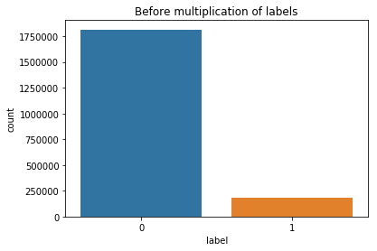

<h1>Transforming Corpus data</h1>
<p>(c) Koray</p>
<p>In deze notebook transformeren we eerst de data naar de gewenste structuur. Daarna gebruiken we de "Phoneme Boundary Generator" om dataset te genereren voor neurale netwerken zoals MLP Classifier, LSTM etc.</p>


```python
import os, io, wave, csv, json, re, glob
from pydub import AudioSegment

import librosa
import numpy as np
import pandas as pd
import matplotlib.pyplot as plt
import scipy.io.wavfile as wav
from scipy.fftpack import dct
import matplotlib.cm as cm
import matplotlib as mpl

from python_speech_features import mfcc
from python_speech_features import delta
from python_speech_features import logfbank
from python_speech_features import get_filterbanks
from python_speech_features import fbank
```

<h3>Benodigde methoden</h3>


```python
# Voor het inlezen van bestanden uit een map.
def getFiles(folderpath):
    files = glob.glob(folderpath + '*')
    return files


# Deze methode is om de hertz van een audio te transformeren naar de gewenste hertz
def transform_audio_hertz(audiofile, audiopath, extension, frame_rate):
    audiofile.set_frame_rate(frame_rate).set_channels(1).export(audiopath, format=extension)
    
    
# Voor het exporteren van data uit Corpus naar een CSV bestand.
def exportDataCSV(filepath):
    # map waarin de wav bestanden zijn opgeslagen
    wavFolderPath = '/datb/aphasia/languagedata/corpus/transform/wavfiles/'
    
    # map waarin de csv bestanden moeten opgeslagen worden
    finalPath = '/datb/aphasia/languagedata/corpus/final/'
    
    with open(filepath, encoding = "ISO-8859-1") as toRead:
        read_data = toRead.readline()
        
        filename = filepath.split('/')[-1].split('.')[0]
        wavfile = wavFolderPath + filename + '.wav'
        
        with open(finalPath+filename+'.csv', 'w') as writeTo:
                # De structuur die van belang is voor de Phoneme boundary generator
                writer = csv.DictWriter(writeTo, fieldnames=['begin', 'end', 'word', 'audiopath'])
                writer.writeheader()

                count = 0
                subCount = 0

                begin = 0
                end = 0
                text = ''
                exclude = 'IntervalTier'

                while read_data:

                    if count > 11:
                        subCount += 1

                        if exclude in read_data:
                            break

                        if subCount == 1:
                            begin = float(read_data)
                        elif subCount == 2:
                            end = float(read_data)
                        elif subCount == 3:
                            text = re.sub('[\n\r"".?]', '', read_data)
                            
                            # Het uit filteren van de ongewenste data
                            if len(text) > 0 and not any(x in text for x in ['ggg', 'XXX', 'xxx', '...', '_', '*', '-']):
                                writer.writerow({'begin': begin, 'end': end, 'word': text, 'audiopath':wavfile})

                            begin = 0
                            end = 0
                            text = ''
                            subCount = 0

                    read_data = toRead.readline()
                    count += 1
```

<h3>Eerst de wav bestanden converteren naar 16khz.</h3>
<p>Dit proces hoeft maar 1 keer uitgevoerd te worden.</p>


```python
folderpath = '/datb/aphasia/languagedata/corpus/transform/wavfiles/'

# Get all csv files where the audiopaths are saved
audiofiles = getFiles(folderpath)

notConvertable = []

# A batch for converting all Corpus audiofiles to a desired HERTZ which is 16000hz
for audiopath in audiofiles:
    try:
        audiofile = AudioSegment.from_file(audiopath, format="wav")
        transform_audio_hertz(audiofile, audiopath, 'wav', 16000)
    except Exception:
        notConvertable.append(audiopath)

print('Converting hertz to 16khz is finished')
```

    Converting hertz to 16khz is finished


<p>Hieronder wordt gekeken of de wav bestanden die niet kunnen worden geconverteerd naar 16khz afkomstig zijn van de map "comp-c". Dit heb ik kunnen realiseren door de naam van het bestand te gebruiken om te matchen met de bestaande non convertable wav bestanden in "notConvertable" lijst. Dit is de enige map waarin alleen 8khz wav bestanden in zitten en die hebben wij niet nodig.</p>


```python
folderpath = '/datb/aphasia/languagedata/corpus/original/wrd/comp-c/nl/'
wavPath = '/datb/aphasia/languagedata/corpus/transform/wavfiles/'

folderBroad = sc.parallelize(getFiles(folderpath))
numbers = folderBroad.filter(lambda x: wavPath+x.split('/')[-1].split('.')[0]+'.wav' in notConvertable).collect()
print('Non Convertable: {}'.format(len(notConvertable)))
print('Map:"comp-c" <- has 8khz wavfiles, match: {}'.format(len(numbers)))
```

    Non Convertable: 93
    Map:"comp-c" <- has 8khz wavfiles, match: 93


<h3>Batch voor het transformeren van de data naar de juiste structuur en opslaan in een CSV bestand.</h3>


```python
# waar we de mappen uit moeten halen
folderpath = '/datb/aphasia/languagedata/corpus/original/wrd/'

# sub map waar we de data uit moeten halen
subFolder = 'nl/'

# Mappen die we moeten uit filteren want die gaan we niet gebruiken
excludeFolders = ['n', 'm', 'l', 'i', 'a', 'c']

foldernames = list(filter(lambda x: not any(y in x[-1] for y in excludeFolders) , getFiles(folderpath)))

print('Folder names to use:')
print(foldernames)

print('---------------------')

for folder in foldernames:
    # ophalen van de bestanden per map
    files = getFiles(folder+'/'+subFolder)
    
    # de bestanden meegeven aan de "exportDataCSV" methode die de data op de juiste structuur zet en opslaat in een CSV bestand.
    for filepath in files:
        exportDataCSV(filepath)
        
    print('Finished folder: {}',format(folder))
        
print('Finished')
```

    Folder names to use:
    ['/datb/aphasia/languagedata/corpus/original/wrd/comp-f', '/datb/aphasia/languagedata/corpus/original/wrd/comp-e', '/datb/aphasia/languagedata/corpus/original/wrd/comp-k', '/datb/aphasia/languagedata/corpus/original/wrd/comp-j', '/datb/aphasia/languagedata/corpus/original/wrd/comp-h', '/datb/aphasia/languagedata/corpus/original/wrd/comp-b', '/datb/aphasia/languagedata/corpus/original/wrd/comp-o', '/datb/aphasia/languagedata/corpus/original/wrd/comp-g']
    ---------------------
    Finished folder: {} /datb/aphasia/languagedata/corpus/original/wrd/comp-f
    Finished folder: {} /datb/aphasia/languagedata/corpus/original/wrd/comp-e
    Finished folder: {} /datb/aphasia/languagedata/corpus/original/wrd/comp-k
    Finished folder: {} /datb/aphasia/languagedata/corpus/original/wrd/comp-j
    Finished folder: {} /datb/aphasia/languagedata/corpus/original/wrd/comp-h
    Finished folder: {} /datb/aphasia/languagedata/corpus/original/wrd/comp-b
    Finished folder: {} /datb/aphasia/languagedata/corpus/original/wrd/comp-o
    Finished folder: {} /datb/aphasia/languagedata/corpus/original/wrd/comp-g
    Finished


<h3>Resultaat</h3>


```python
finalFolder = '/datb/aphasia/languagedata/corpus/final/*'
files = getFiles(finalFolder)

print('Aantal: {}'.format(len(files)))
print(files[0:10])
```

    Aantal: 742
    ['/datb/aphasia/languagedata/corpus/final/fn004915.csv', '/datb/aphasia/languagedata/corpus/final/fn002854.csv', '/datb/aphasia/languagedata/corpus/final/fn002059.csv', '/datb/aphasia/languagedata/corpus/final/fn003438.csv', '/datb/aphasia/languagedata/corpus/final/fn006104.csv', '/datb/aphasia/languagedata/corpus/final/fn007102.csv', '/datb/aphasia/languagedata/corpus/final/fn004375.csv', '/datb/aphasia/languagedata/corpus/final/fn000095.csv', '/datb/aphasia/languagedata/corpus/final/fn004851.csv', '/datb/aphasia/languagedata/corpus/final/fn007146.csv']


```python
exampleFile = '/datb/aphasia/languagedata/corpus/final/fn004915.csv'

# Using Pandas for reading dataset csv
file_df = pd.read_csv(exampleFile, sep=',', skiprows=1, names=['begin', 'end', 'word', 'audiopath'])

print('Example file: fn004915.csv')
print(file_df.head())
```

    Example file: fn004915.csv
       begin    end           word  \
    0  0.478  0.910      tennisser   
    1  0.910  1.143         Raemon   
    2  1.143  1.589        Sluiter   
    3  1.589  1.704             is   
    4  1.704  2.450  uitgeschakeld   
    
                                               audiopath  
    0  /datb/aphasia/languagedata/corpus/transform/wa...  
    1  /datb/aphasia/languagedata/corpus/transform/wa...  
    2  /datb/aphasia/languagedata/corpus/transform/wa...  
    3  /datb/aphasia/languagedata/corpus/transform/wa...  
    4  /datb/aphasia/languagedata/corpus/transform/wa...  


```python
print('------------------------------------------------------------------------------------------------------------')
```

    ------------------------------------------------------------------------------------------------------------


<h2>Phoneme boundary data generator voor CORPUS data.</h2>
<p>(c) Koray</p>
<p>This algorithm generates dataset for training a phoneme boundary classifier</p>

<h4>Benodigde methoden</h4>
<p>Deze methoden zijn van belang voor het uitvoeren van het proces. Elke methode heeft een eigen beschrijving van zijn functie.</p>


```python
# Voor het inlezen van een dictionary bestand.
def readDict(filepath):
    with open(filepath, 'r') as csvfile:
        return [sentence for sentence in csv.DictReader(csvfile)]

    
# Deze methode is om de hertz van een audio te transformeren naar de gewenste hertz
def transform_audio_hertz(audiofile, audiopath, extension, frame_rate):
    audiofile.set_frame_rate(frame_rate).set_channels(1).export(audiopath, format=extension)


# Voor het inlezen van bestanden uit een map.
def getFiles(folderpath, amount=None):
    files = glob.glob(folderpath + '*')
    size = len(files)
    return files[0:amount if amount is not None else size]


# Voor het krijgen van de juiste sample tijd
def getTime(seconds, sample_rate):
    return int(seconds * sample_rate)


# Methode om de audiosegmenten uit de regios te kunnen krijgen.
def getRegions(audio, side, boundary, frame_size, times, sample_rate):
    leftRegion = []
    rightRegion = []

    if 'L' in side:
        for walk in range(0, times):
            frame = boundary - (frame_size * walk)
            left = getTime(frame - frame_size, sample_rate)
            right = getTime(frame, sample_rate)
            tmpRegion = audio[left:right]
            leftRegion.append(tmpRegion)

    if 'R' in side:
        for walk in range(0, times):
            frame = boundary + (frame_size * walk)
            left = getTime(frame, sample_rate)
            right = getTime(frame + frame_size, sample_rate)
            tmpRegion = audio[left:right]
            rightRegion.append(tmpRegion)

    return leftRegion if 'L' in side else rightRegion


# Voor het exporteren van een data naar een CSV bestand.
def exportDataCSV(region, label, sample_rate, audiopath, writer):
    regionFeatures = '|'.join(['{:}'.format(x) for x in region[0].flatten()])
    writer.writerow({'region': regionFeatures, 'label': label, 'sample_rate': sample_rate, 
                     'begin':region[1], 'end':region[2], 'audiopath':audiopath})

    
# Voor het exporteren van data naar een CSV bestand.
def exportDatasCSV(regions, label, sample_rate, audiopath, writer):
    for region in regions:
        exportDataCSV(region, label, sample_rate, audiopath, writer)
```


```python
# Voor het krijgen van features van een audio signaal
def getSignalMFCC(signal, sample_rate):
    mfcc_feat = mfcc(signal, sample_rate, winlen=0.010, winstep=0.001, nfft=512, ceplifter=22)
    return delta(mfcc_feat, 2)


# Een aangepaste variant van de MFCC methode waar de lifter methode niet wordt toegepast.
def getAdjustedMFCC(signal,samplerate=16000,winlen=0.010,winstep=0.001,numcep=13,
         nfilt=26,nfft=1024,lowfreq=0,highfreq=None,preemph=0.97,ceplifter=22,appendEnergy=True,
         winfunc=lambda x:np.ones((x,))):

    feat,energy = fbank(signal,samplerate,winlen,winstep,nfilt,nfft,lowfreq,highfreq,preemph,winfunc)
    feat = np.log(feat)
    feat = dct(feat, type=2, axis=1, norm='ortho')[:,:numcep]
#     feat = lifter(feat,ceplifter)
    if appendEnergy: feat[:,0] = np.log(energy)
    return feat


# Voor het krijgen van tijdsduur van een signaal
def getAudioDuration(signal, sample_rate):
    return signal.shape[0] / float(sample_rate)


# Methode voor het snijden van features in meerdere dimensies 5,13
def transform2DFeatures(features, slice_boundary):
    transformed = []
    
    for x in range(0, len(features), slice_boundary):
        transformed.append([features[y] for y in range(x, x+slice_boundary)])
    
    return np.array(transformed)
```


```python
# Methode om het verschil van twee subregions terug te geven
def getDifferences(region, frame_size):
    sub_frame = int(frame_size/2)
    return region[0:sub_frame] - region[sub_frame:frame_size]


# Methode om de features van de verschil van de subregios uit de regios te kunnen krijgen.
def getRegionsFeaturesDifference(features_mfcc, side, boundary, frame_size, times):
    leftRegion = []
    rightRegion = []

    if 'L' in side:
        for walk in range(0, times):
            frame = boundary - (frame_size * walk)
            left = frame - frame_size
            right = frame
            differenceRegion = getDifferences(features_mfcc[left:right], frame_size)
            leftRegion.append([differenceRegion, left, right])

    if 'R' in side:
        for walk in range(0, times):
            frame = boundary + (frame_size * walk)
            left = frame
            right = frame + frame_size
            differenceRegion = getDifferences(features_mfcc[left:right], frame_size)
            rightRegion.append([differenceRegion, left, right])

    return leftRegion if 'L' in side else rightRegion
```


```python
datasetDir = '/datb/aphasia/languagedata/corpus/dataset/'

folderpath = '/datb/aphasia/languagedata/corpus/final/'

# Get all csv files
files = getFiles(folderpath)

multiply_ms = int(1000)
subRegion = int(10)
tsubRegion = int(subRegion / 2)
size_region = 5

chunkAmount = len(files) / 4
start = 0

# Save dataset in a csv file
with open(datasetDir + 'datasetboundary_difference_v1.csv', 'w') as toWrite:

    fieldnames = ['region', 'label', 'sample_rate', 'begin', 'end', 'audiopath']
    writer = csv.DictWriter(toWrite, fieldnames=fieldnames, quoting=csv.QUOTE_ALL, delimiter=',')

    writer.writeheader()

    for x in range(0, len(files)):
        
        if x == chunkAmount*start:
            print('Start: {} / {}'.format(chunkAmount, len(files)))
            start += 1

        filedict = readDict(files[x])
        audiopath = filedict[0]['audiopath']
        
#         Read audio
        sample_rate, audio = wav.read(audiopath)
        
#       Transform audio to mfcc to get features
        features_mfcc = getSignalMFCC(audio, sample_rate)

        count = 1
        while count < len(filedict):
            # Get prev and current word element
            prevW = filedict[count - 1]
            currW = filedict[count]
            
            # Get prev end-time and current begin-time
            boundaryL = int(float(prevW['end']) * multiply_ms)
            boundaryR = int(float(currW['begin']) * multiply_ms)
            
            try:
    #           # Get (true) left and right subregion frames
                tsubRegionL = features_mfcc[boundaryL-tsubRegion:boundaryL]
                tsubRegionR = features_mfcc[boundaryR:boundaryR + tsubRegion]

    #           # Get difference of (false) subregions from left and right
                nRegionLfeatures = getRegionsFeaturesDifference(features_mfcc, 'L', boundaryL - tsubRegion, subRegion, size_region)
                nRegionRfeatures = getRegionsFeaturesDifference(features_mfcc, 'R', boundaryR + tsubRegion, subRegion, size_region)            

                # Difference (true) left subregion and right subregion to ONE True region
                tRegionFeatures = tsubRegionL - tsubRegionR

                tRegionFeatures = [tRegionFeatures, int(boundaryL-tsubRegion), int(boundaryR+tsubRegion)]

    #           # Export to CSV
                exportDatasCSV(nRegionLfeatures, 0, sample_rate, audiopath, writer)

                exportDataCSV(tRegionFeatures, 1, sample_rate, audiopath, writer)

                exportDatasCSV(nRegionRfeatures, 0, sample_rate, audiopath, writer)
            
            except ValueError:
                print('Audiopath: {}'.format(audiopath))

            count += 1

print('finished')
```

    Start: 185.5 / 742
    Audiopath: /datb/aphasia/languagedata/corpus/transform/wavfiles/fn009091.wav


<h2>Dataset na het uitvoeren van de generator op de CORPUS data.</h2>


```python
datasetDir = '/datb/aphasia/languagedata/corpus/dataset/'

# Using Pandas for reading dataset csv
df = pd.read_csv(datasetDir + 'datasetboundary_difference_v1.csv', sep=',', skiprows=1, names=['region', 'label', 'sample_rate', 'begin', 'end', 'audiopath'])

print('Tail:')
print(df.tail())
```

    Tail:
                                                        region  label  \
    1996198  -0.010112074845092786|-0.12337382033819033|-0....      0   
    1996199  0.03377098086133684|0.1640975463153982|-0.6163...      0   
    1996200  -0.079014368797408|-0.6651461099926628|-1.0014...      0   
    1996201  0.09380798421664026|0.47120384110655955|2.7844...      0   
    1996202  -0.1145584679774558|0.3562739962077849|0.68178...      0   
    
             sample_rate   begin     end  \
    1996198        16000  225538  225548   
    1996199        16000  225548  225558   
    1996200        16000  225558  225568   
    1996201        16000  225568  225578   
    1996202        16000  225578  225588   
    
                                                     audiopath  
    1996198  /datb/aphasia/languagedata/corpus/transform/wa...  
    1996199  /datb/aphasia/languagedata/corpus/transform/wa...  
    1996200  /datb/aphasia/languagedata/corpus/transform/wa...  
    1996201  /datb/aphasia/languagedata/corpus/transform/wa...  
    1996202  /datb/aphasia/languagedata/corpus/transform/wa...  


<p>Verhouding in de dataset tussen de aantal 0 en 1 labels.</p>


```python
import seaborn as sns

fig , ax = plt.subplots(figsize=(6,4))
sns.countplot(x='label', data=df)
plt.title("Before multiplication of labels")
plt.show()
```





<p>Hieronder controleren we of we alle 742 textbestanden/wavfiles hebben gebruikt voor de generator.</p>


```python
dfList = df['audiopath'].tolist()
amountFiles = set(dfList)
print('Succesfully run: {}'.format(len(amountFiles)))
```

    Succesfully run: 742

