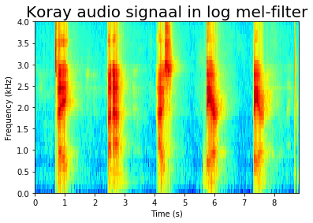
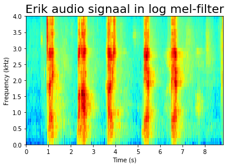
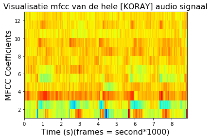
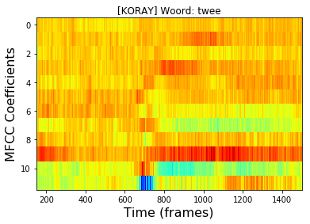
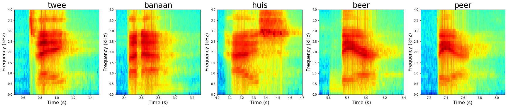
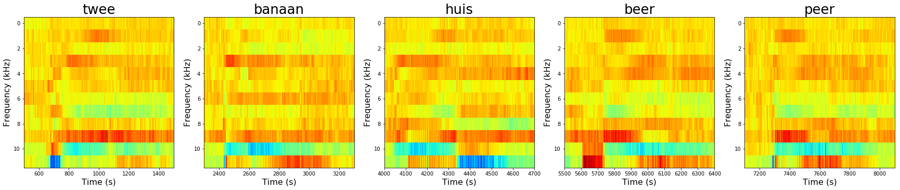
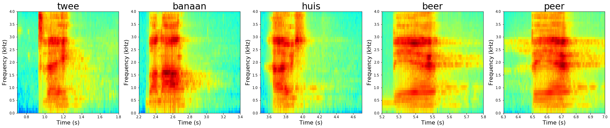
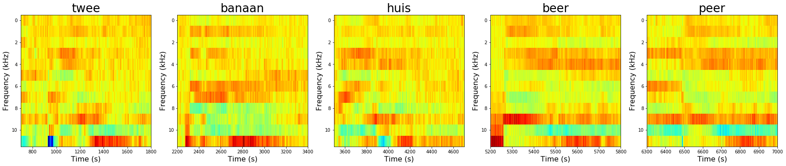
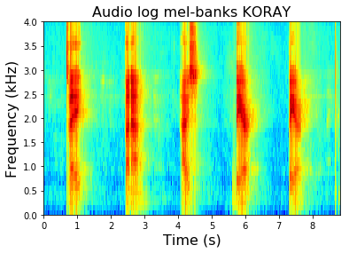
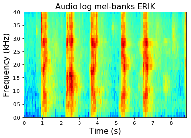

<h1>Analyse woorden met Log mel-banks en MFCC per audio signaal, per woord en per spreker</h1>
<p>(c) Koray</p>
<p>In deze notebook plotten we de Log mel-banks en MFCC per audio signaal, per woord en per spreker. Dit doen we om te kijken naar de vergelijkbare kenmerken van de uitgesproken woorden van de verschillende sprekers.</p>


```python
import os, io, wave, csv, json, re, glob
import librosa
import numpy
import pandas as pd
import matplotlib.pyplot as plt
import scipy.io.wavfile as wav
from scipy.fftpack import dct
import matplotlib.pyplot as plt
import matplotlib.cm as cm
import matplotlib as mpl

from python_speech_features import mfcc
from python_speech_features import delta
from python_speech_features import logfbank
from python_speech_features import get_filterbanks
from python_speech_features import fbank
from python_speech_features import mel2hz
import python_speech_features.sigproc as sigproc
```


```python
audioKoray = '/home/15068145/notebooks/test_koray/koray_woorden.wav'
audioErik = '/home/15068145/notebooks/test_koray/erik_woorden.wav'
audioTest = '/home/15068145/notebooks/test_koray/F60E2VT8.wav'
```


```python
# Voor het krijgen van features van een audio signaal
def getSignalMFCC(signal, sample_rate):
    mfcc_feat = mfcc(signal, sample_rate, winlen=0.010, nfft=1024, ceplifter=0)
    return delta(mfcc_feat, 2)


# Een aangepaste variant van de MFCC methode waar de lifter methode niet wordt toegepast.
def adjustedMFCC(signal,samplerate=16000,winlen=0.010,winstep=0.01,numcep=13,
         nfilt=26,nfft=1024,lowfreq=0,highfreq=None,preemph=0.97,ceplifter=22,appendEnergy=True,
         winfunc=lambda x:numpy.ones((x,))):

    feat,energy = fbank(signal,samplerate,winlen,winstep,nfilt,nfft,lowfreq,highfreq,preemph,winfunc)
    feat = numpy.log(feat)
    feat = dct(feat, type=2, axis=1, norm='ortho')[:,:numcep]
    feat = lifter(feat,ceplifter)
    if appendEnergy: feat[:,0] = numpy.log(energy) # replace first cepstral coefficient with log of frame energy
    return feat

# Methode om de woorden in een spectogram apart van elkaar te plotten waar je per woord zijn spectogram ziet.
# Dit is gedaan om de spectogram van woorden van verschillende sprekers met elkaar te vergelijken
def plotWordsSpectogram(words, features, figureNum):
    print('Log mel-filterbanks features')
    fig = plt.figure(figureNum)
    subplot_num = 550
    for index, word in enumerate(words):
        times = words[word]
        subplot_num += 1
        ax = fig.add_subplot(subplot_num)
        ax.imshow(numpy.flipud(features.T), cmap=cm.jet, aspect='auto', extent=[0,T,0,4])
        ax.set_title(word, fontsize=26)
        ax.set_ylabel('Frequency (kHz)', fontsize=16)
        ax.set_xlabel('Time (s)', fontsize=16)
        from_time = times[0]
        to_time = times[1]
        ax.set_xlim(from_time, to_time)
        ax.set_ylim(0, 4.0)
        
    plt.tight_layout()
    plt.subplots_adjust(top=6, right=4)
    
    
def plotWordsMFCC(words, features, figureNum):
    print('MFCC features')
    fig = plt.figure(figureNum)
    subplot_num = 550
    multi = 1000
    for index, word in enumerate(words):
        times = words[word]
        subplot_num += 1
        ax = fig.add_subplot(subplot_num)
        from_time = times[0] * multi
        to_time = times[1] * multi
#         frames = features[int(from_time):int(to_time)]
        ax.imshow(numpy.flipud(features.T), cmap=cm.jet, aspect='auto')
        ax.set_title(word, fontsize=26)
        ax.set_ylabel('Frequency (kHz)', fontsize=16)
        ax.set_xlabel('Time (s)', fontsize=16)
        ax.set_xlim(from_time, to_time)
#         ax.set_ylim(0, 4.0)
    plt.tight_layout()
    plt.subplots_adjust(top=6, right=4)
    
# Voor het krijgen van de uiteindelijke MFCC features uit de logfbank_features.
def getDCTfeature(features):
    numceps = 13
    feat_dct = dct(features, type=2, axis=1, norm='ortho')[:,1:numceps]
    return feat_dct

# Voor het terug geven van de tijdsduur
def getTime(signal, sample_rate):
    return signal.shape[0] / float(sample_rate)
```

<h1>Plot log filter-banks features</h1>
<p>Hier worden de log Mel-filterbanks geplot. In de plot kun je zien aan de hand van de warme kleur waar wordt gesproken. Voor het krijgen van de uiteindelijke features zouden we de methode MFCC kunnen aanroepen maar voor visualisatie heb ik voor gekozen om in stappen te doen zodat je een beter beeld krijgt.</p>


```python
sample_rate, signal = wav.read(audioKoray)
sample_rate_erik, signal_erik = wav.read(audioErik)

# T = audio tijdsduur in seconden
T = getTime(signal, sample_rate)

# Hier wordt de logfbank methode aangeroepen voor het krijgen van de mel-filterbanks features
logfbank_features = logfbank(signal, sample_rate, nfft=512, nfilt=40, winlen=0.010, winstep=0.001)
logfbank_features_erik = logfbank(signal_erik, sample_rate_erik, nfft=512, nfilt=40, winlen=0.010, winstep=0.001)

plt.title('Koray audio signaal in log mel-filter', fontsize=20)
plt.imshow(numpy.flipud(logfbank_features.T), cmap=cm.jet, aspect='auto', extent=[0,T,0,4])
plt.ylabel('Frequency (kHz)', fontsize=10)
plt.xlabel('Time (s)', fontsize=10)
print('Frams [0] and filterbanks [1]' + str(logfbank_features.shape))
plt.show()

T_erik = getTime(signal_erik, sample_rate_erik)
plt.title('Erik audio signaal in log mel-filter', fontsize=20)
plt.imshow(numpy.flipud(logfbank_features_erik.T), cmap=cm.jet, aspect='auto', extent=[0,T_erik,0,4])
plt.ylabel('Frequency (kHz)', fontsize=10)
plt.xlabel('Time (s)', fontsize=10)
plt.show()
```

    Frams [0] and filterbanks [1](8815, 40)








<h1>Get dct features for plotting mfcc</h1>
<p>Hier worden de features die worden teruggegeven van de DCT methode geplot voor visualisatie. In de plot zie je de Coefficients over de hele audio</p>


```python
numceps = 13

# De uiteindelijke mfcc features
mfcc_features = getDCTfeature(logfbank_features)
mfcc_features_erik = getDCTfeature(logfbank_features_erik)

print('Shape of the features: ' + str(mfcc_features.shape))
print('Frames:{}, Bands:{} '.format(mfcc_features.shape[0], mfcc_features.shape[1]))

# Visualisatie van de tijdsduur en de mfcc coefficients
plt.title('Visualisatie mfcc van de hele [KORAY] audio signaal', fontsize=16)
plt.imshow(numpy.flipud(mfcc_features.T), cmap=cm.jet, aspect='auto', extent=[0,T,1,numceps])
plt.ylabel('MFCC Coefficients', fontsize=16)
plt.xlabel('Time (s)(frames = second*1000)', fontsize=16)
plt.show
```

    Shape of the features: (8815, 12)
    Frames:8815, Bands:12 


    <function matplotlib.pyplot.show(*args, **kw)>





<h1>Plot features van een tijdsduur van 0.5s t/m 1.5s</h1>
<p>Hier wordt een tijdsduur van 0s t/m 1.5s weergegeven. Dit om het eerste woord in mfcc vorm te visualiseren.</p>


```python
feature_time = mfcc_features[0:1500]
print(feature_time.shape)

plt.title('[KORAY] Woord: twee')
plt.imshow(numpy.flipud(feature_time.T), cmap=cm.jet, aspect='auto')
plt.ylabel('MFCC Coefficients', fontsize=16)
plt.xlabel('Time (frames)', fontsize=16)
# Inzoomen op een tijds regio
plt.xlim(150, 1500)
plt.show()
```

    (1500, 12)





<h1>Plot een log mel-banks en MFCC van de gesproken woorden</h1>

<h3>Log mel-banks en MFCC van spreker KORAY</h3>


```python
words = {'twee':[0.5, 1.5], 'banaan':[2.3, 3.3], 'huis':[4.0, 4.7], 'beer':[5.5, 6.4], 'peer':[7.1, 8.1]}
plotWordsSpectogram(words, logfbank_features, 1)
plotWordsMFCC(words, mfcc_features, 2)
plt.show()
```

    Log mel-filterbanks features
    MFCC features








<h3>Log mel-banks en MFCC van spreker ERIK</h3>


```python
words = {'twee':[0.7, 1.8], 'banaan':[2.2, 3.4], 'huis':[3.5, 4.7], 'beer':[5.2, 5.8], 'peer':[6.3, 7.0]}
plotWordsSpectogram(words, logfbank_features_erik, 1)
plotWordsMFCC(words, mfcc_features_erik, 2)
plt.show()
```

    Log mel-filterbanks features
    MFCC features








<h3>Volledige visualisatie van audio signaal van Koray</h3>


```python
fig = plt.figure(1)
ax = fig.add_subplot(111)
ax.imshow(numpy.flipud(logfbank_features.T), cmap=cm.jet, aspect='auto', extent=[0,T,0,4])
ax.set_title("Audio log mel-banks KORAY", fontsize=16)
ax.set_ylabel('Frequency (kHz)', fontsize=16)
ax.set_xlabel('Time (s)', fontsize=16)

words = {'twee':[0.5, 1.5], 'banaan':[2.3, 3.3], 'huis':[4.0, 4.7], 'beer':[5.5, 6.4], 'peer':[7.1, 8.1]}
plotWordsSpectogram(words, logfbank_features, 2)
plotWordsMFCC(words, mfcc_features, 3)
plt.show()
```

    Log mel-filterbanks features
    MFCC features





<h3>Volledige visualisatie van audio signaal van Erik</h3>


```python
fig = plt.figure(1)
ax = fig.add_subplot(111)
ax.imshow(numpy.flipud(logfbank_features_erik.T), cmap=cm.jet, aspect='auto', extent=[0,T_erik,0,4])
ax.set_title("Audio log mel-banks ERIK", fontsize=16)
ax.set_ylabel('Frequency (kHz)', fontsize=16)
ax.set_xlabel('Time (s)', fontsize=16)

words = {'twee':[0.7, 1.8], 'banaan':[2.2, 3.4], 'huis':[3.5, 4.7], 'beer':[5.2, 5.8], 'peer':[6.3, 7.0]}
plotWordsSpectogram(words, logfbank_features_erik, 2)
plotWordsMFCC(words, mfcc_features_erik, 3)
plt.show()
```

    Log mel-filterbanks features
    MFCC features





```python

```
